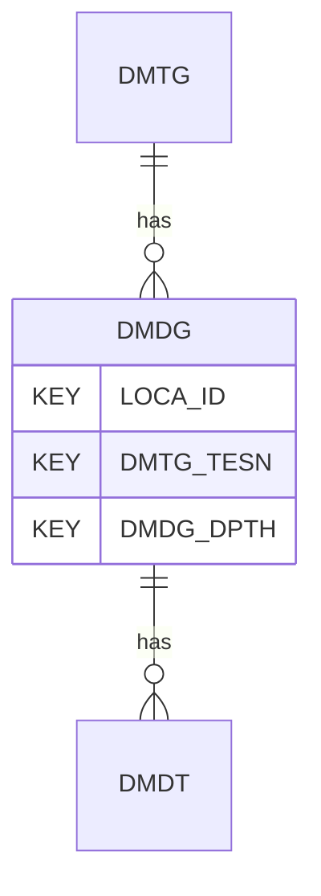

# DMDG — Flat Dilatometer Dissipation Test - General

## Purpose
> [!quote] The **DMDG** group — Flat Dilatometer Dissipation Test - General. It is a **child of [[DMTG]]** in the PROJ-rooted hierarchy. See [[parent-child-graph]].

## Position in the model

- Parent: [[DMTG]]
- Children: [[DMDT]]
- See [[parent-child-graph]] · [[key-tuple-pseudo-keys]] · [[heading-status-vocabulary]]

## Headings
> [!quote] Rendered from `repo:rust-packages/laterite-ags4-reference/data/ags_dictionary.json groups[code=DMDG]` (the repo's model authority — AGS edition 4.2). Suggested UNITs + worked examples are in the cited spec PDF, not duplicated here.

14 heading(s) — `**KEY**` = pseudo-key tuple, `*REQ*` = REQUIRED (non-null, Rule 10b), `DEP` = deprecated, OTHER = scope-dependent.

| Heading | Status | Type | Description |
|---|---|---|---|
| `LOCA_ID` | **KEY** | `ID` | Location identifier |
| `DMTG_TESN` | **KEY** | `X` | Test reference |
| `DMDG_DPTH` | **KEY** | `2DP` | Depth of dissipation test |
| `DMDG_TFLX` | OTHER | `2DP` | Time to point of inflection on dissipation curve (T_flex) |
| `DMDG_CH` | OTHER | `2SCI` | Coefficient of consolidation (c_h), (horizontal), calculated from DMDG_TFLX |
| `DMDG_CHMT` | OTHER | `X` | Method(s) used to determine horizontal coefficient of consolidation |
| `DMDG_MH` | OTHER | `2DP` | Horizontal constrained modulus, M_h |
| `DMDG_MHMT` | OTHER | `X` | Method(s) used to determine horizontal constrained modulus |
| `DMDG_KH` | OTHER | `1SCI` | Horizontal coefficient of permeability (k_h), calculated from DMDG_TFLX |
| `DMDG_KHMT` | OTHER | `X` | Method(s) used to determine horizontal coefficient of permeability |
| `DMDG_DATE` | OTHER | `DT` | Test start date and time |
| `TEST_STAT` | OTHER | `X` | Test status |
| `DMDG_REM` | OTHER | `X` | Note on set up conditions |
| `FILE_FSET` | OTHER | `X` | Associated File Reference |

Full cross-edition heading deltas: AGS Change Log (see [[ags4-rules-frozen-dictionary-evolves]]).

## Relational notes
KEY tuple: `LOCA_ID`, `DMTG_TESN`, `DMDG_DPTH`. Children (1): [[DMDT]]. As a child it **denormalises** its parent's KEY columns into every row; [[rule-10c-parent-child]] re-resolves that repeated tuple upward to [[DMTG]]. See [[key-tuple-pseudo-keys]] · [[denormalised-child-rows]].

## Variations
No group-level change at 4.2 (present across the in-scope editions). Granular per-heading edition deltas live in the AGS online **Change Log** — the spec's own cited delta source (`spec:AGS4-4.2-2025.pdf` Foreword → ags.org.uk/.../change-log). Heading-level archaeology is deferred to a targeted Ingest if a rule/O-N interaction needs it (per [[ags4-rules-frozen-dictionary-evolves]]).

## Related
[[parent-child-graph]] · [[key-tuple-pseudo-keys]] · [[heading-status-vocabulary]] · [[rule-10c-parent-child]] · [[DMTG]] · [[DMDT]]
