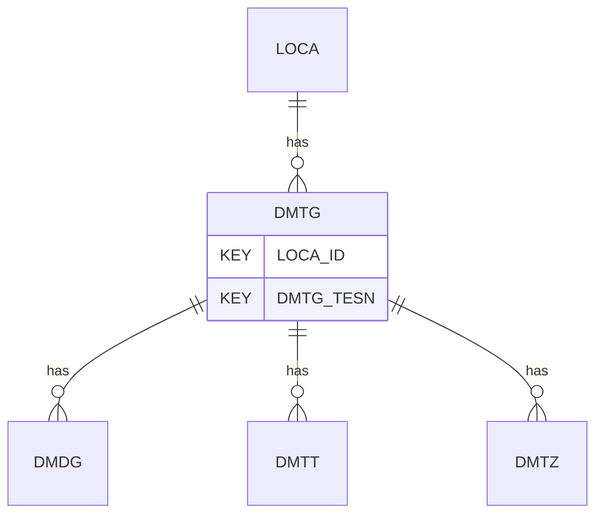

# DMTG — Flat Dilatometer Test - General

## Purpose
> [!quote] The **DMTG** group — Flat Dilatometer Test - General. It is a **child of [[LOCA]]** in the PROJ-rooted hierarchy. See [[parent-child-graph]].

## Position in the model

- Parent: [[LOCA]]
- Children: [[DMDG]] [[DMTT]] [[DMTZ]]
- See [[parent-child-graph]] · [[key-tuple-pseudo-keys]] · [[heading-status-vocabulary]]

## Headings
> [!quote] Rendered from `repo:rust-packages/laterite-ags4-reference/data/ags_dictionary.json groups[code=DMTG]` (the repo's model authority — AGS edition 4.2). Suggested UNITs + worked examples are in the cited spec PDF, not duplicated here.

35 heading(s) — `**KEY**` = pseudo-key tuple, `*REQ*` = REQUIRED (non-null, Rule 10b), `DEP` = deprecated, OTHER = scope-dependent.

| Heading | Status | Type | Description |
|---|---|---|---|
| `LOCA_ID` | **KEY** | `ID` | Location identifier |
| `DMTG_TESN` | **KEY** | `X` | Test reference |
| `DMTG_DATE` | OTHER | `DT` | Test date and time |
| `DMTG_ORNT` | OTHER | `0DP` | Angle that the membrane is pointing to |
| `DMTG_PED` | OTHER | `2DP` | Pre-drilled depth |
| `DMTG_WAT` | OTHER | `2DP` | Depth to groundwater level, z_w at time of test |
| `DMTG_WATA` | OTHER | `X` | Origin of groundwater level in DMTG_WAT |
| `DMTG_TYPE` | OTHER | `PA` | Specific details on type of DMT equipment |
| `DMTG_REFB` | OTHER | `X` | Serial number of blade (if applicable) |
| `DMTG_REFA` | OTHER | `X` | Serial number of the acquisition unit (if applicable) |
| `DMTG_MAN` | OTHER | `X` | Manufacturer of the dilatometer |
| `DMTG_RIG` | OTHER | `X` | Type of penetration rig |
| `DMTG_EQPT` | OTHER | `X` | Mass, reaction and equipment geometry |
| `DMTG_COT` | OTHER | `X` | Method and calibration of thrust measurement |
| `DMTG_TDR` | OTHER | `X` | Type and diameter of penetration rods |
| `DMTG_DIMS` | OTHER | `X` | Geometry and dimensions of the dilatometer, as measured |
| `DMTG_PRSG` | OTHER | `X` | Measuring range of the pressure gauges and zero offset when vented |
| `DMTG_FRIC` | OTHER | `X` | Details of any rod friction reducer, including diameter |
| `DMTG_DITH` | OTHER | `2DP` | Membrane thickness |
| `DMTG_BCVA` | OTHER | `2DP` | Blade calibration value used, delta A |
| `DMTG_BCVB` | OTHER | `2DP` | Blade calibration value used, delta B |
| `DMTG_FAED` | OTHER | `1DP` | Dilatometer modulus (Ed) factor |
| `DMTG_FAS0` | OTHER | `1DP` | Membrane displacement |
| `DMTG_TERM` | OTHER | `X` | Termination reason(s) |
| `DMTG_CORR` | OTHER | `X` | Corrections applied during data processing (e.g. depth corrections, zeros) |
| `DMTG_REM` | OTHER | `X` | Note on set up conditions, comments on testing, types of materials encountered if possible |
| `DMTG_OPER` | OTHER | `X` | Name of test operator |
| `DMTG_ANBY` | OTHER | `X` | Name(s) of analyser / person responsible for data quality and correctness |
| `DMTG_ENV` | OTHER | `X` | Details of weather and environmental conditions during test |
| `DMTG_METH` | OTHER | `X` | Standard followed for testing |
| `DMTG_DEV` | OTHER | `X` | Deviations from the standard followed |
| `DMTG_CONT` | OTHER | `X` | Subcontractors name |
| `DMTG_CRED` | OTHER | `X` | Accrediting body and reference number (when appropriate) |
| `TEST_STAT` | OTHER | `X` | Test status |
| `FILE_FSET` | OTHER | `X` | Associated file reference |

Full cross-edition heading deltas: AGS Change Log (see [[ags4-rules-frozen-dictionary-evolves]]).

## Relational notes
KEY tuple: `LOCA_ID`, `DMTG_TESN`. Children (3): [[DMDG]] [[DMTT]] [[DMTZ]]. As a child it **denormalises** its parent's KEY columns into every row; [[rule-10c-parent-child]] re-resolves that repeated tuple upward to [[LOCA]]. See [[key-tuple-pseudo-keys]] · [[denormalised-child-rows]].

## Variations
No group-level change at 4.2 (present across the in-scope editions). Granular per-heading edition deltas live in the AGS online **Change Log** — the spec's own cited delta source (`spec:AGS4-4.2-2025.pdf` Foreword → ags.org.uk/.../change-log). Heading-level archaeology is deferred to a targeted Ingest if a rule/O-N interaction needs it (per [[ags4-rules-frozen-dictionary-evolves]]).

## Related
[[parent-child-graph]] · [[key-tuple-pseudo-keys]] · [[heading-status-vocabulary]] · [[rule-10c-parent-child]] · [[LOCA]] · [[DMDG]] · [[DMTT]] · [[DMTZ]]
