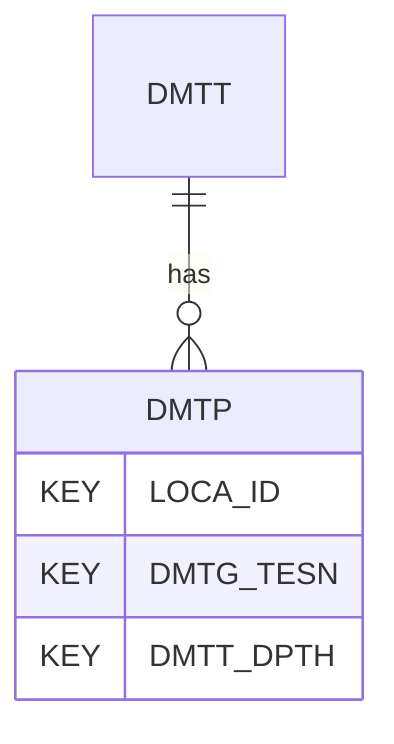

# DMTP — Flat Dilatometer Test - Derived Parameters

## Purpose
> [!quote] The **DMTP** group — Flat Dilatometer Test - Derived Parameters. It is a **child of [[DMTT]]** in the PROJ-rooted hierarchy. See [[parent-child-graph]].

## Position in the model

- Parent: [[DMTT]]
- Children: _none_
- See [[parent-child-graph]] · [[key-tuple-pseudo-keys]] · [[heading-status-vocabulary]]

## Headings
> [!quote] Rendered from `repo:rust-packages/laterite-ags4-reference/data/ags_dictionary.json groups[code=DMTP]` (the repo's model authority — AGS edition 4.2). Suggested UNITs + worked examples are in the cited spec PDF, not duplicated here.

41 heading(s) — `**KEY**` = pseudo-key tuple, `*REQ*` = REQUIRED (non-null, Rule 10b), `DEP` = deprecated, OTHER = scope-dependent.

| Heading | Status | Type | Description |
|---|---|---|---|
| `LOCA_ID` | **KEY** | `ID` | Location identifier |
| `DMTG_TESN` | **KEY** | `X` | Test reference |
| `DMTT_DPTH` | **KEY** | `2DP` | Depth of result |
| `DMTP_BUW` | OTHER | `1DP` | Estimated bulk unit weight of soil, gamma (can be custom or correlation from software) |
| `DMTP_TVS` | OTHER | `0DP` | Estimated total vertical stress, sigma_v, (based on DMTP_BUW) |
| `DMTP_EVS` | OTHER | `0DP` | Estimated effective vertical stress, sigma'_v (Calculated from DMTP_TVS and DMTP_U0 or DMTG_WAT) |
| `DMTP_U0` | OTHER | `1DP` | In situ pore pressure, u_o (can be custom or based on depth below DMTG_WAT) |
| `DMTP_ID` | OTHER | `2DP` | Material index, I_D |
| `DMTP_KD` | OTHER | `1DP` | Horizontal stress index, K_D |
| `DMTP_ED` | OTHER | `1DP` | Dilatometer modulus, E_D |
| `DMTP_UD` | OTHER | `2DP` | Pore pressure index u_D |
| `DMTP_VS` | OTHER | `0DP` | Shear wave velocity (correlated), V_s |
| `DMTP_VDM` | OTHER | `1DP` | Vertical drained constrained modulus, M |
| `DMTP_SU` | OTHER | `0DP` | Undrained shear strength, s_u, fine soils only |
| `DMTP_PHI` | OTHER | `1DP` | Effective angle of internal friction, phi', coarse soils only |
| `DMTP_K0` | OTHER | `2DP` | Coefficient of lateral earth pressure at rest, K_0, fine soils only |
| `DMTP_THS` | OTHER | `0DP` | Estimated total horizontal stress, sigma_h |
| `DMTP_EHS` | OTHER | `0DP` | Estimated effective horizontal stress, sigma'_h |
| `DMTP_OCR` | OTHER | `1DP` | Over-consolidation ratio, OCR, fine soils only |
| `DMTP_MPS` | OTHER | `1DP` | Estimated maximum preconsolidation stress, sigma'_p, (calculated from DMTP_OCR and DMTP_EVS) |
| `DMTP_DSD` | OTHER | `X` | Interpreted soil description |
| `DMTP_BUWM` | OTHER | `X` | Method for estimated bulk unit weight of soil, gamma_b |
| `DMTP_TVSM` | OTHER | `X` | Method for estimated total vertical stress, sigma_v |
| `DMTP_EVSM` | OTHER | `X` | Method for estimated effective vertical stress, sigma'_v |
| `DMTP_U0M` | OTHER | `X` | Method for in situ pore pressure, u_o |
| `DMTP_IDM` | OTHER | `X` | Method for material index, I_D |
| `DMTP_KDM` | OTHER | `X` | Method for horizontal stress index, K_D |
| `DMTP_EDM` | OTHER | `X` | Method for dilatometer modulus, E_D |
| `DMTP_UDM` | OTHER | `X` | Method for pore pressure index u_D |
| `DMTP_VSM` | OTHER | `X` | Method for shear wave velocity (correlated), V_s |
| `DMTP_VDMM` | OTHER | `X` | Method for vertical drained constrained modulus, M |
| `DMTP_SUM` | OTHER | `X` | Method for undrained shear strength, s_u, fine soils only |
| `DMTP_PHIM` | OTHER | `X` | Method for effective angle of internal friction, phi', coarse soils only |
| `DMTP_K0M` | OTHER | `X` | Method for coefficient of lateral earth pressure at rest, K_0, fine soils only |
| `DMTP_THSM` | OTHER | `X` | Method for estimated total horizontal stress, sigma_h |
| `DMTP_EHSM` | OTHER | `X` | Method for estimated effective horizontal stress, sigma'_h |
| `DMTP_OCRM` | OTHER | `X` | Method for over-consolidation ratio, OCR, fine soils only |
| `DMTP_MPSM` | OTHER | `X` | Method for estimated maximum preconsolidation stress, sigma'_p, (calculated from DMTP_OCR and DMTP_EVS) |
| `DMTP_DSDM` | OTHER | `X` | Method for interpreted soil description |
| `DMTP_REM` | OTHER | `X` | Remarks |
| `FILE_FSET` | OTHER | `X` | Associated file reference |

Full cross-edition heading deltas: AGS Change Log (see [[ags4-rules-frozen-dictionary-evolves]]).

## Relational notes
KEY tuple: `LOCA_ID`, `DMTG_TESN`, `DMTT_DPTH`. Children (0): _none_. As a child it **denormalises** its parent's KEY columns into every row; [[rule-10c-parent-child]] re-resolves that repeated tuple upward to [[DMTT]]. See [[key-tuple-pseudo-keys]] · [[denormalised-child-rows]].

## Variations
No group-level change at 4.2 (present across the in-scope editions). Granular per-heading edition deltas live in the AGS online **Change Log** — the spec's own cited delta source (`spec:AGS4-4.2-2025.pdf` Foreword → ags.org.uk/.../change-log). Heading-level archaeology is deferred to a targeted Ingest if a rule/O-N interaction needs it (per [[ags4-rules-frozen-dictionary-evolves]]).

## Related
[[parent-child-graph]] · [[key-tuple-pseudo-keys]] · [[heading-status-vocabulary]] · [[rule-10c-parent-child]] · [[DMTT]]
