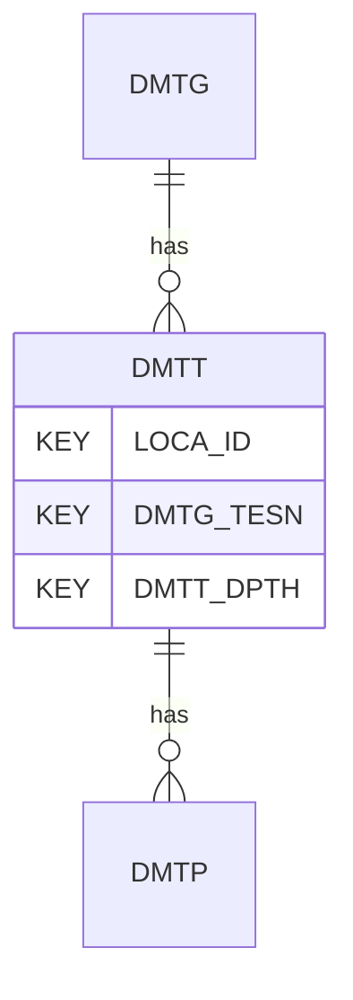

# DMTT — Flat Dilatometer Test - Data

## Purpose
> [!quote] The **DMTT** group — Flat Dilatometer Test - Data. It is a **child of [[DMTG]]** in the PROJ-rooted hierarchy. See [[parent-child-graph]].

## Position in the model

- Parent: [[DMTG]]
- Children: [[DMTP]]
- See [[parent-child-graph]] · [[key-tuple-pseudo-keys]] · [[heading-status-vocabulary]]

## Headings
> [!quote] Rendered from `repo:rust-packages/laterite-ags4-reference/data/ags_dictionary.json groups[code=DMTT]` (the repo's model authority — AGS edition 4.2). Suggested UNITs + worked examples are in the cited spec PDF, not duplicated here.

21 heading(s) — `**KEY**` = pseudo-key tuple, `*REQ*` = REQUIRED (non-null, Rule 10b), `DEP` = deprecated, OTHER = scope-dependent.

| Heading | Status | Type | Description |
|---|---|---|---|
| `LOCA_ID` | **KEY** | `ID` | Location identifier |
| `DMTG_TESN` | **KEY** | `X` | Test reference |
| `DMTT_DPTH` | **KEY** | `2DP` | Depth of result |
| `DMTT_MTH` | OTHER | `0DP` | Thrust |
| `DMTT_BCVA` | OTHER | `2DP` | Blade calibration value for specific depth record, delta A |
| `DMTT_BCVB` | OTHER | `2DP` | Blade calibration value for specific depth record, delta B |
| `DMTT_TMST` | OTHER | `DT` | Pressurisation start time |
| `DMTT_A` | OTHER | `2DP` | A-pressure test reading |
| `DMTT_TMA` | OTHER | `1DP` | A-position time since start of pressurisation |
| `DMTT_B` | OTHER | `2DP` | B-pressure test reading |
| `DMTT_TMB` | OTHER | `1DP` | B-position time since start of pressurisation |
| `DMTT_C` | OTHER | `2DP` | C-pressure test reading |
| `DMTT_TMC` | OTHER | `1DP` | C-position time since start of pressurisation |
| `DMTT_P0` | OTHER | `0DP` | Corrected test reading A, p_0 |
| `DMTT_P1` | OTHER | `0DP` | Corrected test reading B, p_1 |
| `DMTT_P2` | OTHER | `0DP` | Corrected test reading C, p_2 |
| `DMTT_INCX` | OTHER | `1DP` | Inclination 1 (the axis through the membrane) |
| `DMTT_INCY` | OTHER | `1DP` | Inclination 2 (the axis across the width of the blade) |
| `DMTT_RATE` | OTHER | `0DP` | Penetration rate |
| `DMTT_REM` | OTHER | `X` | Remarks on specific depth readings |
| `FILE_FSET` | OTHER | `X` | Associated file reference |

Full cross-edition heading deltas: AGS Change Log (see [[ags4-rules-frozen-dictionary-evolves]]).

## Relational notes
KEY tuple: `LOCA_ID`, `DMTG_TESN`, `DMTT_DPTH`. Children (1): [[DMTP]]. As a child it **denormalises** its parent's KEY columns into every row; [[rule-10c-parent-child]] re-resolves that repeated tuple upward to [[DMTG]]. See [[key-tuple-pseudo-keys]] · [[denormalised-child-rows]].

## Variations
No group-level change at 4.2 (present across the in-scope editions). Granular per-heading edition deltas live in the AGS online **Change Log** — the spec's own cited delta source (`spec:AGS4-4.2-2025.pdf` Foreword → ags.org.uk/.../change-log). Heading-level archaeology is deferred to a targeted Ingest if a rule/O-N interaction needs it (per [[ags4-rules-frozen-dictionary-evolves]]).

## Related
[[parent-child-graph]] · [[key-tuple-pseudo-keys]] · [[heading-status-vocabulary]] · [[rule-10c-parent-child]] · [[DMTG]] · [[DMTP]]
