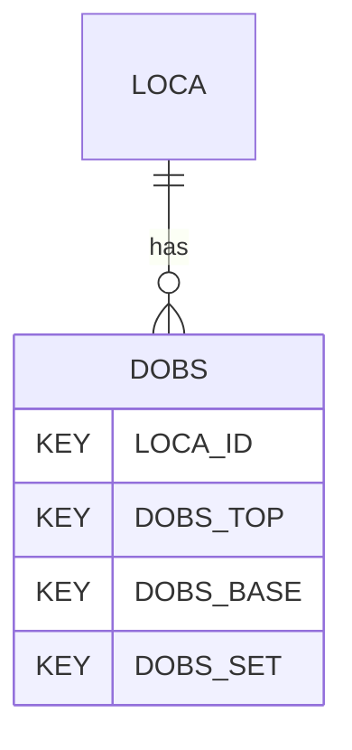

# DOBS — Drilling/Advancement Observations & Parameters

## Purpose
> [!quote] The **DOBS** group — Drilling/Advancement Observations & Parameters. It is a **child of [[LOCA]]** in the PROJ-rooted hierarchy. See [[parent-child-graph]].

## Position in the model

- Parent: [[LOCA]]
- Children: _none_
- See [[parent-child-graph]] · [[key-tuple-pseudo-keys]] · [[heading-status-vocabulary]]

## Headings
> [!quote] Rendered from `repo:rust-packages/laterite-ags4-reference/data/ags_dictionary.json groups[code=DOBS]` (the repo's model authority — AGS edition 4.2). Suggested UNITs + worked examples are in the cited spec PDF, not duplicated here.

25 heading(s) — `**KEY**` = pseudo-key tuple, `*REQ*` = REQUIRED (non-null, Rule 10b), `DEP` = deprecated, OTHER = scope-dependent.

| Heading | Status | Type | Description |
|---|---|---|---|
| `LOCA_ID` | **KEY** | `ID` | Location identifier |
| `DOBS_TOP` | **KEY** | `2DP` | Depth to top of reported section |
| `DOBS_BASE` | **KEY** | `2DP` | Depth to base of reported section |
| `DOBS_SET` | **KEY** | `X` | Readings set reference |
| `DOBS_DURN` | OTHER | `T` | Duration to advance reported section |
| `DOBS_STIM` | OTHER | `DT` | Date and time of start of reported section |
| `DOBS_ETIM` | OTHER | `DT` | Date and time at end of reported section |
| `DOBS_DHRT` | OTHER | `1DP` | Drill head rotational torque |
| `DOBS_DHRS` | OTHER | `0DP` | Drill head rotational speed |
| `DOBS_PENR` | OTHER | `1DP` | Penetration rate |
| `DOBS_HAMM` | OTHER | `YN` | Hammering used during section |
| `DOBS_THRP` | OTHER | `1DP` | Pressure of downthrust system |
| `DOBS_RESP` | OTHER | `1DP` | Pressure of restraining (holdback) system |
| `DOBS_TORP` | OTHER | `1DP` | Torque pressure |
| `DOBS_TORQ` | OTHER | `1DP` | Torque applied to top of drill rods |
| `DOBS_THST` | OTHER | `1DP` | Downward thrust on bit |
| `DOBS_REST` | OTHER | `1DP` | Restraining (holdback) force |
| `DOBS_HAMP` | OTHER | `1DP` | Supply pressure to downhole hammer |
| `DOBS_SPEN` | OTHER | `1DP` | Specific energy |
| `DOBS_FMPO` | OTHER | `1DP` | Flushing medium pressure at the output of the pump over flush zone |
| `DOBS_FMCR` | OTHER | `1DP` | Flushing medium circulation rate (input) over flush zone |
| `DOBS_FMRR` | OTHER | `1DP` | Flushing medium recovery rate over flush zone |
| `DOBS_REM` | OTHER | `X` | Remarks |
| `FILE_FSET` | OTHER | `X` | Associated file reference (e.g. drilling journals or log files) |
| `DOBS_METH` | OTHER | `X` | Measurement method |

Full cross-edition heading deltas: AGS Change Log (see [[ags4-rules-frozen-dictionary-evolves]]).

## Relational notes
KEY tuple: `LOCA_ID`, `DOBS_TOP`, `DOBS_BASE`, `DOBS_SET`. Children (0): _none_. As a child it **denormalises** its parent's KEY columns into every row; [[rule-10c-parent-child]] re-resolves that repeated tuple upward to [[LOCA]]. See [[key-tuple-pseudo-keys]] · [[denormalised-child-rows]].

## Variations
No group-level change at 4.2 (present across the in-scope editions). Granular per-heading edition deltas live in the AGS online **Change Log** — the spec's own cited delta source (`spec:AGS4-4.2-2025.pdf` Foreword → ags.org.uk/.../change-log). Heading-level archaeology is deferred to a targeted Ingest if a rule/O-N interaction needs it (per [[ags4-rules-frozen-dictionary-evolves]]).

## Related
[[parent-child-graph]] · [[key-tuple-pseudo-keys]] · [[heading-status-vocabulary]] · [[rule-10c-parent-child]] · [[LOCA]]
