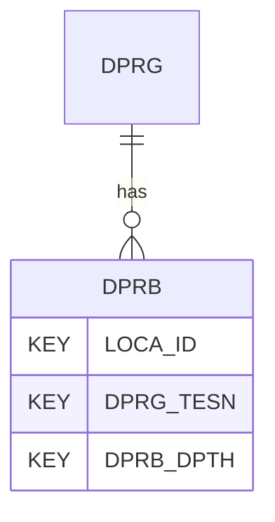

# DPRB — Dynamic Probe Tests - Data

## Purpose
> [!quote] The **DPRB** group — Dynamic Probe Tests - Data. It is a **child of [[DPRG]]** in the PROJ-rooted hierarchy. See [[parent-child-graph]].

## Position in the model

- Parent: [[DPRG]]
- Children: _none_
- See [[parent-child-graph]] · [[key-tuple-pseudo-keys]] · [[heading-status-vocabulary]]

## Headings
> [!quote] Rendered from `repo:rust-packages/laterite-ags4-reference/data/ags_dictionary.json groups[code=DPRB]` (the repo's model authority — AGS edition 4.2). Suggested UNITs + worked examples are in the cited spec PDF, not duplicated here.

10 heading(s) — `**KEY**` = pseudo-key tuple, `*REQ*` = REQUIRED (non-null, Rule 10b), `DEP` = deprecated, OTHER = scope-dependent.

| Heading | Status | Type | Description |
|---|---|---|---|
| `LOCA_ID` | **KEY** | `ID` | Location identifier |
| `DPRG_TESN` | **KEY** | `X` | Test reference |
| `DPRB_DPTH` | **KEY** | `2DP` | Depth to start of dynamic probe increment |
| `DPRB_BLOW` | OTHER | `0DP` | Dynamic probe blows for increment DPRB_INC |
| `DPRB_CBLW` | OTHER | `0DP` | Cumulative blows for test |
| `DPRB_TORQ` | OTHER | `0DP` | Maximum torque required to rotate rods |
| `DPRB_DEL` | OTHER | `T` | Delay before increment started |
| `DPRB_INC` | OTHER | `0DP` | Dynamic probe increment |
| `DPRB_REM` | OTHER | `X` | Notes on events during increment |
| `FILE_FSET` | OTHER | `X` | Associated file reference |

Full cross-edition heading deltas: AGS Change Log (see [[ags4-rules-frozen-dictionary-evolves]]).

## Relational notes
KEY tuple: `LOCA_ID`, `DPRG_TESN`, `DPRB_DPTH`. Children (0): _none_. As a child it **denormalises** its parent's KEY columns into every row; [[rule-10c-parent-child]] re-resolves that repeated tuple upward to [[DPRG]]. See [[key-tuple-pseudo-keys]] · [[denormalised-child-rows]].

## Variations
No group-level change at 4.2 (present across the in-scope editions). Granular per-heading edition deltas live in the AGS online **Change Log** — the spec's own cited delta source (`spec:AGS4-4.2-2025.pdf` Foreword → ags.org.uk/.../change-log). Heading-level archaeology is deferred to a targeted Ingest if a rule/O-N interaction needs it (per [[ags4-rules-frozen-dictionary-evolves]]).

## Related
[[parent-child-graph]] · [[key-tuple-pseudo-keys]] · [[heading-status-vocabulary]] · [[rule-10c-parent-child]] · [[DPRG]]
