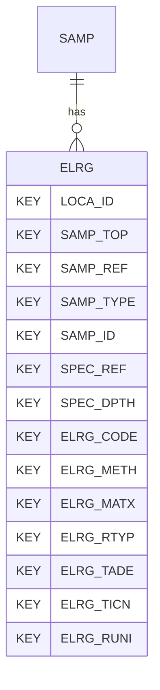

# ELRG — Environmental Laboratory Reporting

## Purpose
> [!quote] The **ELRG** group — Environmental Laboratory Reporting. It is a **child of [[SAMP]]** in the PROJ-rooted hierarchy. See [[parent-child-graph]].

## Position in the model

- Parent: [[SAMP]]
- Children: _none_
- See [[parent-child-graph]] · [[key-tuple-pseudo-keys]] · [[heading-status-vocabulary]]

## Headings
> [!quote] Rendered from `repo:rust-packages/laterite-ags4-reference/data/ags_dictionary.json groups[code=ELRG]` (the repo's model authority — AGS edition 4.2). Suggested UNITs + worked examples are in the cited spec PDF, not duplicated here.

58 heading(s) — `**KEY**` = pseudo-key tuple, `*REQ*` = REQUIRED (non-null, Rule 10b), `DEP` = deprecated, OTHER = scope-dependent.

| Heading | Status | Type | Description |
|---|---|---|---|
| `LOCA_ID` | **KEY** | `ID` | Location identifier |
| `SAMP_TOP` | **KEY** | `2DP` | Depth to top of sample |
| `SAMP_REF` | **KEY** | `X` | Sample reference |
| `SAMP_TYPE` | **KEY** | `PA` | Sample type |
| `SAMP_ID` | **KEY** | `ID` | Sample unique identifier |
| `SPEC_REF` | **KEY** | `X` | Specimen reference |
| `SPEC_DPTH` | **KEY** | `2DP` | Depth to top of test specimen |
| `ELRG_CODE` | **KEY** | `PA` | Determinand code |
| `ELRG_METH` | **KEY** | `X` | Test method |
| `ELRG_MATX` | **KEY** | `PA` | Laboratory test matrix |
| `ELRG_RTYP` | **KEY** | `PA` | Run type (initial or reanalysis) |
| `ELRG_TADE` | **KEY** | `PA` | Test additional descriptor |
| `ELRG_TICN` | **KEY** | `X` | Tentatively identified compound (TIC) |
| `ELRG_RUNI` | **KEY** | `PU` | Result unit |
| `SPEC_DESC` | OTHER | `X` | Specimen description |
| `SPEC_PREP` | OTHER | `X` | Details of specimen preparation including time between preparation and testing |
| `SPEC_BASE` | OTHER | `2DP` | Depth to base of specimen |
| `ELRG_LSID` | OTHER | `X` | Laboratory sample ID |
| `ELRG_RTCD` | OTHER | `PA` | Result type |
| `ELRG_IQLF` | OTHER | `X` | Interpreted qualifiers |
| `ELRG_LQLF` | OTHER | `X` | Laboratory qualifiers |
| `ELRG_RVAL` | OTHER | `U` | Result value |
| `ELRG_RTXT` | OTHER | `X` | Reported result |
| `ELRG_NAME` | OTHER | `X` | Determinand name |
| `ELRG_TNAM` | OTHER | `X` | Laboratory analytical name |
| `ELRG_DCAT` | OTHER | `X` | Determinand category |
| `ELRG_TESN` | OTHER | `X` | Test reference |
| `ELRG_FDEV` | OTHER | `YN` | Flagged deviation |
| `ELRG_DEV` | OTHER | `X` | Result deviation description(s) |
| `ELRG_RRES` | OTHER | `YN` | Reportable result |
| `ELRG_DETF` | OTHER | `YN` | Detect flag |
| `ELRG_ORG` | OTHER | `YN` | Organic |
| `ELRG_RDLM` | OTHER | `U` | Reporting detection limit |
| `ELRG_MDLM` | OTHER | `U` | Method detection limit |
| `ELRG_QLM` | OTHER | `U` | Quantification limit |
| `ELRG_DUNI` | OTHER | `PU` | Unit of detection/quantification limits |
| `ELRG_CASC` | OTHER | `X` | CAS code |
| `ELRG_TICP` | OTHER | `0DP` | Tentatively identified compound (TIC) probability |
| `ELRG_TICT` | OTHER | `0DP` | Tentatively identified compound (TIC) retention time |
| `ELRG_RDAT` | OTHER | `DT` | Sample receipt date/time at laboratory |
| `ELRG_SGRP` | OTHER | `X` | Sample delivery or batch code |
| `ELRG_DTIM` | OTHER | `DT` | Analysis date and time |
| `ELRG_TEST` | OTHER | `X` | Test or Suite Name |
| `ELRG_TORD` | OTHER | `X` | Total or dissolved |
| `ELRG_LOCN` | OTHER | `PA` | Analysis location |
| `ELRG_BAS` | OTHER | `PA` | Basis |
| `ELRG_DIL` | OTHER | `0DP` | Dilution factor |
| `ELRG_LMTH` | OTHER | `X` | Leachate preparation method |
| `ELRG_LDTM` | OTHER | `DT` | Leachate preparation date and time |
| `ELRG_IREF` | OTHER | `X` | Instrument reference number or identifier |
| `ELRG_ITYP` | OTHER | `X` | Instrument type |
| `ELRG_SIZE` | OTHER | `0DP` | Size of material removed prior to test; value given indicates lowest sized material removed |
| `ELRG_PERP` | OTHER | `1DP` | Percentage of material removed |
| `ELRG_REM` | OTHER | `X` | Remarks |
| `ELRG_LAB` | OTHER | `X` | Name of testing laboratory/organization |
| `ELRG_CRED` | OTHER | `X` | Accrediting body and reference number (when appropriate) |
| `TEST_STAT` | OTHER | `X` | Test status |
| `FILE_FSET` | OTHER | `X` | Associated file reference (e.g. test result sheets) |

Full cross-edition heading deltas: AGS Change Log (see [[ags4-rules-frozen-dictionary-evolves]]).

## Relational notes
KEY tuple: `LOCA_ID`, `SAMP_TOP`, `SAMP_REF`, `SAMP_TYPE`, `SAMP_ID`, `SPEC_REF`, `SPEC_DPTH`, `ELRG_CODE`, `ELRG_METH`, `ELRG_MATX`, `ELRG_RTYP`, `ELRG_TADE`, `ELRG_TICN`, `ELRG_RUNI`. Children (0): _none_. As a child it **denormalises** its parent's KEY columns into every row; [[rule-10c-parent-child]] re-resolves that repeated tuple upward to [[SAMP]]. See [[key-tuple-pseudo-keys]] · [[denormalised-child-rows]].

## Variations
No group-level change at 4.2 (present across the in-scope editions). Granular per-heading edition deltas live in the AGS online **Change Log** — the spec's own cited delta source (`spec:AGS4-4.2-2025.pdf` Foreword → ags.org.uk/.../change-log). Heading-level archaeology is deferred to a targeted Ingest if a rule/O-N interaction needs it (per [[ags4-rules-frozen-dictionary-evolves]]).

## Related
[[parent-child-graph]] · [[key-tuple-pseudo-keys]] · [[heading-status-vocabulary]] · [[rule-10c-parent-child]] · [[SAMP]]
