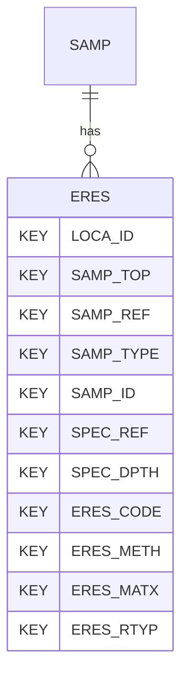

# ERES — Environmental Contaminant Testing

## Purpose
> [!quote] The **ERES** group — Environmental Contaminant Testing. It is a **child of [[SAMP]]** in the PROJ-rooted hierarchy. See [[parent-child-graph]].

## Position in the model

- Parent: [[SAMP]]
- Children: _none_
- See [[parent-child-graph]] · [[key-tuple-pseudo-keys]] · [[heading-status-vocabulary]]

## Headings
> [!quote] Rendered from `repo:rust-packages/laterite-ags4-reference/data/ags_dictionary.json groups[code=ERES]` (the repo's model authority — AGS edition 4.2). Suggested UNITs + worked examples are in the cited spec PDF, not duplicated here.

49 heading(s) — `**KEY**` = pseudo-key tuple, `*REQ*` = REQUIRED (non-null, Rule 10b), `DEP` = deprecated, OTHER = scope-dependent.

| Heading | Status | Type | Description |
|---|---|---|---|
| `LOCA_ID` | **KEY** | `ID` | Location Identifier |
| `SAMP_TOP` | **KEY** | `2DP` | Depth to top of sample |
| `SAMP_REF` | **KEY** | `X` | Sample reference |
| `SAMP_TYPE` | **KEY** | `PA` | Sample type |
| `SAMP_ID` | **KEY** | `ID` | Sample unique identifier |
| `SPEC_REF` | **KEY** | `X` | Laboratory specimen reference or Laboratory ID |
| `SPEC_DPTH` | **KEY** | `2DP` | Depth to top of test specimen |
| `ERES_CODE` | **KEY** | `PA` | Chemical code |
| `ERES_METH` | **KEY** | `X` | Test method |
| `ERES_MATX` | **KEY** | `PA` | Laboratory test matrix |
| `ERES_RTYP` | **KEY** | `PA` | Run type (Initial or Reanalysis) |
| `ERES_TESN` | OTHER | `X` | Test reference |
| `ERES_NAME` | OTHER | `X` | Chemical name |
| `ERES_TNAM` | OTHER | `X` | Laboratory analytical test name |
| `ERES_RVAL` | OTHER | `U` | Result value |
| `ERES_RUNI` | *REQ* | `PU` | Result unit |
| `ERES_RTXT` | OTHER | `X` | Reported result |
| `ERES_RTCD` | OTHER | `PA` | Result type |
| `ERES_RRES` | OTHER | `YN` | Reportable result |
| `ERES_DETF` | OTHER | `YN` | Detect flag |
| `ERES_ORG` | OTHER | `YN` | Organic |
| `ERES_IQLF` | OTHER | `X` | Interpreted qualifiers |
| `ERES_LQLF` | OTHER | `X` | Laboratory qualifiers |
| `ERES_RDLM` | OTHER | `U` | Reporting detection limit |
| `ERES_MDLM` | OTHER | `U` | Method detection limit |
| `ERES_QLM` | OTHER | `U` | Quantification limit |
| `ERES_DUNI` | OTHER | `PU` | Unit of detection/quantification limits |
| `ERES_TICP` | OTHER | `0DP` | Tentatively Identified Compound (TIC) probability |
| `ERES_TICT` | OTHER | `0DP` | Tentatively Identified Compound (TIC) retention time |
| `ERES_RDAT` | OTHER | `DT` | Sample receipt date at laboratory |
| `ERES_SGRP` | OTHER | `X` | Sample delivery or batch code |
| `SPEC_PREP` | OTHER | `X` | Details of specimen preparation including time between preparation and testing |
| `SPEC_DESC` | OTHER | `X` | Specimen description |
| `ERES_DTIM` | OTHER | `DT` | Analysis date and time date |
| `ERES_TEST` | OTHER | `X` | Test Name as defined in LBST_TEST during electronic scheduling |
| `ERES_TORD` | OTHER | `X` | Total or dissolved |
| `ERES_LOCN` | OTHER | `PA` | Analysis location |
| `ERES_BAS` | OTHER | `PA` | Basis |
| `ERES_DIL` | OTHER | `0DP` | Dilution factor |
| `ERES_LMTH` | OTHER | `X` | Leachate preparation method |
| `ERES_LDTM` | OTHER | `DT` | Leachate preparation date and time |
| `ERES_IREF` | OTHER | `X` | Instrument Reference No or Identifier |
| `ERES_SIZE` | OTHER | `0DP` | Size of material removed prior to test; value given indicates lowest sized material removed |
| `ERES_PERP` | OTHER | `1DP` | Percentage of material removed |
| `ERES_REM` | OTHER | `X` | Remarks |
| `ERES_LAB` | OTHER | `X` | Name of testing laboratory/organization |
| `ERES_CRED` | OTHER | `X` | Accrediting body and reference number (when appropriate) |
| `TEST_STAT` | OTHER | `X` | Test status |
| `FILE_FSET` | OTHER | `X` | Associated file reference (e.g. test result sheets) |

Full cross-edition heading deltas: AGS Change Log (see [[ags4-rules-frozen-dictionary-evolves]]).

## Relational notes
KEY tuple: `LOCA_ID`, `SAMP_TOP`, `SAMP_REF`, `SAMP_TYPE`, `SAMP_ID`, `SPEC_REF`, `SPEC_DPTH`, `ERES_CODE`, `ERES_METH`, `ERES_MATX`, `ERES_RTYP`. Children (0): _none_. As a child it **denormalises** its parent's KEY columns into every row; [[rule-10c-parent-child]] re-resolves that repeated tuple upward to [[SAMP]]. See [[key-tuple-pseudo-keys]] · [[denormalised-child-rows]].

## Variations
> [!warning] **REMOVED in AGS 4.2** (`spec:AGS4-4.2-2025.pdf` Foreword). Present only in 4.0.3–4.1.1 files; superseded by ELRG.

Files using this group are valid ≤4.1.1, invalid under 4.2 — a concrete edition-dependent validation divergence (Phase D probe candidate).

## Related
[[parent-child-graph]] · [[key-tuple-pseudo-keys]] · [[heading-status-vocabulary]] · [[rule-10c-parent-child]] · [[SAMP]]
