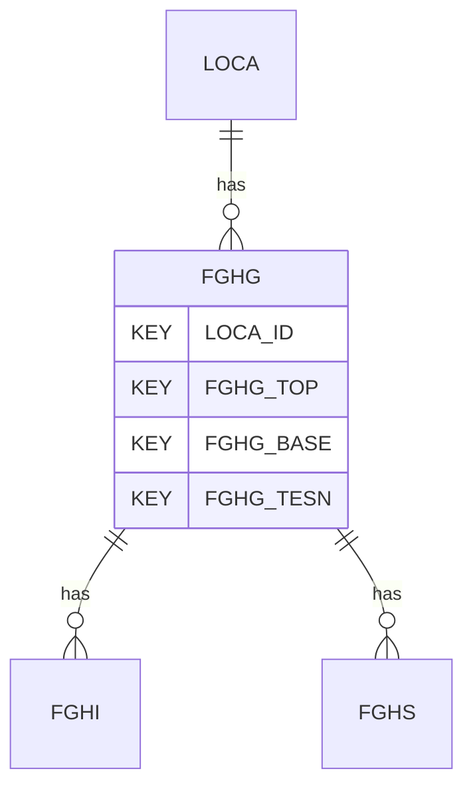

# FGHG — Field Geohydraulic Testing - General

## Purpose
> [!quote] The **FGHG** group — Field Geohydraulic Testing - General. It is a **child of [[LOCA]]** in the PROJ-rooted hierarchy. See [[parent-child-graph]].

## Position in the model

- Parent: [[LOCA]]
- Children: [[FGHI]] [[FGHS]]
- See [[parent-child-graph]] · [[key-tuple-pseudo-keys]] · [[heading-status-vocabulary]]

## Headings
> [!quote] Rendered from `repo:rust-packages/laterite-ags4-reference/data/ags_dictionary.json groups[code=FGHG]` (the repo's model authority — AGS edition 4.2). Suggested UNITs + worked examples are in the cited spec PDF, not duplicated here.

29 heading(s) — `**KEY**` = pseudo-key tuple, `*REQ*` = REQUIRED (non-null, Rule 10b), `DEP` = deprecated, OTHER = scope-dependent.

| Heading | Status | Type | Description |
|---|---|---|---|
| `LOCA_ID` | **KEY** | `ID` | Location identifier |
| `FGHG_TOP` | **KEY** | `2DP` | Depth to top of test zone |
| `FGHG_BASE` | **KEY** | `2DP` | Depth to base of test zone |
| `FGHG_TESN` | **KEY** | `X` | Test reference |
| `FGHG_TDIA` | OTHER | `0DP` | Diameter of test zone |
| `FGHG_SDIA` | OTHER | `0DP` | Inside diameter of installation standpipe or borehole casing |
| `FGHG_ODIA` | OTHER | `0DP` | Outside diameter of installation standpipe or borehole casing |
| `FGHG_HBAS` | OTHER | `2DP` | Depth of borehole during test (excluding tests in installations) |
| `FGHG_CAS` | OTHER | `2DP` | Depth of casing during test (excluding tests in installations) |
| `FGHG_SFAC` | OTHER | `2DP` | Shape factor for test zone |
| `FGHG_SFRF` | OTHER | `X` | Shape factor reference |
| `FGHG_DATE` | OTHER | `DT` | Test date |
| `FGHG_TYPE` | OTHER | `PA` | Type of test |
| `FGHG_CNFG` | OTHER | `PA` | Test configuration |
| `FGHG_METH` | OTHER | `X` | Test method |
| `FGHG_PRWL` | OTHER | `2DP` | Depth to water in borehole or installation prior to test |
| `FGHG_AWL` | OTHER | `2DP` | Depth to assumed standing water level used for calculations of head during test |
| `FGHG_HEAD` | OTHER | `2DP` | Applied total head of water at centre of test zone |
| `FGHG_FLOW` | OTHER | `1DP` | Average flow rate during test |
| `FGHG_IPRM` | OTHER | `1SCI` | Representative permeability for test |
| `FGHG_ILUG` | OTHER | `XN` | Representative Lugeon value for water pressure test |
| `FGHG_FTYP` | OTHER | `PA` | Flow type for water pressure test |
| `FGHG_REM` | OTHER | `X` | Test remarks |
| `FGHG_ENV` | OTHER | `X` | Details of weather and environmental conditions during test |
| `FGHG_CONT` | OTHER | `X` | Name of testing organization |
| `FGHG_OPER` | OTHER | `X` | Name of test operator |
| `FGHG_CRED` | OTHER | `X` | Accrediting body and reference number (when appropriate) |
| `TEST_STAT` | OTHER | `X` | Test status |
| `FILE_FSET` | OTHER | `X` | Associated file reference (e.g. equipment calibrations) |

Full cross-edition heading deltas: AGS Change Log (see [[ags4-rules-frozen-dictionary-evolves]]).

## Relational notes
KEY tuple: `LOCA_ID`, `FGHG_TOP`, `FGHG_BASE`, `FGHG_TESN`. Children (2): [[FGHI]] [[FGHS]]. As a child it **denormalises** its parent's KEY columns into every row; [[rule-10c-parent-child]] re-resolves that repeated tuple upward to [[LOCA]]. See [[key-tuple-pseudo-keys]] · [[denormalised-child-rows]].

## Variations
No group-level change at 4.2 (present across the in-scope editions). Granular per-heading edition deltas live in the AGS online **Change Log** — the spec's own cited delta source (`spec:AGS4-4.2-2025.pdf` Foreword → ags.org.uk/.../change-log). Heading-level archaeology is deferred to a targeted Ingest if a rule/O-N interaction needs it (per [[ags4-rules-frozen-dictionary-evolves]]).

## Related
[[parent-child-graph]] · [[key-tuple-pseudo-keys]] · [[heading-status-vocabulary]] · [[rule-10c-parent-child]] · [[LOCA]] · [[FGHI]] · [[FGHS]]
