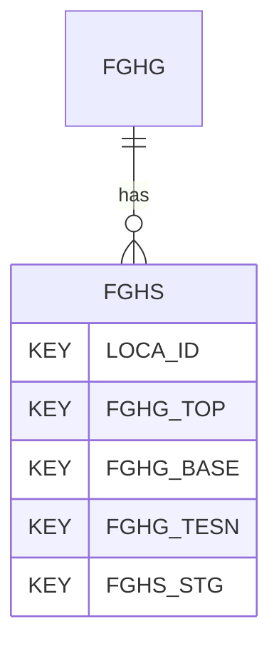

# FGHS — Field Geohydraulic Testing - Test Results (per stage)

## Purpose
> [!quote] The **FGHS** group — Field Geohydraulic Testing - Test Results (per stage). It is a **child of [[FGHG]]** in the PROJ-rooted hierarchy. See [[parent-child-graph]].

## Position in the model

- Parent: [[FGHG]]
- Children: _none_
- See [[parent-child-graph]] · [[key-tuple-pseudo-keys]] · [[heading-status-vocabulary]]

## Headings
> [!quote] Rendered from `repo:rust-packages/laterite-ags4-reference/data/ags_dictionary.json groups[code=FGHS]` (the repo's model authority — AGS edition 4.2). Suggested UNITs + worked examples are in the cited spec PDF, not duplicated here.

13 heading(s) — `**KEY**` = pseudo-key tuple, `*REQ*` = REQUIRED (non-null, Rule 10b), `DEP` = deprecated, OTHER = scope-dependent.

| Heading | Status | Type | Description |
|---|---|---|---|
| `LOCA_ID` | **KEY** | `ID` | Location identifier |
| `FGHG_TOP` | **KEY** | `2DP` | Depth to top of test zone |
| `FGHG_BASE` | **KEY** | `2DP` | Depth to base of test zone |
| `FGHG_TESN` | **KEY** | `X` | Test reference |
| `FGHS_STG` | **KEY** | `0DP` | Stage number of multistage test |
| `FGHS_STTM` | OTHER | `DT` | Start of stage date / time |
| `FGHS_ENTM` | OTHER | `DT` | End of stage date / time |
| `FGHS_HEAD` | OTHER | `2DP` | Applied head of water during test stage at centre of test zone |
| `FGHS_FLOW` | OTHER | `1DP` | Average flow rate during test stage |
| `FGHS_IPRM` | OTHER | `1SCI` | Permeability for test stage |
| `FGHS_ILUG` | OTHER | `XN` | Lugeon value for test stage |
| `FGHS_REM` | OTHER | `X` | Test remarks |
| `FILE_FSET` | OTHER | `X` | Associated file reference (e.g. equipment calibrations) |

Full cross-edition heading deltas: AGS Change Log (see [[ags4-rules-frozen-dictionary-evolves]]).

## Relational notes
KEY tuple: `LOCA_ID`, `FGHG_TOP`, `FGHG_BASE`, `FGHG_TESN`, `FGHS_STG`. Children (0): _none_. As a child it **denormalises** its parent's KEY columns into every row; [[rule-10c-parent-child]] re-resolves that repeated tuple upward to [[FGHG]]. See [[key-tuple-pseudo-keys]] · [[denormalised-child-rows]].

## Variations
No group-level change at 4.2 (present across the in-scope editions). Granular per-heading edition deltas live in the AGS online **Change Log** — the spec's own cited delta source (`spec:AGS4-4.2-2025.pdf` Foreword → ags.org.uk/.../change-log). Heading-level archaeology is deferred to a targeted Ingest if a rule/O-N interaction needs it (per [[ags4-rules-frozen-dictionary-evolves]]).

## Related
[[parent-child-graph]] · [[key-tuple-pseudo-keys]] · [[heading-status-vocabulary]] · [[rule-10c-parent-child]] · [[FGHG]]
