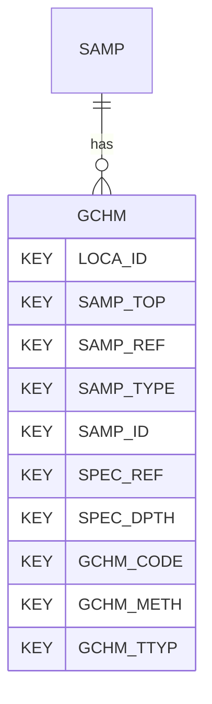

# GCHM — Geotechnical Chemistry Testing

## Purpose
> [!quote] The **GCHM** group — Geotechnical Chemistry Testing. It is a **child of [[SAMP]]** in the PROJ-rooted hierarchy. See [[parent-child-graph]].

## Position in the model

- Parent: [[SAMP]]
- Children: _none_
- See [[parent-child-graph]] · [[key-tuple-pseudo-keys]] · [[heading-status-vocabulary]]

## Headings
> [!quote] Rendered from `repo:rust-packages/laterite-ags4-reference/data/ags_dictionary.json groups[code=GCHM]` (the repo's model authority — AGS edition 4.2). Suggested UNITs + worked examples are in the cited spec PDF, not duplicated here.

34 heading(s) — `**KEY**` = pseudo-key tuple, `*REQ*` = REQUIRED (non-null, Rule 10b), `DEP` = deprecated, OTHER = scope-dependent.

| Heading | Status | Type | Description |
|---|---|---|---|
| `LOCA_ID` | **KEY** | `ID` | Location identifier |
| `SAMP_TOP` | **KEY** | `2DP` | Depth to top of sample |
| `SAMP_REF` | **KEY** | `X` | Sample reference |
| `SAMP_TYPE` | **KEY** | `PA` | Sample type |
| `SAMP_ID` | **KEY** | `ID` | Sample unique identifier |
| `SPEC_REF` | **KEY** | `X` | Specimen reference |
| `SPEC_DPTH` | **KEY** | `2DP` | Depth to top of test specimen |
| `GCHM_CODE` | **KEY** | `PA` | Determinand |
| `GCHM_METH` | **KEY** | `X` | Test method |
| `GCHM_TTYP` | **KEY** | `PA` | Test type |
| `GCHM_RESL` | OTHER | `U` | Test result |
| `GCHM_UNIT` | *REQ* | `PU` | Test result units |
| `GCHM_NAME` | OTHER | `X` | Client/laboratory preferred name of determinand |
| `SPEC_DESC` | OTHER | `X` | Specimen description |
| `SPEC_PREP` | OTHER | `X` | Details of specimen preparation including time between preparation and testing |
| `GCHM_REM` | OTHER | `X` | Remarks on test |
| `GCHM_LAB` | OTHER | `X` | Name of testing laboratory/organization |
| `GCHM_CRED` | OTHER | `X` | Accrediting body and reference number (when appropriate) |
| `TEST_STAT` | OTHER | `X` | Test status |
| `FILE_FSET` | OTHER | `X` | Associated file reference (e.g. test result sheets) |
| `GCHM_RTXT` | OTHER | `X` | Reported result |
| `GCHM_DLM` | OTHER | `U` | Lower detection limit |
| `SPEC_BASE` | OTHER | `2DP` | Depth to base of specimen |
| `GCHM_DEV` | OTHER | `X` | Deviations from the test method |
| `GCHM_SGRP` | OTHER | `X` | Sample delivery or batch code |
| `GCHM_LSID` | OTHER | `X` | Laboratory sample ID |
| `GCHM_RDAT` | OTHER | `DT` | Sample receipt date/time at laboratory |
| `GCHM_DTIM` | OTHER | `DT` | Analysis date and time |
| `GCHM_TEST` | OTHER | `X` | Test of Suite name |
| `GCHM_IREF` | OTHER | `X` | Instrument reference no or identifier |
| `GCHM_ITYP` | OTHER | `X` | Instrument type |
| `GCHM_SIZE` | OTHER | `0DP` | Size of material removed prior to test; value given indicates lowest sized material removed |
| `GCHM_PERP` | OTHER | `1DP` | Percentage of material removed |
| `GCHM_RDEV` | OTHER | `X` | Result deviation description(s) |

Full cross-edition heading deltas: AGS Change Log (see [[ags4-rules-frozen-dictionary-evolves]]).

## Relational notes
KEY tuple: `LOCA_ID`, `SAMP_TOP`, `SAMP_REF`, `SAMP_TYPE`, `SAMP_ID`, `SPEC_REF`, `SPEC_DPTH`, `GCHM_CODE`, `GCHM_METH`, `GCHM_TTYP`. Children (0): _none_. As a child it **denormalises** its parent's KEY columns into every row; [[rule-10c-parent-child]] re-resolves that repeated tuple upward to [[SAMP]]. See [[key-tuple-pseudo-keys]] · [[denormalised-child-rows]].

## Variations
No group-level change at 4.2 (present across the in-scope editions). Granular per-heading edition deltas live in the AGS online **Change Log** — the spec's own cited delta source (`spec:AGS4-4.2-2025.pdf` Foreword → ags.org.uk/.../change-log). Heading-level archaeology is deferred to a targeted Ingest if a rule/O-N interaction needs it (per [[ags4-rules-frozen-dictionary-evolves]]).

## Related
[[parent-child-graph]] · [[key-tuple-pseudo-keys]] · [[heading-status-vocabulary]] · [[rule-10c-parent-child]] · [[SAMP]]
