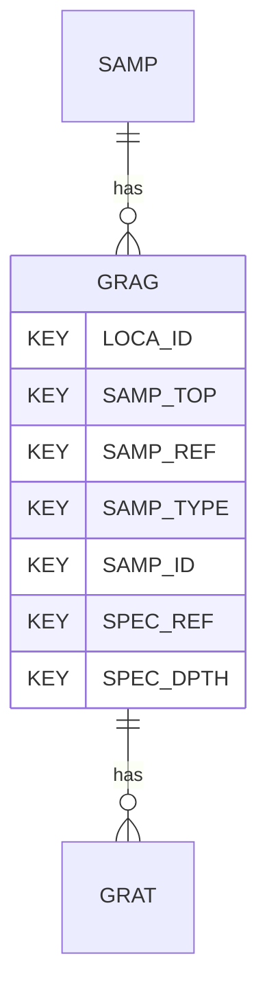

# GRAG — Particle Size Distribution Analysis - General

## Purpose
> [!quote] The **GRAG** group — Particle Size Distribution Analysis - General. It is a **child of [[SAMP]]** in the PROJ-rooted hierarchy. See [[parent-child-graph]].

## Position in the model

- Parent: [[SAMP]]
- Children: [[GRAT]]
- See [[parent-child-graph]] · [[key-tuple-pseudo-keys]] · [[heading-status-vocabulary]]

## Headings
> [!quote] Rendered from `repo:rust-packages/laterite-ags4-reference/data/ags_dictionary.json groups[code=GRAG]` (the repo's model authority — AGS edition 4.2). Suggested UNITs + worked examples are in the cited spec PDF, not duplicated here.

29 heading(s) — `**KEY**` = pseudo-key tuple, `*REQ*` = REQUIRED (non-null, Rule 10b), `DEP` = deprecated, OTHER = scope-dependent.

| Heading | Status | Type | Description |
|---|---|---|---|
| `LOCA_ID` | **KEY** | `ID` | Location identifier |
| `SAMP_TOP` | **KEY** | `2DP` | Depth to top of sample |
| `SAMP_REF` | **KEY** | `X` | Sample reference |
| `SAMP_TYPE` | **KEY** | `PA` | Sample type |
| `SAMP_ID` | **KEY** | `ID` | Sample unique identifier |
| `SPEC_REF` | **KEY** | `X` | Specimen reference |
| `SPEC_DPTH` | **KEY** | `2DP` | Depth to top of test specimen |
| `SPEC_DESC` | OTHER | `X` | Specimen description |
| `SPEC_PREP` | OTHER | `X` | Details of specimen preparation including time between preparation and testing |
| `GRAG_UC` | OTHER | `1SF` | Uniformity coefficient D60/D10 |
| `GRAG_VCRE` | OTHER | `1DP` | Percentage of material tested greater than 63mm (cobbles) |
| `GRAG_GRAV` | OTHER | `1DP` | Percentage of material tested in range 63mm to 2mm (gravel) |
| `GRAG_SAND` | OTHER | `1DP` | Percentage of material tested in range 2mm to 63um (sand) |
| `GRAG_SILT` | OTHER | `1DP` | Percentage of material tested in range 63um to 2um (silt) |
| `GRAG_CLAY` | OTHER | `1DP` | Percentage of material tested less than 2um (clay) |
| `GRAG_FINE` | OTHER | `1DP` | Percentage less than 63um |
| `GRAG_REM` | OTHER | `X` | Remarks including commentary on effect of specimen disturbance on test result |
| `GRAG_METH` | OTHER | `X` | Test method |
| `GRAG_LAB` | OTHER | `X` | Name of testing laboratory/organization |
| `GRAG_CRED` | OTHER | `X` | Accrediting body and reference number (when appropriate) |
| `TEST_STAT` | OTHER | `X` | Test status |
| `FILE_FSET` | OTHER | `X` | Associated file reference (e.g. equipment calibrations) |
| `SPEC_BASE` | OTHER | `2DP` | Depth to base of specimen |
| `GRAG_DEV` | OTHER | `X` | Any deviation from the specified test procedure, and any other information that could be important for interpreting the test results. |
| `GRAG_PDEN` | OTHER | `XN` | Particle density used in calculations with prefix # if value assumed |
| `GRAG_PRET` | OTHER | `X` | Method of pre-treatment, when applied |
| `GRAG_SUFF` | OTHER | `YN` | Amount of soil tested was sufficient to comply with recommended minimum mass |
| `GRAG_EXCL` | OTHER | `X` | Remark if the size of the fractions is not expressed as percentage of total dry mass, together with the nature and amount of fractions excluded. |
| `GRAG_CC` | OTHER | `1SF` | Coefficient of curvature |

Full cross-edition heading deltas: AGS Change Log (see [[ags4-rules-frozen-dictionary-evolves]]).

## Relational notes
KEY tuple: `LOCA_ID`, `SAMP_TOP`, `SAMP_REF`, `SAMP_TYPE`, `SAMP_ID`, `SPEC_REF`, `SPEC_DPTH`. Children (1): [[GRAT]]. As a child it **denormalises** its parent's KEY columns into every row; [[rule-10c-parent-child]] re-resolves that repeated tuple upward to [[SAMP]]. See [[key-tuple-pseudo-keys]] · [[denormalised-child-rows]].

## Variations
No group-level change at 4.2 (present across the in-scope editions). Granular per-heading edition deltas live in the AGS online **Change Log** — the spec's own cited delta source (`spec:AGS4-4.2-2025.pdf` Foreword → ags.org.uk/.../change-log). Heading-level archaeology is deferred to a targeted Ingest if a rule/O-N interaction needs it (per [[ags4-rules-frozen-dictionary-evolves]]).

## Related
[[parent-child-graph]] · [[key-tuple-pseudo-keys]] · [[heading-status-vocabulary]] · [[rule-10c-parent-child]] · [[SAMP]] · [[GRAT]]
