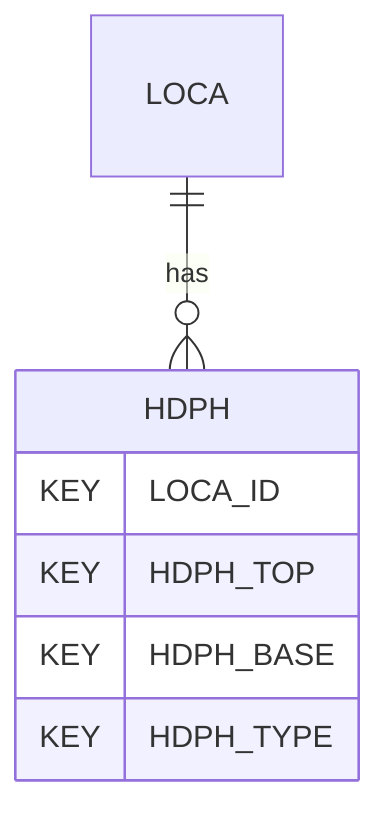

# HDPH — Depth Related Exploratory Hole Construction Information

## Purpose
> [!quote] The **HDPH** group — Depth Related Exploratory Hole Construction Information. It is a **child of [[LOCA]]** in the PROJ-rooted hierarchy. See [[parent-child-graph]].

## Position in the model

- Parent: [[LOCA]]
- Children: _none_
- See [[parent-child-graph]] · [[key-tuple-pseudo-keys]] · [[heading-status-vocabulary]]

## Headings
> [!quote] Rendered from `repo:rust-packages/laterite-ags4-reference/data/ags_dictionary.json groups[code=HDPH]` (the repo's model authority — AGS edition 4.2). Suggested UNITs + worked examples are in the cited spec PDF, not duplicated here.

23 heading(s) — `**KEY**` = pseudo-key tuple, `*REQ*` = REQUIRED (non-null, Rule 10b), `DEP` = deprecated, OTHER = scope-dependent.

| Heading | Status | Type | Description |
|---|---|---|---|
| `LOCA_ID` | **KEY** | `ID` | Location identifier |
| `HDPH_TOP` | **KEY** | `2DP` | Depth to top of section |
| `HDPH_BASE` | **KEY** | `2DP` | Depth to base of section |
| `HDPH_TYPE` | **KEY** | `PA` | Type of depth related information |
| `HDPH_STAR` | OTHER | `DT` | Date and time of start of section |
| `HDPH_ENDD` | OTHER | `DT` | Date and time of end of section |
| `HDPH_CREW` | OTHER | `X` | Name of rig/drill crew/operator |
| `HDPH_EXC` | OTHER | `X` | Plant used |
| `HDPH_SHOR` | OTHER | `X` | Shoring/support used |
| `HDPH_STAB` | OTHER | `X` | Stability of trial pit / trial trench or logged traverse length |
| `HDPH_DIML` | OTHER | `2DP` | Trial pit / trial trench or logged traverse length |
| `HDPH_DIMW` | OTHER | `2DP` | Trial pit / trial trench or logged traverse width |
| `HDPH_DBIT` | OTHER | `X` | Drill bit used |
| `HDPH_BCON` | OTHER | `X` | Bit condition |
| `HDPH_BTYP` | OTHER | `X` | Barrel type |
| `HDPH_BLEN` | OTHER | `2DP` | Barrel length |
| `HDPH_LOG` | OTHER | `X` | Definitive person responsible for logging the section |
| `HDPH_LOGD` | OTHER | `DT` | Start date of hole section logging |
| `HDPH_REM` | OTHER | `X` | Remarks |
| `HDPH_ENV` | OTHER | `X` | Details of weather and environmental conditions during hole section construction |
| `HDPH_METH` | OTHER | `X` | Details of method of hole section construction |
| `HDPH_CONT` | OTHER | `X` | Drilling contractor |
| `FILE_FSET` | OTHER | `X` | Associated file reference (e.g. drilling journals, hole orientation data) |

Full cross-edition heading deltas: AGS Change Log (see [[ags4-rules-frozen-dictionary-evolves]]).

## Relational notes
KEY tuple: `LOCA_ID`, `HDPH_TOP`, `HDPH_BASE`, `HDPH_TYPE`. Children (0): _none_. As a child it **denormalises** its parent's KEY columns into every row; [[rule-10c-parent-child]] re-resolves that repeated tuple upward to [[LOCA]]. See [[key-tuple-pseudo-keys]] · [[denormalised-child-rows]].

## Variations
No group-level change at 4.2 (present across the in-scope editions). Granular per-heading edition deltas live in the AGS online **Change Log** — the spec's own cited delta source (`spec:AGS4-4.2-2025.pdf` Foreword → ags.org.uk/.../change-log). Heading-level archaeology is deferred to a targeted Ingest if a rule/O-N interaction needs it (per [[ags4-rules-frozen-dictionary-evolves]]).

## Related
[[parent-child-graph]] · [[key-tuple-pseudo-keys]] · [[heading-status-vocabulary]] · [[rule-10c-parent-child]] · [[LOCA]]
