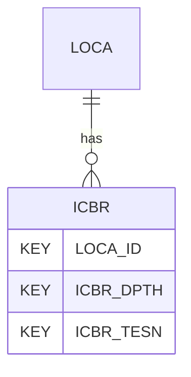

# ICBR — In Situ California Bearing Ratio Tests

## Purpose
> [!quote] The **ICBR** group — In Situ California Bearing Ratio Tests. It is a **child of [[LOCA]]** in the PROJ-rooted hierarchy. See [[parent-child-graph]].

## Position in the model

- Parent: [[LOCA]]
- Children: _none_
- See [[parent-child-graph]] · [[key-tuple-pseudo-keys]] · [[heading-status-vocabulary]]

## Headings
> [!quote] Rendered from `repo:rust-packages/laterite-ags4-reference/data/ags_dictionary.json groups[code=ICBR]` (the repo's model authority — AGS edition 4.2). Suggested UNITs + worked examples are in the cited spec PDF, not duplicated here.

20 heading(s) — `**KEY**` = pseudo-key tuple, `*REQ*` = REQUIRED (non-null, Rule 10b), `DEP` = deprecated, OTHER = scope-dependent.

| Heading | Status | Type | Description |
|---|---|---|---|
| `LOCA_ID` | **KEY** | `ID` | Location identifier |
| `ICBR_DPTH` | **KEY** | `2DP` | Depth to top of CBR test |
| `ICBR_TESN` | **KEY** | `X` | Test reference |
| `ICBR_ICBR` | OTHER | `2SF` | CBR value |
| `ICBR_MC` | OTHER | `X` | Water/moisture content relating to test |
| `ICBR_DATE` | OTHER | `DT` | Test date |
| `ICBR_KENT` | OTHER | `X` | Details of kentledge (reaction load) |
| `ICBR_SEAT` | OTHER | `0DP` | Seating force |
| `ICBR_SURC` | OTHER | `0DP` | Surcharge pressure |
| `ICBR_TYPE` | OTHER | `PA` | Type of CBR |
| `ICBR_REM` | OTHER | `X` | Remarks |
| `ICBR_ENV` | OTHER | `X` | Details of weather and environmental conditions during test |
| `ICBR_METH` | OTHER | `X` | Test method |
| `ICBR_CONT` | OTHER | `X` | Name of testing organization |
| `ICBR_CRED` | OTHER | `X` | Accrediting body and reference number (when appropriate) |
| `TEST_STAT` | OTHER | `X` | Test status |
| `GEOL_STAT` | OTHER | `X` | Stratum reference shown on trial pit or traverse sketch |
| `FILE_FSET` | OTHER | `X` | Associated file reference (e.g. test result sheets) |
| `ICBR_OPER` | OTHER | `X` | Name of test operator |
| `ICBR_BASE` | OTHER | `2DP` | Depth to base of derived CBR layer (DCP) |

Full cross-edition heading deltas: AGS Change Log (see [[ags4-rules-frozen-dictionary-evolves]]).

## Relational notes
KEY tuple: `LOCA_ID`, `ICBR_DPTH`, `ICBR_TESN`. Children (0): _none_. As a child it **denormalises** its parent's KEY columns into every row; [[rule-10c-parent-child]] re-resolves that repeated tuple upward to [[LOCA]]. See [[key-tuple-pseudo-keys]] · [[denormalised-child-rows]].

## Variations
No group-level change at 4.2 (present across the in-scope editions). Granular per-heading edition deltas live in the AGS online **Change Log** — the spec's own cited delta source (`spec:AGS4-4.2-2025.pdf` Foreword → ags.org.uk/.../change-log). Heading-level archaeology is deferred to a targeted Ingest if a rule/O-N interaction needs it (per [[ags4-rules-frozen-dictionary-evolves]]).

## Related
[[parent-child-graph]] · [[key-tuple-pseudo-keys]] · [[heading-status-vocabulary]] · [[rule-10c-parent-child]] · [[LOCA]]
