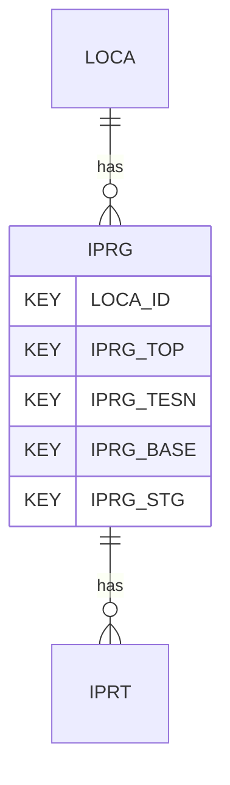

# IPRG — In Situ Permeability Tests - General

## Purpose
> [!quote] The **IPRG** group — In Situ Permeability Tests - General. It is a **child of [[LOCA]]** in the PROJ-rooted hierarchy. See [[parent-child-graph]].

## Position in the model

- Parent: [[LOCA]]
- Children: [[IPRT]]
- See [[parent-child-graph]] · [[key-tuple-pseudo-keys]] · [[heading-status-vocabulary]]

## Headings
> [!quote] Rendered from `repo:rust-packages/laterite-ags4-reference/data/ags_dictionary.json groups[code=IPRG]` (the repo's model authority — AGS edition 4.2). Suggested UNITs + worked examples are in the cited spec PDF, not duplicated here.

22 heading(s) — `**KEY**` = pseudo-key tuple, `*REQ*` = REQUIRED (non-null, Rule 10b), `DEP` = deprecated, OTHER = scope-dependent.

| Heading | Status | Type | Description |
|---|---|---|---|
| `LOCA_ID` | **KEY** | `ID` | Location identifier |
| `IPRG_TOP` | **KEY** | `2DP` | Depth to top of test zone |
| `IPRG_TESN` | **KEY** | `X` | Test reference |
| `IPRG_BASE` | **KEY** | `2DP` | Depth to base of test zone |
| `IPRG_STG` | **KEY** | `0DP` | Stage number of multistage test |
| `IPRG_TYPE` | OTHER | `PA` | Type of test |
| `IPRG_PRWL` | OTHER | `2DP` | Depth to water in test zone immediately prior to test |
| `IPRG_SWAL` | OTHER | `2DP` | Depth to water at start of test |
| `IPRG_TDIA` | OTHER | `2DP` | Diameter of test zone |
| `IPRG_SDIA` | OTHER | `3DP` | Diameter of test installation (e.g. standpipe or casing) |
| `IPRG_IPRM` | OTHER | `1SCI` | Permeability |
| `IPRG_FLOW` | OTHER | `1DP` | Average flow during test stage |
| `IPRG_AWL` | OTHER | `2DP` | Depth to assumed standing water level |
| `IPRG_HEAD` | OTHER | `2DP` | Applied total head of water during test stage at centre of test zone |
| `IPRG_DATE` | OTHER | `DT` | Test date |
| `IPRG_REM` | OTHER | `X` | Test remarks |
| `IPRG_ENV` | OTHER | `X` | Details of weather and environmental conditions during test |
| `IPRG_METH` | OTHER | `X` | Test method |
| `IPRG_CONT` | OTHER | `X` | Name of testing organization |
| `IPRG_CRED` | OTHER | `X` | Accrediting body and reference number (when appropriate) |
| `TEST_STAT` | OTHER | `X` | Test status |
| `FILE_FSET` | OTHER | `X` | Associated file reference (e.g. equipment calibrations) |

Full cross-edition heading deltas: AGS Change Log (see [[ags4-rules-frozen-dictionary-evolves]]).

## Relational notes
KEY tuple: `LOCA_ID`, `IPRG_TOP`, `IPRG_TESN`, `IPRG_BASE`, `IPRG_STG`. Children (1): [[IPRT]]. As a child it **denormalises** its parent's KEY columns into every row; [[rule-10c-parent-child]] re-resolves that repeated tuple upward to [[LOCA]]. See [[key-tuple-pseudo-keys]] · [[denormalised-child-rows]].

## Variations
> [!warning] **REMOVED in AGS 4.2** (`spec:AGS4-4.2-2025.pdf` Foreword). Present only in 4.0.3–4.1.1 files; superseded by FGHG.

Files using this group are valid ≤4.1.1, invalid under 4.2 — a concrete edition-dependent validation divergence (Phase D probe candidate).

## Related
[[parent-child-graph]] · [[key-tuple-pseudo-keys]] · [[heading-status-vocabulary]] · [[rule-10c-parent-child]] · [[LOCA]] · [[IPRT]]
