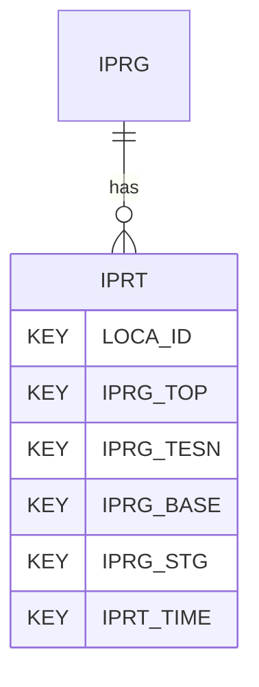

# IPRT — In Situ Permeability Tests - Data

## Purpose
> [!quote] The **IPRT** group — In Situ Permeability Tests - Data. It is a **child of [[IPRG]]** in the PROJ-rooted hierarchy. See [[parent-child-graph]].

## Position in the model

- Parent: [[IPRG]]
- Children: _none_
- See [[parent-child-graph]] · [[key-tuple-pseudo-keys]] · [[heading-status-vocabulary]]

## Headings
> [!quote] Rendered from `repo:rust-packages/laterite-ags4-reference/data/ags_dictionary.json groups[code=IPRT]` (the repo's model authority — AGS edition 4.2). Suggested UNITs + worked examples are in the cited spec PDF, not duplicated here.

9 heading(s) — `**KEY**` = pseudo-key tuple, `*REQ*` = REQUIRED (non-null, Rule 10b), `DEP` = deprecated, OTHER = scope-dependent.

| Heading | Status | Type | Description |
|---|---|---|---|
| `LOCA_ID` | **KEY** | `ID` | Location identifier |
| `IPRG_TOP` | **KEY** | `2DP` | Depth to top of test zone |
| `IPRG_TESN` | **KEY** | `X` | Test reference |
| `IPRG_BASE` | **KEY** | `2DP` | Depth to base of test zone |
| `IPRG_STG` | **KEY** | `0DP` | Stage number of multistage packer test |
| `IPRT_TIME` | **KEY** | `T` | Elapsed time |
| `IPRT_DPTH` | OTHER | `2DP` | Depth to water at time IPRT_TIME |
| `IPRT_REM` | OTHER | `X` | Test reading remark |
| `FILE_FSET` | OTHER | `X` | Associated file reference (e.g. test result sheets) |

Full cross-edition heading deltas: AGS Change Log (see [[ags4-rules-frozen-dictionary-evolves]]).

## Relational notes
KEY tuple: `LOCA_ID`, `IPRG_TOP`, `IPRG_TESN`, `IPRG_BASE`, `IPRG_STG`, `IPRT_TIME`. Children (0): _none_. As a child it **denormalises** its parent's KEY columns into every row; [[rule-10c-parent-child]] re-resolves that repeated tuple upward to [[IPRG]]. See [[key-tuple-pseudo-keys]] · [[denormalised-child-rows]].

## Variations
> [!warning] **REMOVED in AGS 4.2** (`spec:AGS4-4.2-2025.pdf` Foreword). Present only in 4.0.3–4.1.1 files; superseded by FGHS.

Files using this group are valid ≤4.1.1, invalid under 4.2 — a concrete edition-dependent validation divergence (Phase D probe candidate).

## Related
[[parent-child-graph]] · [[key-tuple-pseudo-keys]] · [[heading-status-vocabulary]] · [[rule-10c-parent-child]] · [[IPRG]]
