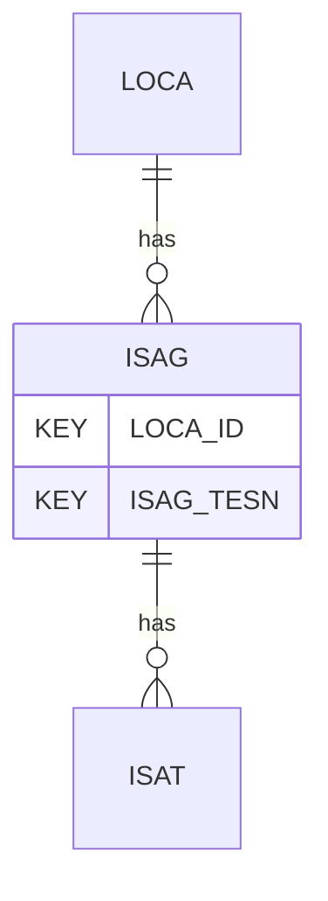

# ISAG — Soakaway Tests - General

## Purpose
> [!quote] The **ISAG** group — Soakaway Tests - General. It is a **child of [[LOCA]]** in the PROJ-rooted hierarchy. See [[parent-child-graph]].

## Position in the model

- Parent: [[LOCA]]
- Children: [[ISAT]]
- See [[parent-child-graph]] · [[key-tuple-pseudo-keys]] · [[heading-status-vocabulary]]

## Headings
> [!quote] Rendered from `repo:rust-packages/laterite-ags4-reference/data/ags_dictionary.json groups[code=ISAG]` (the repo's model authority — AGS edition 4.2). Suggested UNITs + worked examples are in the cited spec PDF, not duplicated here.

20 heading(s) — `**KEY**` = pseudo-key tuple, `*REQ*` = REQUIRED (non-null, Rule 10b), `DEP` = deprecated, OTHER = scope-dependent.

| Heading | Status | Type | Description |
|---|---|---|---|
| `LOCA_ID` | **KEY** | `ID` | Location identifier |
| `ISAG_TESN` | **KEY** | `X` | Test reference |
| `ISAG_DATE` | OTHER | `DT` | Test date |
| `ISAG_DURN` | OTHER | `T` | Test duration |
| `ISAG_PWID` | OTHER | `2DP` | Soakaway pit width |
| `ISAG_PLEN` | OTHER | `2DP` | Soakaway pit length |
| `ISAG_PDIA` | OTHER | `2DP` | Soakaway pit diameter |
| `ISAG_DPTS` | OTHER | `2DP` | Soakaway pit depth at start of test |
| `ISAG_DPTE` | OTHER | `2DP` | Soakaway pit depth at end of test |
| `ISAG_CONS` | OTHER | `X` | Description of soakaway construction |
| `ISAG_SI` | OTHER | `2SCI` | Soil infiltration rate |
| `ISAG_PORO` | OTHER | `0DP` | Fill porosity |
| `ISAG_REM` | OTHER | `X` | Remarks |
| `ISAG_ENV` | OTHER | `X` | Details of weather and environmental conditions during test |
| `ISAG_METH` | OTHER | `X` | Test method |
| `ISAG_CONT` | OTHER | `X` | Name of testing organization |
| `ISAG_CRED` | OTHER | `X` | Accrediting body and reference number (when appropriate) |
| `TEST_STAT` | OTHER | `X` | Test status |
| `FILE_FSET` | OTHER | `X` | Associated file reference (e.g. equipment calibrations) |
| `ISAG_OPER` | OTHER | `X` | Name of operator carrying out test |

Full cross-edition heading deltas: AGS Change Log (see [[ags4-rules-frozen-dictionary-evolves]]).

## Relational notes
KEY tuple: `LOCA_ID`, `ISAG_TESN`. Children (1): [[ISAT]]. As a child it **denormalises** its parent's KEY columns into every row; [[rule-10c-parent-child]] re-resolves that repeated tuple upward to [[LOCA]]. See [[key-tuple-pseudo-keys]] · [[denormalised-child-rows]].

## Variations
No group-level change at 4.2 (present across the in-scope editions). Granular per-heading edition deltas live in the AGS online **Change Log** — the spec's own cited delta source (`spec:AGS4-4.2-2025.pdf` Foreword → ags.org.uk/.../change-log). Heading-level archaeology is deferred to a targeted Ingest if a rule/O-N interaction needs it (per [[ags4-rules-frozen-dictionary-evolves]]).

## Related
[[parent-child-graph]] · [[key-tuple-pseudo-keys]] · [[heading-status-vocabulary]] · [[rule-10c-parent-child]] · [[LOCA]] · [[ISAT]]
