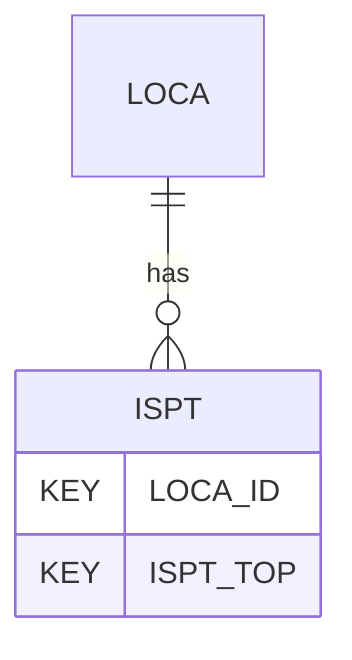

# ISPT — Standard Penetration Test Results

## Purpose
> [!quote] The **ISPT** group — Standard Penetration Test Results. It is a **child of [[LOCA]]** in the PROJ-rooted hierarchy. See [[parent-child-graph]].

## Position in the model

- Parent: [[LOCA]]
- Children: _none_
- See [[parent-child-graph]] · [[key-tuple-pseudo-keys]] · [[heading-status-vocabulary]]

## Headings
> [!quote] Rendered from `repo:rust-packages/laterite-ags4-reference/data/ags_dictionary.json groups[code=ISPT]` (the repo's model authority — AGS edition 4.2). Suggested UNITs + worked examples are in the cited spec PDF, not duplicated here.

33 heading(s) — `**KEY**` = pseudo-key tuple, `*REQ*` = REQUIRED (non-null, Rule 10b), `DEP` = deprecated, OTHER = scope-dependent.

| Heading | Status | Type | Description |
|---|---|---|---|
| `LOCA_ID` | **KEY** | `ID` | Location identifier |
| `ISPT_TOP` | **KEY** | `2DP` | Depth to top of test |
| `ISPT_SEAT` | OTHER | `0DP` | Number of blows for seating drive |
| `ISPT_MAIN` | OTHER | `0DP` | Number of blows for main test drive |
| `ISPT_NPEN` | OTHER | `0DP` | Total penetration for seating drive and test drive |
| `ISPT_NVAL` | OTHER | `0DP` | SPT 'N' value |
| `ISPT_REP` | OTHER | `X` | SPT reported result |
| `ISPT_CAS` | OTHER | `2DP` | Casing depth at time of test |
| `ISPT_WAT` | OTHER | `XN` | Depth to water at time of test |
| `ISPT_TYPE` | OTHER | `PA` | Type of SPT test |
| `ISPT_HAM` | OTHER | `X` | Hammer serial number from manufacturer |
| `ISPT_ERAT` | OTHER | `0DP` | Energy ratio of the hammer |
| `ISPT_SWP` | OTHER | `0DP` | Self-weight penetration |
| `ISPT_INC1` | OTHER | `0DP` | Number of blows for 1st Increment (Seating) |
| `ISPT_INC2` | OTHER | `0DP` | Number of blows for 2nd Increment (Seating) |
| `ISPT_INC3` | OTHER | `0DP` | Number of blows for 1st Increment (Test) |
| `ISPT_INC4` | OTHER | `0DP` | Number of blows for 2nd Increment (Test) |
| `ISPT_INC5` | OTHER | `0DP` | Number of blows for 3rd Increment (Test) |
| `ISPT_INC6` | OTHER | `0DP` | Number of blows for 4th Increment (Test) |
| `ISPT_PEN1` | OTHER | `0DP` | Penetration for 1st Increment (Seating Drive) |
| `ISPT_PEN2` | OTHER | `0DP` | Penetration for 2nd Increment (Seating Drive) |
| `ISPT_PEN3` | OTHER | `0DP` | Penetration for 1st Increment (Test) |
| `ISPT_PEN4` | OTHER | `0DP` | Penetration for 2nd Increment (Test) |
| `ISPT_PEN5` | OTHER | `0DP` | Penetration for 3rd Increment (Test) |
| `ISPT_PEN6` | OTHER | `0DP` | Penetration for 4th Increment (Test) |
| `ISPT_ROCK` | OTHER | `YN` | SPT carried out in soft rock |
| `ISPT_REM` | OTHER | `X` | Remarks |
| `ISPT_ENV` | OTHER | `X` | Details of weather and environmental conditions during test |
| `ISPT_METH` | OTHER | `X` | Test method |
| `ISPT_CRED` | OTHER | `X` | Accrediting body and reference number (when appropriate) |
| `TEST_STAT` | OTHER | `X` | Test status |
| `FILE_FSET` | OTHER | `X` | Associated file reference (e.g. test result sheets) |
| `ISPT_N60` | OTHER | `0DP` | SPT 'N' value (corrected by energy ratio ISPT_ERAT) |

Full cross-edition heading deltas: AGS Change Log (see [[ags4-rules-frozen-dictionary-evolves]]).

## Relational notes
KEY tuple: `LOCA_ID`, `ISPT_TOP`. Children (0): _none_. As a child it **denormalises** its parent's KEY columns into every row; [[rule-10c-parent-child]] re-resolves that repeated tuple upward to [[LOCA]]. See [[key-tuple-pseudo-keys]] · [[denormalised-child-rows]].

## Variations
No group-level change at 4.2 (present across the in-scope editions). Granular per-heading edition deltas live in the AGS online **Change Log** — the spec's own cited delta source (`spec:AGS4-4.2-2025.pdf` Foreword → ags.org.uk/.../change-log). Heading-level archaeology is deferred to a targeted Ingest if a rule/O-N interaction needs it (per [[ags4-rules-frozen-dictionary-evolves]]).

## Related
[[parent-child-graph]] · [[key-tuple-pseudo-keys]] · [[heading-status-vocabulary]] · [[rule-10c-parent-child]] · [[LOCA]]
