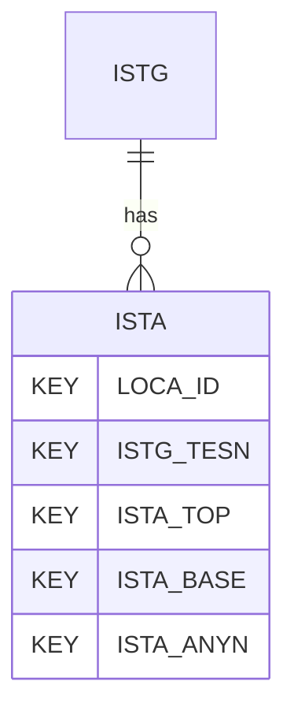

# ISTA — In Situ Seismic Test - Analysis

## Purpose
> [!quote] The **ISTA** group — In Situ Seismic Test - Analysis. It is a **child of [[ISTG]]** in the PROJ-rooted hierarchy. See [[parent-child-graph]].

## Position in the model

- Parent: [[ISTG]]
- Children: _none_
- See [[parent-child-graph]] · [[key-tuple-pseudo-keys]] · [[heading-status-vocabulary]]

## Headings
> [!quote] Rendered from `repo:rust-packages/laterite-ags4-reference/data/ags_dictionary.json groups[code=ISTA]` (the repo's model authority — AGS edition 4.2). Suggested UNITs + worked examples are in the cited spec PDF, not duplicated here.

29 heading(s) — `**KEY**` = pseudo-key tuple, `*REQ*` = REQUIRED (non-null, Rule 10b), `DEP` = deprecated, OTHER = scope-dependent.

| Heading | Status | Type | Description |
|---|---|---|---|
| `LOCA_ID` | **KEY** | `ID` | Location identifier |
| `ISTG_TESN` | **KEY** | `X` | Setup reference |
| `ISTA_TOP` | **KEY** | `2DP` | Depth to top of analysis range |
| `ISTA_BASE` | **KEY** | `2DP` | Depth to base of analysis range |
| `ISTA_ANYN` | **KEY** | `X` | Analysis Reference |
| `ISTA_DPTH` | OTHER | `2DP` | Midpoint of analysis depth range |
| `ISTA_RECT` | OTHER | `RL` | Link(s) to signal receiver top record |
| `ISTA_RECB` | OTHER | `RL` | Link(s) to signal receiver bottom record |
| `ISTA_RCOM` | OTHER | `PA` | Selected receiver component |
| `ISTA_MIVL` | OTHER | `PA` | Selected method for interval velocity |
| `ISTA_WVTY` | OTHER | `PA` | Wave type |
| `ISTA_UPSR` | OTHER | `3DP` | Up-sample rate |
| `ISTA_FTU` | OTHER | `PA` | Filter type used |
| `ISTA_FMIN` | OTHER | `0DP` | Minimum filter frequency |
| `ISTA_FMAX` | OTHER | `0DP` | Maximum filter frequency |
| `ISTA_WATT` | OTHER | `3DP` | Wave arrival time top signal |
| `ISTA_WATB` | OTHER | `3DP` | Wave arrival time bottom signal |
| `ISTA_WATM` | OTHER | `X` | Method to assess wave arrival time |
| `ISTA_ITM` | OTHER | `X` | Method to assess interval time |
| `ISTA_WVL` | OTHER | `1DP` | Final wave velocity |
| `ISTA_WVLM` | OTHER | `X` | Method to assess wave velocity |
| `ISTA_STAC` | OTHER | `YN` | Final shear wave velocity is based on stacked traces |
| `ISTA_IVAL` | OTHER | `YN` | Result invalid? |
| `ISTA_REM` | OTHER | `X` | Remarks |
| `ISTA_ANBY` | OTHER | `X` | Name of analyser/ person responsible for data QAQC |
| `ISTA_CONT` | OTHER | `X` | Analysis subcontractors name |
| `ISTA_DATE` | OTHER | `DT` | Analysis date |
| `TEST_STAT` | OTHER | `X` | Analysis status |
| `FILE_FSET` | OTHER | `X` | Associated file reference (e.g. ASCII .csv file containing logged instrumentation data) |

Full cross-edition heading deltas: AGS Change Log (see [[ags4-rules-frozen-dictionary-evolves]]).

## Relational notes
KEY tuple: `LOCA_ID`, `ISTG_TESN`, `ISTA_TOP`, `ISTA_BASE`, `ISTA_ANYN`. Children (0): _none_. As a child it **denormalises** its parent's KEY columns into every row; [[rule-10c-parent-child]] re-resolves that repeated tuple upward to [[ISTG]]. See [[key-tuple-pseudo-keys]] · [[denormalised-child-rows]].

## Variations
No group-level change at 4.2 (present across the in-scope editions). Granular per-heading edition deltas live in the AGS online **Change Log** — the spec's own cited delta source (`spec:AGS4-4.2-2025.pdf` Foreword → ags.org.uk/.../change-log). Heading-level archaeology is deferred to a targeted Ingest if a rule/O-N interaction needs it (per [[ags4-rules-frozen-dictionary-evolves]]).

## Related
[[parent-child-graph]] · [[key-tuple-pseudo-keys]] · [[heading-status-vocabulary]] · [[rule-10c-parent-child]] · [[ISTG]]
