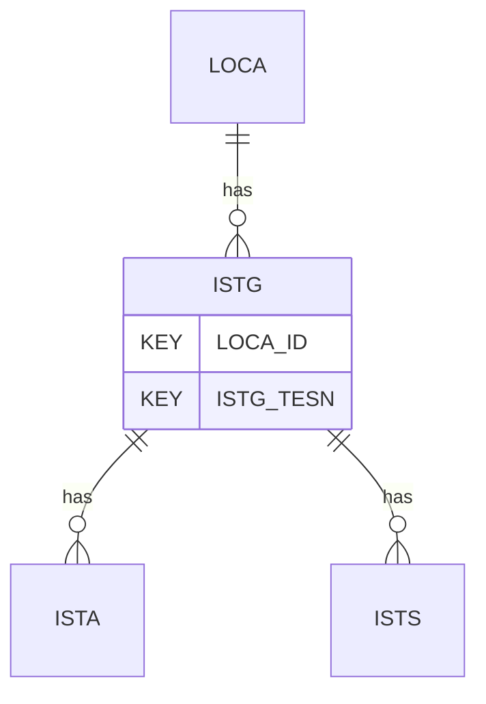

# ISTG — In Situ Seismic Test - General

## Purpose
> [!quote] The **ISTG** group — In Situ Seismic Test - General. It is a **child of [[LOCA]]** in the PROJ-rooted hierarchy. See [[parent-child-graph]].

## Position in the model

- Parent: [[LOCA]]
- Children: [[ISTA]] [[ISTS]]
- See [[parent-child-graph]] · [[key-tuple-pseudo-keys]] · [[heading-status-vocabulary]]

## Headings
> [!quote] Rendered from `repo:rust-packages/laterite-ags4-reference/data/ags_dictionary.json groups[code=ISTG]` (the repo's model authority — AGS edition 4.2). Suggested UNITs + worked examples are in the cited spec PDF, not duplicated here.

27 heading(s) — `**KEY**` = pseudo-key tuple, `*REQ*` = REQUIRED (non-null, Rule 10b), `DEP` = deprecated, OTHER = scope-dependent.

| Heading | Status | Type | Description |
|---|---|---|---|
| `LOCA_ID` | **KEY** | `ID` | Location identifier |
| `ISTG_TESN` | **KEY** | `X` | Setup reference |
| `ISTG_TYPE` | OTHER | `PA` | Seismic test type |
| `ISTG_LINK` | OTHER | `RL` | Record Link to pushing test, such as CPT |
| `ISTG_STAR` | OTHER | `DT` | Date and time at the beginning of seismic setup reference |
| `ISTG_END` | OTHER | `DT` | Date and time at the end of seismic setup reference |
| `ISTG_REF` | OTHER | `X` | Seismic receiver module reference |
| `ISTG_RECC` | OTHER | `PA` | Seismic receiver configuration. SINGLE for single receiver, DUAL for dual receiver test |
| `ISTG_RECD` | OTHER | `X` | Seismic receiver details, such as model |
| `ISTG_SOUR` | OTHER | `PA` | Source, such as Hammer system |
| `ISTG_RORD` | OTHER | `X` | Recording equipment details |
| `ISTG_SHOF` | OTHER | `2DP` | Horizontal offset between centre of hole and source |
| `ISTG_ORNT` | OTHER | `0DP` | Orientation of source relative to the receivers in plan view. Ideally 90 deg, such that the waves are directed at the receivers |
| `ISTG_SVOF` | OTHER | `2DP` | Source measured vertical offset from ground level/seafloor (positive down) |
| `ISTG_OTOP` | OTHER | `2DP` | Offset between centre of the top receiver and the pushing device (CPT/DMT) tip. (Use this entry for both SINGLE and DUAL receiver setup.) |
| `ISTG_OBOT` | OTHER | `2DP` | Offset between centre of the bottom receiver and the pushing device (CPT/DMT) tip. (Only use this entry for DUAL receiver setup.) |
| `ISTG_BHCP` | OTHER | `X` | Borehole, how receiver is clamped in place |
| `ISTG_MTO` | OTHER | `PA` | Method of determination of trigger time latency |
| `ISTG_OPER` | OTHER | `X` | Name of test operator |
| `ISTG_ANBY` | OTHER | `X` | Name of analyser/ person responsible for data QAQC |
| `ISTG_REM` | OTHER | `X` | Remarks, including borehole state at time of test if needed |
| `ISTG_ENV` | OTHER | `X` | Details of weather and environmental conditions during test |
| `ISTG_METH` | OTHER | `X` | Test method |
| `ISTG_CONT` | OTHER | `X` | Subcontractors name |
| `ISTG_CRED` | OTHER | `X` | Accrediting body and reference number (when appropriate) |
| `TEST_STAT` | OTHER | `X` | Test status |
| `FILE_FSET` | OTHER | `X` | Associated file reference |

Full cross-edition heading deltas: AGS Change Log (see [[ags4-rules-frozen-dictionary-evolves]]).

## Relational notes
KEY tuple: `LOCA_ID`, `ISTG_TESN`. Children (2): [[ISTA]] [[ISTS]]. As a child it **denormalises** its parent's KEY columns into every row; [[rule-10c-parent-child]] re-resolves that repeated tuple upward to [[LOCA]]. See [[key-tuple-pseudo-keys]] · [[denormalised-child-rows]].

## Variations
No group-level change at 4.2 (present across the in-scope editions). Granular per-heading edition deltas live in the AGS online **Change Log** — the spec's own cited delta source (`spec:AGS4-4.2-2025.pdf` Foreword → ags.org.uk/.../change-log). Heading-level archaeology is deferred to a targeted Ingest if a rule/O-N interaction needs it (per [[ags4-rules-frozen-dictionary-evolves]]).

## Related
[[parent-child-graph]] · [[key-tuple-pseudo-keys]] · [[heading-status-vocabulary]] · [[rule-10c-parent-child]] · [[LOCA]] · [[ISTA]] · [[ISTS]]
