# LOCA — Location Details

## Purpose
> [!quote] The **LOCA** group — Location Details. It is a **child of [[PROJ]]** in the PROJ-rooted hierarchy. See [[parent-child-graph]].

## Position in the model

```mermaid
erDiagram
  PROJ ||--o{ LOCA : has
  LOCA ||--o{ BKFL : has
  LOCA ||--o{ CDIA : has
  LOCA ||--o{ CHIS : has
  LOCA ||--o{ CORE : has
  LOCA ||--o{ CPTG : has
  LOCA ||--o{ CPTM : has
  LOCA ||--o{ CPTP : has
  LOCA ||--o{ DCPG : has
  LOCA ||--o{ DETL : has
  LOCA ||--o{ DISC : has
  LOCA ||--o{ DLOG : has
  LOCA ||--o{ DMTG : has
  LOCA ||--o{ DOBS : has
  LOCA ||--o{ DPRG : has
  LOCA ||--o{ DREM : has
  LOCA ||--o{ FGHG : has
  LOCA ||--o{ FLSH : has
  LOCA ||--o{ FRAC : has
  LOCA ||--o{ GEOL : has
  LOCA ||--o{ HDIA : has
  LOCA ||--o{ HDPH : has
  LOCA ||--o{ HORN : has
  LOCA ||--o{ ICBR : has
  LOCA ||--o{ IDEN : has
  LOCA ||--o{ IFID : has
  LOCA ||--o{ IPEN : has
  LOCA ||--o{ IPID : has
  LOCA ||--o{ IPRG : has
  LOCA ||--o{ IRDX : has
  LOCA ||--o{ IRES : has
  LOCA ||--o{ ISAG : has
  LOCA ||--o{ ISPT : has
  LOCA ||--o{ ISTG : has
  LOCA ||--o{ ITCH : has
  LOCA ||--o{ IVAN : has
  LOCA ||--o{ MONG : has
  LOCA ||--o{ PIPE : has
  LOCA ||--o{ PLTG : has
  LOCA ||--o{ PMMG : has
  LOCA ||--o{ PMTG : has
  LOCA ||--o{ PTIM : has
  LOCA ||--o{ PUMG : has
  LOCA ||--o{ SAMP : has
  LOCA ||--o{ SCPG : has
  LOCA ||--o{ TREM : has
  LOCA ||--o{ WADD : has
  LOCA ||--o{ WETH : has
  LOCA ||--o{ WGPG : has
  LOCA ||--o{ WINS : has
  LOCA ||--o{ WSTG : has
  LOCA {
    KEY LOCA_ID
  }
```

- Parent: [[PROJ]]
- Children: [[BKFL]] [[CDIA]] [[CHIS]] [[CORE]] [[CPTG]] [[CPTM]] [[CPTP]] [[DCPG]] [[DETL]] [[DISC]] [[DLOG]] [[DMTG]] [[DOBS]] [[DPRG]] [[DREM]] [[FGHG]] [[FLSH]] [[FRAC]] [[GEOL]] [[HDIA]] [[HDPH]] [[HORN]] [[ICBR]] [[IDEN]] [[IFID]] [[IPEN]] [[IPID]] [[IPRG]] [[IRDX]] [[IRES]] [[ISAG]] [[ISPT]] [[ISTG]] [[ITCH]] [[IVAN]] [[MONG]] [[PIPE]] [[PLTG]] [[PMMG]] [[PMTG]] [[PTIM]] [[PUMG]] [[SAMP]] [[SCPG]] [[TREM]] [[WADD]] [[WETH]] [[WGPG]] [[WINS]] [[WSTG]]
- See [[parent-child-graph]] · [[key-tuple-pseudo-keys]] · [[heading-status-vocabulary]]

## Headings
> [!quote] Rendered from `repo:rust-packages/laterite-ags4-reference/data/ags_dictionary.json groups[code=LOCA]` (the repo's model authority — AGS edition 4.2). Suggested UNITs + worked examples are in the cited spec PDF, not duplicated here.

47 heading(s) — `**KEY**` = pseudo-key tuple, `*REQ*` = REQUIRED (non-null, Rule 10b), `DEP` = deprecated, OTHER = scope-dependent.

| Heading | Status | Type | Description |
|---|---|---|---|
| `LOCA_ID` | **KEY** | `ID` | Location identifier |
| `LOCA_TYPE` | OTHER | `PA` | Type of activity |
| `LOCA_STAT` | OTHER | `PA` | Status of information relating to this position |
| `LOCA_NATE` | OTHER | `2DP` | National Grid Easting of location or start of traverse |
| `LOCA_NATN` | OTHER | `2DP` | National Grid Northing of location or start of traverse |
| `LOCA_GREF` | OTHER | `PA` | National grid referencing system used |
| `LOCA_GL` | OTHER | `2DP` | Ground level relative to datum of location or start of traverse |
| `LOCA_REM` | OTHER | `X` | General remarks |
| `LOCA_FDEP` | OTHER | `2DP` | Final depth |
| `LOCA_STAR` | OTHER | `DT` | Date of start of activity |
| `LOCA_PURP` | OTHER | `X` | Purpose of activity at this location |
| `LOCA_TERM` | OTHER | `X` | Reason for activity termination |
| `LOCA_ENDD` | OTHER | `DT` | End date of activity |
| `LOCA_LETT` | OTHER | `X` | OSGB letter grid reference |
| `LOCA_LOCX` | OTHER | `2DP` | Local grid x co-ordinate or start of traverse |
| `LOCA_LOCY` | OTHER | `2DP` | Local grid y co-ordinate or start of traverse |
| `LOCA_LOCZ` | OTHER | `2DP` | Level or start of traverse to local datum |
| `LOCA_LREF` | OTHER | `X` | Local grid referencing system used |
| `LOCA_DATM` | OTHER | `X` | Local vertical datum referencing system used |
| `LOCA_ETRV` | OTHER | `2DP` | National Grid Easting of end of traverse |
| `LOCA_NTRV` | OTHER | `2DP` | National Grid Northing of end of traverse |
| `LOCA_LTRV` | OTHER | `2DP` | Ground level relative to datum of end of traverse |
| `LOCA_XTRL` | OTHER | `2DP` | Local grid easting of end of traverse |
| `LOCA_YTRL` | OTHER | `2DP` | Local grid northing of end of traverse |
| `LOCA_ZTRL` | OTHER | `2DP` | Local elevation of end of traverse |
| `LOCA_LAT` | OTHER | `DMS` | Latitude of location or start of traverse |
| `LOCA_LON` | OTHER | `DMS` | Longitude of location or start of traverse |
| `LOCA_ELAT` | OTHER | `DMS` | Latitude of end of traverse |
| `LOCA_ELON` | OTHER | `DMS` | Longitude of end of traverse |
| `LOCA_LLZ` | OTHER | `X` | Geodetic datum |
| `LOCA_LOCM` | OTHER | `X` | Method of location |
| `LOCA_LOCA` | OTHER | `X` | Site location sub division (within project) code or description |
| `LOCA_CLST` | OTHER | `X` | Investigation phase grouping code or description |
| `LOCA_ALID` | OTHER | `X` | Alignment Identifier |
| `LOCA_OFFS` | OTHER | `2DP` | Offset |
| `LOCA_CNGE` | OTHER | `X` | Chainage |
| `LOCA_TRAN` | OTHER | `X` | Reference to or details of algorithm used to calculate local grid reference, local ground levels or chainage |
| `FILE_FSET` | OTHER | `X` | Associated file reference (e.g. boring or pitting instructions, location photographs) |
| `LOCA_NATD` | OTHER | `X` | National vertical datum referencing system used |
| `LOCA_ORID` | OTHER | `X` | Original Hole ID |
| `LOCA_ORJO` | OTHER | `X` | Original Job Reference |
| `LOCA_ORCO` | OTHER | `X` | Originating Company |
| `LOCA_GLDT` | OTHER | `DT` | Date time of LOCA_GL measurement |
| `LOCA_VSSL` | OTHER | `X` | Survey vessel |
| `LOCA_NSRI` | OTHER | `0DP` | Spatial reference identifier for national grid referencing system used (EPSG code) |
| `LOCA_LSRI` | OTHER | `0DP` | Spatial reference identifier for local grid referencing system used (EPSG code) |
| `LOCA_LLSI` | OTHER | `0DP` | Spatial reference identifier for latitude and longitude referencing system used (EPSG code) |

Full cross-edition heading deltas: AGS Change Log (see [[ags4-rules-frozen-dictionary-evolves]]).

## Relational notes
KEY tuple: `LOCA_ID`. Children (50): [[BKFL]] [[CDIA]] [[CHIS]] [[CORE]] [[CPTG]] [[CPTM]] [[CPTP]] [[DCPG]] [[DETL]] [[DISC]] [[DLOG]] [[DMTG]] [[DOBS]] [[DPRG]] [[DREM]] [[FGHG]] [[FLSH]] [[FRAC]] [[GEOL]] [[HDIA]] [[HDPH]] [[HORN]] [[ICBR]] [[IDEN]] [[IFID]] [[IPEN]] [[IPID]] [[IPRG]] [[IRDX]] [[IRES]] [[ISAG]] [[ISPT]] [[ISTG]] [[ITCH]] [[IVAN]] [[MONG]] [[PIPE]] [[PLTG]] [[PMMG]] [[PMTG]] [[PTIM]] [[PUMG]] [[SAMP]] [[SCPG]] [[TREM]] [[WADD]] [[WETH]] [[WGPG]] [[WINS]] [[WSTG]]. As a child it **denormalises** its parent's KEY columns into every row; [[rule-10c-parent-child]] re-resolves that repeated tuple upward to [[PROJ]]. See [[key-tuple-pseudo-keys]] · [[denormalised-child-rows]].

## Variations
No group-level change at 4.2 (present across the in-scope editions). Granular per-heading edition deltas live in the AGS online **Change Log** — the spec's own cited delta source (`spec:AGS4-4.2-2025.pdf` Foreword → ags.org.uk/.../change-log). Heading-level archaeology is deferred to a targeted Ingest if a rule/O-N interaction needs it (per [[ags4-rules-frozen-dictionary-evolves]]).

## Related
[[parent-child-graph]] · [[key-tuple-pseudo-keys]] · [[heading-status-vocabulary]] · [[rule-10c-parent-child]] · [[PROJ]] · [[BKFL]] · [[CDIA]] · [[CHIS]] · [[CORE]] · [[CPTG]] · [[CPTM]] · [[CPTP]] · [[DCPG]] · [[DETL]] · [[DISC]] · [[DLOG]] · [[DMTG]] · [[DOBS]] · [[DPRG]] · [[DREM]] · [[FGHG]] · [[FLSH]] · [[FRAC]] · [[GEOL]] · [[HDIA]] · [[HDPH]] · [[HORN]] · [[ICBR]] · [[IDEN]] · [[IFID]] · [[IPEN]] · [[IPID]] · [[IPRG]] · [[IRDX]] · [[IRES]] · [[ISAG]] · [[ISPT]] · [[ISTG]] · [[ITCH]] · [[IVAN]] · [[MONG]] · [[PIPE]] · [[PLTG]] · [[PMMG]] · [[PMTG]] · [[PTIM]] · [[PUMG]] · [[SAMP]] · [[SCPG]] · [[TREM]] · [[WADD]] · [[WETH]] · [[WGPG]] · [[WINS]] · [[WSTG]]
