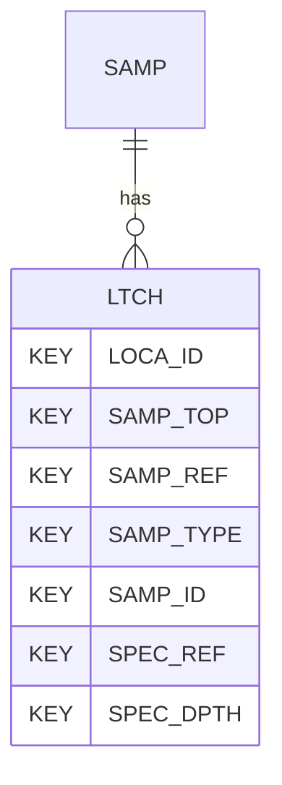

# LTCH — Laboratory Thermal Conductivity

## Purpose
> [!quote] The **LTCH** group — Laboratory Thermal Conductivity. It is a **child of [[SAMP]]** in the PROJ-rooted hierarchy. See [[parent-child-graph]].

## Position in the model

- Parent: [[SAMP]]
- Children: _none_
- See [[parent-child-graph]] · [[key-tuple-pseudo-keys]] · [[heading-status-vocabulary]]

## Headings
> [!quote] Rendered from `repo:rust-packages/laterite-ags4-reference/data/ags_dictionary.json groups[code=LTCH]` (the repo's model authority — AGS edition 4.2). Suggested UNITs + worked examples are in the cited spec PDF, not duplicated here.

29 heading(s) — `**KEY**` = pseudo-key tuple, `*REQ*` = REQUIRED (non-null, Rule 10b), `DEP` = deprecated, OTHER = scope-dependent.

| Heading | Status | Type | Description |
|---|---|---|---|
| `LOCA_ID` | **KEY** | `ID` | Location identifier |
| `SAMP_TOP` | **KEY** | `2DP` | Depth to top of sample |
| `SAMP_REF` | **KEY** | `X` | Sample reference |
| `SAMP_TYPE` | **KEY** | `PA` | Sample type |
| `SAMP_ID` | **KEY** | `ID` | Sample unique identifier |
| `SPEC_REF` | **KEY** | `X` | Specimen reference |
| `SPEC_DPTH` | **KEY** | `2DP` | Depth to top of test specimen |
| `SPEC_DESC` | OTHER | `X` | Specimen description |
| `SPEC_PREP` | OTHER | `X` | Details of specimen preparation including time between preparation and testing |
| `SPEC_BASE` | OTHER | `2DP` | Depth to base of specimen |
| `LTCH_COND` | OTHER | `X` | Sample condition |
| `LTCH_BDEN` | OTHER | `2DP` | Bulk density |
| `LTCH_DDEN` | OTHER | `2DP` | Dry density |
| `LTCH_MC` | OTHER | `X` | Water/moisture content |
| `LTCH_TCON` | OTHER | `2DP` | Thermal Conductivity |
| `LTCH_TRES` | OTHER | `2DP` | Thermal Resistivity |
| `LTCH_TEMP` | OTHER | `0DP` | Ambient temperature at which test is performed |
| `LTCH_PDIA` | OTHER | `0DP` | Probe diameter |
| `LTCH_PSPA` | OTHER | `0DP` | Probe spacing |
| `LTCH_PPEN` | OTHER | `0DP` | Probe penetration |
| `LTCH_PRBE` | OTHER | `X` | Method of probe insertion |
| `LTCH_PART` | OTHER | `X` | Particle grain size removed |
| `LTCH_DEV` | OTHER | `X` | Deviation from the procedure |
| `LTCH_REM` | OTHER | `X` | Remarks |
| `LTCH_METH` | OTHER | `X` | Test method |
| `LTCH_LAB` | OTHER | `X` | Name of testing laboratory/organization |
| `LTCH_CRED` | OTHER | `X` | Accrediting body and reference number (when appropriate) |
| `TEST_STAT` | OTHER | `X` | Test status |
| `FILE_FSET` | OTHER | `X` | Associated file reference (e.g. equipment calibrations) |

Full cross-edition heading deltas: AGS Change Log (see [[ags4-rules-frozen-dictionary-evolves]]).

## Relational notes
KEY tuple: `LOCA_ID`, `SAMP_TOP`, `SAMP_REF`, `SAMP_TYPE`, `SAMP_ID`, `SPEC_REF`, `SPEC_DPTH`. Children (0): _none_. As a child it **denormalises** its parent's KEY columns into every row; [[rule-10c-parent-child]] re-resolves that repeated tuple upward to [[SAMP]]. See [[key-tuple-pseudo-keys]] · [[denormalised-child-rows]].

## Variations
No group-level change at 4.2 (present across the in-scope editions). Granular per-heading edition deltas live in the AGS online **Change Log** — the spec's own cited delta source (`spec:AGS4-4.2-2025.pdf` Foreword → ags.org.uk/.../change-log). Heading-level archaeology is deferred to a targeted Ingest if a rule/O-N interaction needs it (per [[ags4-rules-frozen-dictionary-evolves]]).

## Related
[[parent-child-graph]] · [[key-tuple-pseudo-keys]] · [[heading-status-vocabulary]] · [[rule-10c-parent-child]] · [[SAMP]]
