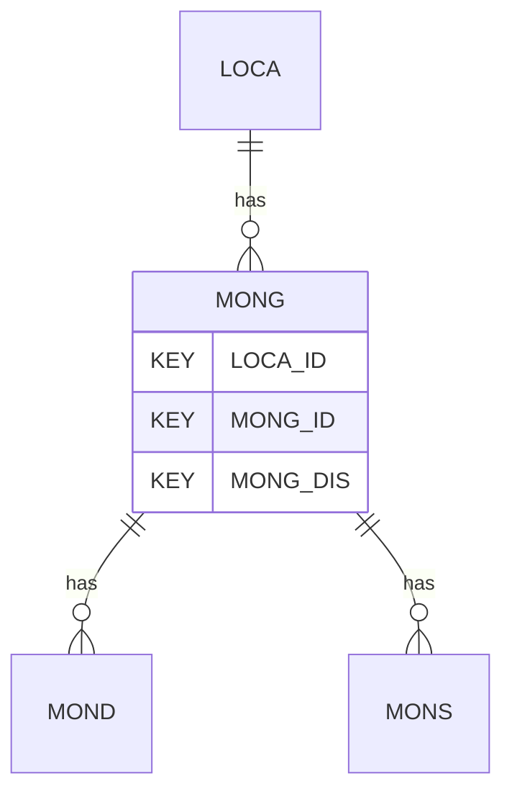

# MONG — Monitoring Installations and Instruments

## Purpose
> [!quote] The **MONG** group — Monitoring Installations and Instruments. It is a **child of [[LOCA]]** in the PROJ-rooted hierarchy. See [[parent-child-graph]].

## Position in the model

- Parent: [[LOCA]]
- Children: [[MOND]] [[MONS]]
- See [[parent-child-graph]] · [[key-tuple-pseudo-keys]] · [[heading-status-vocabulary]]

## Headings
> [!quote] Rendered from `repo:rust-packages/laterite-ags4-reference/data/ags_dictionary.json groups[code=MONG]` (the repo's model authority — AGS edition 4.2). Suggested UNITs + worked examples are in the cited spec PDF, not duplicated here.

21 heading(s) — `**KEY**` = pseudo-key tuple, `*REQ*` = REQUIRED (non-null, Rule 10b), `DEP` = deprecated, OTHER = scope-dependent.

| Heading | Status | Type | Description |
|---|---|---|---|
| `LOCA_ID` | **KEY** | `ID` | Location identifier |
| `MONG_ID` | **KEY** | `X` | Monitoring point reference |
| `MONG_DIS` | **KEY** | `2DP` | Initial distance of monitoring point from LOCA_ID |
| `PIPE_REF` | OTHER | `X` | Pipe reference |
| `MONG_DATE` | OTHER | `DT` | Installation date |
| `MONG_TYPE` | OTHER | `PA` | Instrument type |
| `MONG_DETL` | OTHER | `X` | Details of instrument |
| `MONG_TRZ` | OTHER | `2DP` | Distance to start of response zone from LOCA_ID datum |
| `MONG_BRZ` | OTHER | `2DP` | Distance to end of response zone from LOCA_ID datum |
| `MONG_BRGA` | OTHER | `0DP` | Bearing of monitoring axis A (compass bearing) |
| `MONG_BRGB` | OTHER | `0DP` | Bearing of monitoring axis B (compass bearing) |
| `MONG_BRGC` | OTHER | `0DP` | Bearing of monitoring axis C (compass bearing) |
| `MONG_INCA` | OTHER | `0DP` | Inclination of instrument axis A (measured positively down from horizontal) |
| `MONG_INCB` | OTHER | `0DP` | Inclination of instrument axis B (measured positively down from horizontal) |
| `MONG_INCC` | OTHER | `0DP` | Inclination of instrument axis C (measured positively down from horizontal) |
| `MONG_RSCA` | OTHER | `X` | Reading sign convention in direction A |
| `MONG_RSCB` | OTHER | `X` | Reading sign convention in direction B |
| `MONG_RSCC` | OTHER | `X` | Reading sign convention in direction C |
| `MONG_REM` | OTHER | `X` | Remarks |
| `MONG_CONT` | OTHER | `X` | Contractor who installed monitoring instrument |
| `FILE_FSET` | OTHER | `X` | Associated file reference (e.g. equipment calibrations) |

Full cross-edition heading deltas: AGS Change Log (see [[ags4-rules-frozen-dictionary-evolves]]).

## Relational notes
KEY tuple: `LOCA_ID`, `MONG_ID`, `MONG_DIS`. Children (2): [[MOND]] [[MONS]]. As a child it **denormalises** its parent's KEY columns into every row; [[rule-10c-parent-child]] re-resolves that repeated tuple upward to [[LOCA]]. See [[key-tuple-pseudo-keys]] · [[denormalised-child-rows]].

## Variations
No group-level change at 4.2 (present across the in-scope editions). Granular per-heading edition deltas live in the AGS online **Change Log** — the spec's own cited delta source (`spec:AGS4-4.2-2025.pdf` Foreword → ags.org.uk/.../change-log). Heading-level archaeology is deferred to a targeted Ingest if a rule/O-N interaction needs it (per [[ags4-rules-frozen-dictionary-evolves]]).

## Related
[[parent-child-graph]] · [[key-tuple-pseudo-keys]] · [[heading-status-vocabulary]] · [[rule-10c-parent-child]] · [[LOCA]] · [[MOND]] · [[MONS]]
