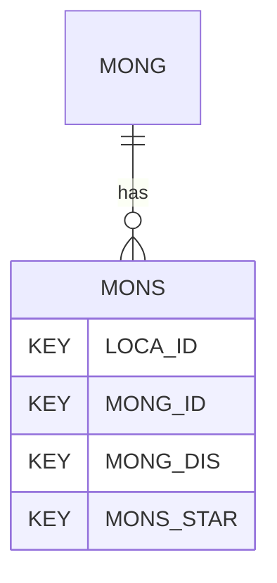

# MONS — Monitoring Installations and Instruments Status

## Purpose
> [!quote] The **MONS** group — Monitoring Installations and Instruments Status. It is a **child of [[MONG]]** in the PROJ-rooted hierarchy. See [[parent-child-graph]].

## Position in the model

- Parent: [[MONG]]
- Children: _none_
- See [[parent-child-graph]] · [[key-tuple-pseudo-keys]] · [[heading-status-vocabulary]]

## Headings
> [!quote] Rendered from `repo:rust-packages/laterite-ags4-reference/data/ags_dictionary.json groups[code=MONS]` (the repo's model authority — AGS edition 4.2). Suggested UNITs + worked examples are in the cited spec PDF, not duplicated here.

12 heading(s) — `**KEY**` = pseudo-key tuple, `*REQ*` = REQUIRED (non-null, Rule 10b), `DEP` = deprecated, OTHER = scope-dependent.

| Heading | Status | Type | Description |
|---|---|---|---|
| `LOCA_ID` | **KEY** | `ID` | Location identifier |
| `MONG_ID` | **KEY** | `X` | Monitoring point reference |
| `MONG_DIS` | **KEY** | `2DP` | Initial distance of monitoring point from LOCA_ID |
| `MONS_STAR` | **KEY** | `DT` | Date and time of start of status |
| `MONS_ENDD` | OTHER | `DT` | Date and time of end of status |
| `MONS_BY` | OTHER | `X` | Who recorded status |
| `MONS_TYPE` | OTHER | `PA` | Type of status |
| `MONS_STAT` | OTHER | `X` | Status |
| `MONS_RPLO` | OTHER | `ID` | Location identifier this installation or instrument replaces |
| `MONS_RPID` | OTHER | `X` | Monitoring point reference this installation or instrument replaces |
| `MONS_REM` | OTHER | `X` | Remarks |
| `FILE_FSET` | OTHER | `X` | Associated file reference |

Full cross-edition heading deltas: AGS Change Log (see [[ags4-rules-frozen-dictionary-evolves]]).

## Relational notes
KEY tuple: `LOCA_ID`, `MONG_ID`, `MONG_DIS`, `MONS_STAR`. Children (0): _none_. As a child it **denormalises** its parent's KEY columns into every row; [[rule-10c-parent-child]] re-resolves that repeated tuple upward to [[MONG]]. See [[key-tuple-pseudo-keys]] · [[denormalised-child-rows]].

## Variations
No group-level change at 4.2 (present across the in-scope editions). Granular per-heading edition deltas live in the AGS online **Change Log** — the spec's own cited delta source (`spec:AGS4-4.2-2025.pdf` Foreword → ags.org.uk/.../change-log). Heading-level archaeology is deferred to a targeted Ingest if a rule/O-N interaction needs it (per [[ags4-rules-frozen-dictionary-evolves]]).

## Related
[[parent-child-graph]] · [[key-tuple-pseudo-keys]] · [[heading-status-vocabulary]] · [[rule-10c-parent-child]] · [[MONG]]
