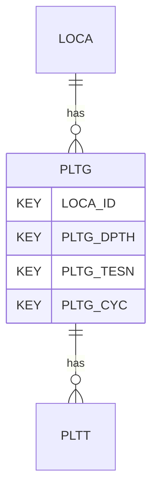

# PLTG — Plate Loading Tests - General

## Purpose
> [!quote] The **PLTG** group — Plate Loading Tests - General. It is a **child of [[LOCA]]** in the PROJ-rooted hierarchy. See [[parent-child-graph]].

## Position in the model

- Parent: [[LOCA]]
- Children: [[PLTT]]
- See [[parent-child-graph]] · [[key-tuple-pseudo-keys]] · [[heading-status-vocabulary]]

## Headings
> [!quote] Rendered from `repo:rust-packages/laterite-ags4-reference/data/ags_dictionary.json groups[code=PLTG]` (the repo's model authority — AGS edition 4.2). Suggested UNITs + worked examples are in the cited spec PDF, not duplicated here.

25 heading(s) — `**KEY**` = pseudo-key tuple, `*REQ*` = REQUIRED (non-null, Rule 10b), `DEP` = deprecated, OTHER = scope-dependent.

| Heading | Status | Type | Description |
|---|---|---|---|
| `LOCA_ID` | **KEY** | `ID` | Location identifier |
| `PLTG_DPTH` | **KEY** | `2DP` | Test depth |
| `PLTG_TESN` | **KEY** | `X` | Test reference |
| `PLTG_CYC` | **KEY** | `X` | Load cycle |
| `PLTG_PDIA` | OTHER | `0DP` | Plate diameter |
| `PLTG_SEAT` | OTHER | `1DP` | Seating load including apparatus mass |
| `PLTG_FA0` | OTHER | `2DP` | Factor a0 |
| `PLTG_FA1` | OTHER | `2DP` | Factor a1 |
| `PLTG_FA2` | OTHER | `2DP` | Factor a2 |
| `PLTG_SMOD` | OTHER | `1DP` | Strain modulus |
| `PLTG_EV2` | OTHER | `1DP` | Elastic modulus for second loading cycle |
| `PLTG_MOSR` | OTHER | `1DP` | Modulus of subgrade reaction |
| `PLTG_EMOD` | OTHER | `1DP` | Elastic modulus |
| `PLTG_DATE` | OTHER | `DT` | Test date |
| `PLTG_STAB` | OTHER | `2SF` | Amount of stabiliser added |
| `PLTG_STYP` | OTHER | `X` | Type of stabiliser added |
| `PLTG_REM` | OTHER | `X` | Remarks |
| `PLTG_ENV` | OTHER | `X` | Details of weather and environmental conditions during test |
| `PLTG_METH` | OTHER | `X` | Test method |
| `PLTG_CONT` | OTHER | `X` | Name of testing organization |
| `PLTG_CRED` | OTHER | `X` | Accrediting body and reference number (when appropriate) |
| `TEST_STAT` | OTHER | `X` | Test status |
| `GEOL_STAT` | OTHER | `X` | Stratum reference shown on trial pit or traverse sketch |
| `FILE_FSET` | OTHER | `X` | Associated file reference (e.g. equipment calibrations) |
| `PLTG_OPER` | OTHER | `X` | Name of test operator |

Full cross-edition heading deltas: AGS Change Log (see [[ags4-rules-frozen-dictionary-evolves]]).

## Relational notes
KEY tuple: `LOCA_ID`, `PLTG_DPTH`, `PLTG_TESN`, `PLTG_CYC`. Children (1): [[PLTT]]. As a child it **denormalises** its parent's KEY columns into every row; [[rule-10c-parent-child]] re-resolves that repeated tuple upward to [[LOCA]]. See [[key-tuple-pseudo-keys]] · [[denormalised-child-rows]].

## Variations
No group-level change at 4.2 (present across the in-scope editions). Granular per-heading edition deltas live in the AGS online **Change Log** — the spec's own cited delta source (`spec:AGS4-4.2-2025.pdf` Foreword → ags.org.uk/.../change-log). Heading-level archaeology is deferred to a targeted Ingest if a rule/O-N interaction needs it (per [[ags4-rules-frozen-dictionary-evolves]]).

## Related
[[parent-child-graph]] · [[key-tuple-pseudo-keys]] · [[heading-status-vocabulary]] · [[rule-10c-parent-child]] · [[LOCA]] · [[PLTT]]
