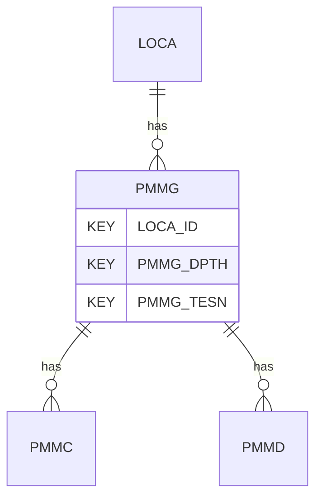

# PMMG — Menard Pressuremeter Test Results - General

## Purpose
> [!quote] The **PMMG** group — Menard Pressuremeter Test Results - General. It is a **child of [[LOCA]]** in the PROJ-rooted hierarchy. See [[parent-child-graph]].

## Position in the model

- Parent: [[LOCA]]
- Children: [[PMMC]] [[PMMD]]
- See [[parent-child-graph]] · [[key-tuple-pseudo-keys]] · [[heading-status-vocabulary]]

## Headings
> [!quote] Rendered from `repo:rust-packages/laterite-ags4-reference/data/ags_dictionary.json groups[code=PMMG]` (the repo's model authority — AGS edition 4.2). Suggested UNITs + worked examples are in the cited spec PDF, not duplicated here.

28 heading(s) — `**KEY**` = pseudo-key tuple, `*REQ*` = REQUIRED (non-null, Rule 10b), `DEP` = deprecated, OTHER = scope-dependent.

| Heading | Status | Type | Description |
|---|---|---|---|
| `LOCA_ID` | **KEY** | `ID` | Location identifier |
| `PMMG_DPTH` | **KEY** | `2DP` | Depth of test |
| `PMMG_TESN` | **KEY** | `X` | Test reference |
| `PMMG_DATE` | OTHER | `DT` | Date and time of test |
| `PMMG_DCU` | OTHER | `2DP` | Distance of control unit above ground |
| `PMMG_PRWL` | OTHER | `2DP` | Depth to water/fluid in borehole prior to test |
| `PMMG_REF` | OTHER | `X` | Instrument reference / serial number |
| `PMMG_TYPE` | OTHER | `PA` | Pressuremeter type |
| `PMMG_DIAM` | OTHER | `0DP` | Uninflated diameter of pressuremeter |
| `PMMG_PRC` | OTHER | `0DP` | Pressure capacity |
| `PMMG_TC` | OTHER | `PA` | Method of test control |
| `PMMG_P1` | OTHER | `2DP` | Start of linear section pressure, P_1 |
| `PMMG_P2` | OTHER | `2DP` | End of linear section pressure, P_2 |
| `PMMG_EM` | OTHER | `1DP` | Menard modulus, E_M |
| `PMMG_MPL` | OTHER | `2DP` | Menard limit pressure |
| `PMMG_MPLM` | OTHER | `PA` | Menard limit pressure method |
| `PMMG_PF` | OTHER | `2DP` | Creep pressure |
| `PMMG_METH` | OTHER | `X` | Test method |
| `PMMG_CREM` | OTHER | `X` | Describe corrections applied during processing |
| `PMMG_REM` | OTHER | `X` | Remarks |
| `PMMG_CRDT` | OTHER | `DT` | Date of last calibration of instrument |
| `PMMG_OPER` | OTHER | `X` | Name of test operator |
| `PMMG_ANBY` | OTHER | `X` | Name(s) of analyser / person responsible for data quality and correctness |
| `PMMG_CONT` | OTHER | `X` | Subcontractors name |
| `PMMG_CRED` | OTHER | `X` | Accrediting body and reference number (when appropriate) |
| `TEST_STAT` | OTHER | `X` | Test status |
| `PMMG_ENV` | OTHER | `X` | Details of weather and environmental conditions during test |
| `FILE_FSET` | OTHER | `X` | Associated file reference (e.g. equipment calibrations) |

Full cross-edition heading deltas: AGS Change Log (see [[ags4-rules-frozen-dictionary-evolves]]).

## Relational notes
KEY tuple: `LOCA_ID`, `PMMG_DPTH`, `PMMG_TESN`. Children (2): [[PMMC]] [[PMMD]]. As a child it **denormalises** its parent's KEY columns into every row; [[rule-10c-parent-child]] re-resolves that repeated tuple upward to [[LOCA]]. See [[key-tuple-pseudo-keys]] · [[denormalised-child-rows]].

## Variations
No group-level change at 4.2 (present across the in-scope editions). Granular per-heading edition deltas live in the AGS online **Change Log** — the spec's own cited delta source (`spec:AGS4-4.2-2025.pdf` Foreword → ags.org.uk/.../change-log). Heading-level archaeology is deferred to a targeted Ingest if a rule/O-N interaction needs it (per [[ags4-rules-frozen-dictionary-evolves]]).

## Related
[[parent-child-graph]] · [[key-tuple-pseudo-keys]] · [[heading-status-vocabulary]] · [[rule-10c-parent-child]] · [[LOCA]] · [[PMMC]] · [[PMMD]]
