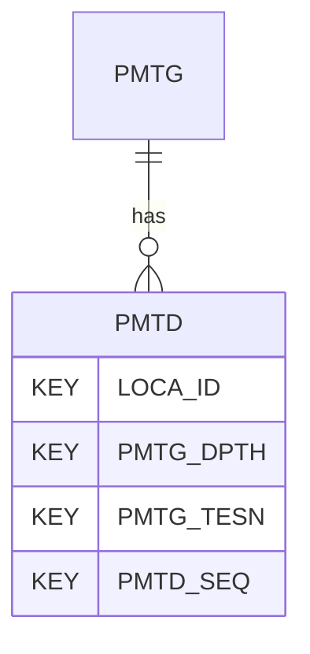

# PMTD — Pressuremeter Test Data

## Purpose
> [!quote] The **PMTD** group — Pressuremeter Test Data. It is a **child of [[PMTG]]** in the PROJ-rooted hierarchy. See [[parent-child-graph]].

## Position in the model

- Parent: [[PMTG]]
- Children: _none_
- See [[parent-child-graph]] · [[key-tuple-pseudo-keys]] · [[heading-status-vocabulary]]

## Headings
> [!quote] Rendered from `repo:rust-packages/laterite-ags4-reference/data/ags_dictionary.json groups[code=PMTD]` (the repo's model authority — AGS edition 4.2). Suggested UNITs + worked examples are in the cited spec PDF, not duplicated here.

24 heading(s) — `**KEY**` = pseudo-key tuple, `*REQ*` = REQUIRED (non-null, Rule 10b), `DEP` = deprecated, OTHER = scope-dependent.

| Heading | Status | Type | Description |
|---|---|---|---|
| `LOCA_ID` | **KEY** | `ID` | Location identifier |
| `PMTG_DPTH` | **KEY** | `2DP` | Depth of test |
| `PMTG_TESN` | **KEY** | `X` | Test reference |
| `PMTD_SEQ` | **KEY** | `0DP` | Sequence number |
| `PMTD_TPC` | OTHER | `1DP` | Total pressure |
| `PMTD_PPA` | OTHER | `1DP` | Pore pressure cell A |
| `PMTD_PPB` | OTHER | `1DP` | Pore pressure cell B |
| `PMTD_VOL` | OTHER | `1DP` | Volume change in test cell |
| `PMTD_REM` | OTHER | `X` | Remarks |
| `FILE_FSET` | OTHER | `X` | Associated file reference (e.g. test result sheets) |
| `PMTD_AX1` | OTHER | `4DP` | Axis 1 displacement |
| `PMTD_AX2` | OTHER | `4DP` | Axis 2 displacement |
| `PMTD_AX3` | OTHER | `4DP` | Axis 3 displacement |
| `PMTD_SA1` | OTHER | `4DP` | Arm 1 displacement |
| `PMTD_SA2` | OTHER | `4DP` | Arm 2 displacement |
| `PMTD_SA3` | OTHER | `4DP` | Arm 3 displacement |
| `PMTD_SA4` | OTHER | `4DP` | Arm 4 displacement |
| `PMTD_SA5` | OTHER | `4DP` | Arm 5 displacement |
| `PMTD_SA6` | OTHER | `4DP` | Arm 6 displacement |
| `PMTD_SAME` | OTHER | `4DP` | Mean arm displacement |
| `PMTD_TIME` | OTHER | `0DP` | Time elapsed since start of test |
| `PMTD_ARM1` | `DEP` | `3DP` | Axis 1 displacement |
| `PMTD_ARM2` | `DEP` | `3DP` | Axis 2 displacement |
| `PMTD_ARM3` | `DEP` | `3DP` | Axis 3 displacement |

Full cross-edition heading deltas: AGS Change Log (see [[ags4-rules-frozen-dictionary-evolves]]).

## Relational notes
KEY tuple: `LOCA_ID`, `PMTG_DPTH`, `PMTG_TESN`, `PMTD_SEQ`. Children (0): _none_. As a child it **denormalises** its parent's KEY columns into every row; [[rule-10c-parent-child]] re-resolves that repeated tuple upward to [[PMTG]]. See [[key-tuple-pseudo-keys]] · [[denormalised-child-rows]].

## Variations
No group-level change at 4.2 (present across the in-scope editions). Granular per-heading edition deltas live in the AGS online **Change Log** — the spec's own cited delta source (`spec:AGS4-4.2-2025.pdf` Foreword → ags.org.uk/.../change-log). Heading-level archaeology is deferred to a targeted Ingest if a rule/O-N interaction needs it (per [[ags4-rules-frozen-dictionary-evolves]]).

## Related
[[parent-child-graph]] · [[key-tuple-pseudo-keys]] · [[heading-status-vocabulary]] · [[rule-10c-parent-child]] · [[PMTG]]
