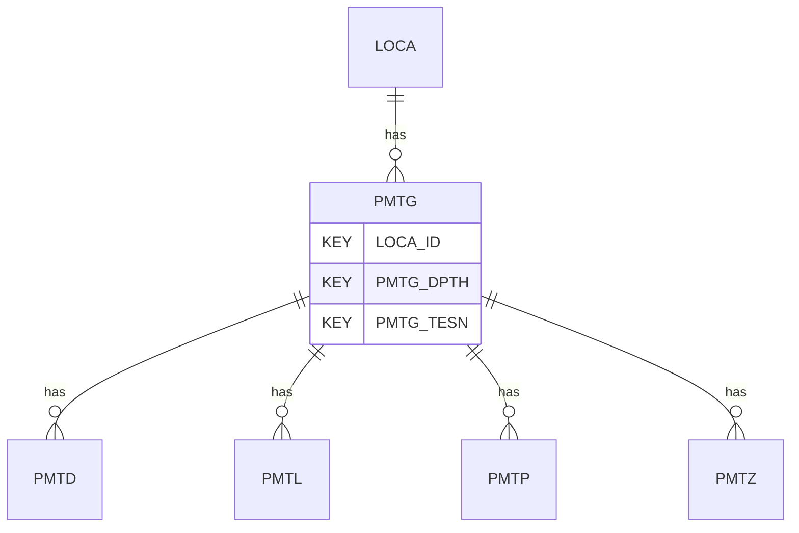

# PMTG — Pressuremeter Test Results - General

## Purpose
> [!quote] The **PMTG** group — Pressuremeter Test Results - General. It is a **child of [[LOCA]]** in the PROJ-rooted hierarchy. See [[parent-child-graph]].

## Position in the model

- Parent: [[LOCA]]
- Children: [[PMTD]] [[PMTL]] [[PMTP]] [[PMTZ]]
- See [[parent-child-graph]] · [[key-tuple-pseudo-keys]] · [[heading-status-vocabulary]]

## Headings
> [!quote] Rendered from `repo:rust-packages/laterite-ags4-reference/data/ags_dictionary.json groups[code=PMTG]` (the repo's model authority — AGS edition 4.2). Suggested UNITs + worked examples are in the cited spec PDF, not duplicated here.

45 heading(s) — `**KEY**` = pseudo-key tuple, `*REQ*` = REQUIRED (non-null, Rule 10b), `DEP` = deprecated, OTHER = scope-dependent.

| Heading | Status | Type | Description |
|---|---|---|---|
| `LOCA_ID` | **KEY** | `ID` | Location identifier |
| `PMTG_DPTH` | **KEY** | `2DP` | Depth of test |
| `PMTG_TESN` | **KEY** | `X` | Test reference |
| `PMTG_DATE` | OTHER | `DT` | Date of test |
| `PMTG_WAT` | OTHER | `2DP` | Measured or assumed ground water level |
| `PMTG_CONT` | OTHER | `X` | Subcontractors name |
| `PMTG_CREW` | OTHER | `X` | Operators details |
| `PMTG_REF` | OTHER | `X` | Instrument reference / serial number |
| `PMTG_TYPE` | OTHER | `PA` | Pressuremeter type |
| `PMTG_DIAM` | OTHER | `2DP` | Uninflated diameter of pressuremeter |
| `PMTG_HO` | OTHER | `0DP` | Estimated in situ horizontal stress |
| `PMTG_GI` | OTHER | `0DP` | Initial shear modulus |
| `PMTG_CU` | OTHER | `0DP` | Undrained shear strength |
| `PMTG_PL` | OTHER | `0DP` | Limit pressure |
| `PMTG_AF` | OTHER | `1DP` | Angle of friction |
| `PMTG_AD` | OTHER | `0DP` | Angle of dilation |
| `PMTG_AFCV` | OTHER | `1DP` | Angle of friction at constant volume (*cv) used |
| `PMTG_METH` | OTHER | `X` | Method(s) used to determine derived soil parameters (including those in PMTL). |
| `PMTG_CRED` | OTHER | `X` | Accrediting body and reference number (when appropriate) |
| `TEST_STAT` | OTHER | `X` | Test status |
| `PMTG_ENV` | OTHER | `X` | Details of weather and environmental conditions during test |
| `PMTG_REM` | OTHER | `X` | Remarks |
| `FILE_FSET` | OTHER | `X` | Associated file reference (e.g. equipment calibrations) |
| `PMTG_NUAR` | OTHER | `0DP` | Number of arms |
| `PMTG_ORNT` | OTHER | `0DP` | Bearing of arm 1 (clockwise degrees from North) |
| `PMTG_AXIS` | OTHER | `X` | Arm combination used for analysis |
| `PMTG_PRWL` | OTHER | `2DP` | Depth to water/fluid in borehole prior to test |
| `PMTG_TC` | OTHER | `PA` | Method of test control |
| `PMTG_STAD` | OTHER | `DT` | Start of drilling of SBPM |
| `PMTG_ENDD` | OTHER | `DT` | End of drilling of SBPM |
| `PMTG_TOPP` | OTHER | `2DP` | Depth to top of test pocket for SBPM |
| `PMTG_BOTP` | OTHER | `2DP` | Depth to base of test pocket for SBPM |
| `PMTG_SBHT` | OTHER | `PA` | Self-boring head type of SBPM |
| `PMTG_SBCS` | OTHER | `1DP` | Self-boring cutting shoe diameter, dp, of SBPM |
| `PMTG_SBCT` | OTHER | `PA` | Cutter type of SBPM |
| `PMTG_SBCD` | OTHER | `1DP` | Cutter dimension of SBPM |
| `PMTG_SBCP` | OTHER | `0DP` | Cutter position, h (+ve inside cutting shoe, -ve outside cutting shoe) of SBPM |
| `PMTG_FLFT` | OTHER | `X` | Flushing fluid type of SBPM |
| `PMTG_FLFP` | OTHER | `0DP` | Flushing or jetting fluid pressure of SBPM |
| `PMTG_TRST` | OTHER | `0DP` | Thrust force of SBPM |
| `PMTG_PPRD` | OTHER | `YN` | Pore pressures recorded during boring |
| `PMTG_CMT` | OTHER | `PA` | Cone module type |
| `PMTG_CREM` | OTHER | `X` | Describe corrections applied during processing |
| `PMTG_CRDT` | OTHER | `DT` | Date of last calibration of instrument |
| `PMTG_ANBY` | OTHER | `X` | Name(s) of analyser / person responsible for data quality and correctness |

Full cross-edition heading deltas: AGS Change Log (see [[ags4-rules-frozen-dictionary-evolves]]).

## Relational notes
KEY tuple: `LOCA_ID`, `PMTG_DPTH`, `PMTG_TESN`. Children (4): [[PMTD]] [[PMTL]] [[PMTP]] [[PMTZ]]. As a child it **denormalises** its parent's KEY columns into every row; [[rule-10c-parent-child]] re-resolves that repeated tuple upward to [[LOCA]]. See [[key-tuple-pseudo-keys]] · [[denormalised-child-rows]].

## Variations
No group-level change at 4.2 (present across the in-scope editions). Granular per-heading edition deltas live in the AGS online **Change Log** — the spec's own cited delta source (`spec:AGS4-4.2-2025.pdf` Foreword → ags.org.uk/.../change-log). Heading-level archaeology is deferred to a targeted Ingest if a rule/O-N interaction needs it (per [[ags4-rules-frozen-dictionary-evolves]]).

## Related
[[parent-child-graph]] · [[key-tuple-pseudo-keys]] · [[heading-status-vocabulary]] · [[rule-10c-parent-child]] · [[LOCA]] · [[PMTD]] · [[PMTL]] · [[PMTP]] · [[PMTZ]]
