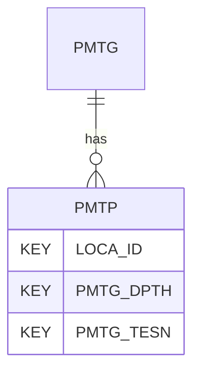

# PMTP — Pressuremeter Test Results - Parameters

## Purpose
> [!quote] The **PMTP** group — Pressuremeter Test Results - Parameters. It is a **child of [[PMTG]]** in the PROJ-rooted hierarchy. See [[parent-child-graph]].

## Position in the model

- Parent: [[PMTG]]
- Children: _none_
- See [[parent-child-graph]] · [[key-tuple-pseudo-keys]] · [[heading-status-vocabulary]]

## Headings
> [!quote] Rendered from `repo:rust-packages/laterite-ags4-reference/data/ags_dictionary.json groups[code=PMTP]` (the repo's model authority — AGS edition 4.2). Suggested UNITs + worked examples are in the cited spec PDF, not duplicated here.

24 heading(s) — `**KEY**` = pseudo-key tuple, `*REQ*` = REQUIRED (non-null, Rule 10b), `DEP` = deprecated, OTHER = scope-dependent.

| Heading | Status | Type | Description |
|---|---|---|---|
| `LOCA_ID` | **KEY** | `ID` | Location identifier |
| `PMTG_DPTH` | **KEY** | `2DP` | Depth of test |
| `PMTG_TESN` | **KEY** | `X` | Test reference |
| `PMTP_U0` | OTHER | `0DP` | In situ pore water pressure |
| `PMTP_STO` | OTHER | `2DP` | Strain origin |
| `PMTP_HO` | OTHER | `0DP` | Estimated in situ horizontal stress |
| `PMTP_HOM` | OTHER | `X` | Method remark for Estimated in situ horizontal stress |
| `PMTP_GI` | OTHER | `3SF` | Shear modulus from first loading |
| `PMTP_SU` | OTHER | `1DP` | Undrained shear strength |
| `PMTP_SUM` | OTHER | `X` | Method remark for Undrained Shear Strength (s_u) |
| `PMTP_AF` | OTHER | `1DP` | Peak angle of friction |
| `PMTP_AD` | OTHER | `1DP` | Angle of dilation |
| `PMTP_AFDM` | OTHER | `X` | Method remark for Peak angle of friction and Angle of dilation |
| `PMTP_AFCV` | OTHER | `1DP` | Angle of friction at constant volume (*cv) used |
| `PMTP_DC` | OTHER | `0DP` | Drained cohesion |
| `PMTP_DCM` | OTHER | `X` | Method remark for Drained cohesion |
| `PMTP_PL` | OTHER | `0DP` | Total limit pressure |
| `PMTP_PF` | OTHER | `0DP` | Total yield stress |
| `PMTP_PFM` | OTHER | `X` | Method remark for Total yield stress |
| `PMTP_YM` | OTHER | `1DP` | Yield modulus |
| `PMTP_YMM` | OTHER | `X` | Method remark for Yield modulus |
| `PMTP_MU` | OTHER | `2DP` | Poisson's ratio |
| `PMTP_REM` | OTHER | `X` | Remarks |
| `FILE_FSET` | OTHER | `X` | Associated file reference (e.g. equipment calibrations) |

Full cross-edition heading deltas: AGS Change Log (see [[ags4-rules-frozen-dictionary-evolves]]).

## Relational notes
KEY tuple: `LOCA_ID`, `PMTG_DPTH`, `PMTG_TESN`. Children (0): _none_. As a child it **denormalises** its parent's KEY columns into every row; [[rule-10c-parent-child]] re-resolves that repeated tuple upward to [[PMTG]]. See [[key-tuple-pseudo-keys]] · [[denormalised-child-rows]].

## Variations
No group-level change at 4.2 (present across the in-scope editions). Granular per-heading edition deltas live in the AGS online **Change Log** — the spec's own cited delta source (`spec:AGS4-4.2-2025.pdf` Foreword → ags.org.uk/.../change-log). Heading-level archaeology is deferred to a targeted Ingest if a rule/O-N interaction needs it (per [[ags4-rules-frozen-dictionary-evolves]]).

## Related
[[parent-child-graph]] · [[key-tuple-pseudo-keys]] · [[heading-status-vocabulary]] · [[rule-10c-parent-child]] · [[PMTG]]
