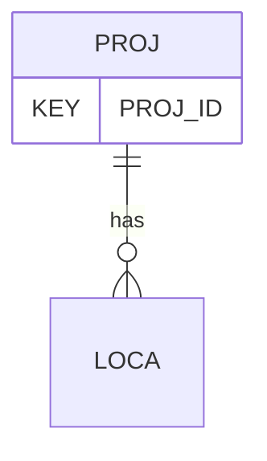

# PROJ — Project Information

## Purpose
> [!quote] The **PROJ** group — Project Information. It is a **root / non-hierarchy** group (file submission & description — Rules 13–18 territory). See [[parent-child-graph]].

## Position in the model

- Parent: _(root — no parent)_
- Children: [[LOCA]]
- See [[parent-child-graph]] · [[key-tuple-pseudo-keys]] · [[heading-status-vocabulary]]

## Headings
> [!quote] Rendered from `repo:rust-packages/laterite-ags4-reference/data/ags_dictionary.json groups[code=PROJ]` (the repo's model authority — AGS edition 4.2). Suggested UNITs + worked examples are in the cited spec PDF, not duplicated here.

8 heading(s) — `**KEY**` = pseudo-key tuple, `*REQ*` = REQUIRED (non-null, Rule 10b), `DEP` = deprecated, OTHER = scope-dependent.

| Heading | Status | Type | Description |
|---|---|---|---|
| `PROJ_ID` | **KEY** | `ID` | Project identifier |
| `PROJ_NAME` | OTHER | `X` | Project title |
| `PROJ_LOC` | OTHER | `X` | Location of site |
| `PROJ_CLNT` | OTHER | `X` | Client organisation name |
| `PROJ_CONT` | OTHER | `X` | Contractor organisation name |
| `PROJ_ENG` | OTHER | `X` | Project engineer/consultant/designer organisation name |
| `PROJ_MEMO` | OTHER | `X` | General project comments |
| `FILE_FSET` | OTHER | `X` | Associated file reference (e.g. project specification, site location drawings) |

Full cross-edition heading deltas: AGS Change Log (see [[ags4-rules-frozen-dictionary-evolves]]).

## Relational notes
KEY tuple: `PROJ_ID`. Children (1): [[LOCA]]. Parent linkage is implicit/absent — Rule 10c is skipped for root groups (see [[non-hierarchy-ten-vs-parentless-list]]). See [[key-tuple-pseudo-keys]] · [[denormalised-child-rows]].

## Variations
No group-level change at 4.2 (present across the in-scope editions). Granular per-heading edition deltas live in the AGS online **Change Log** — the spec's own cited delta source (`spec:AGS4-4.2-2025.pdf` Foreword → ags.org.uk/.../change-log). Heading-level archaeology is deferred to a targeted Ingest if a rule/O-N interaction needs it (per [[ags4-rules-frozen-dictionary-evolves]]).

## Related
[[parent-child-graph]] · [[key-tuple-pseudo-keys]] · [[heading-status-vocabulary]] · [[rule-10c-parent-child]] · [[LOCA]]
