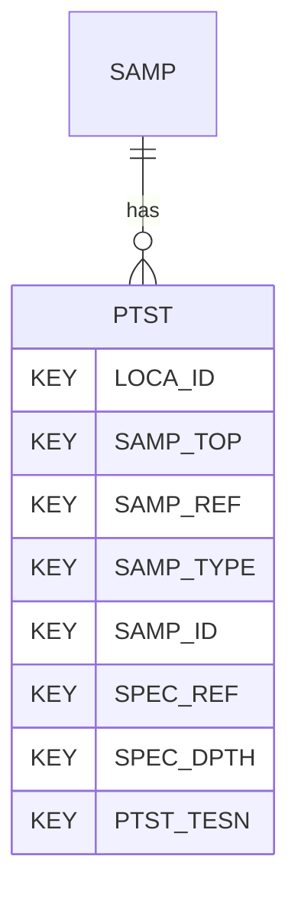

# PTST — Laboratory Permeability Tests

## Purpose
> [!quote] The **PTST** group — Laboratory Permeability Tests. It is a **child of [[SAMP]]** in the PROJ-rooted hierarchy. See [[parent-child-graph]].

## Position in the model

- Parent: [[SAMP]]
- Children: _none_
- See [[parent-child-graph]] · [[key-tuple-pseudo-keys]] · [[heading-status-vocabulary]]

## Headings
> [!quote] Rendered from `repo:rust-packages/laterite-ags4-reference/data/ags_dictionary.json groups[code=PTST]` (the repo's model authority — AGS edition 4.2). Suggested UNITs + worked examples are in the cited spec PDF, not duplicated here.

46 heading(s) — `**KEY**` = pseudo-key tuple, `*REQ*` = REQUIRED (non-null, Rule 10b), `DEP` = deprecated, OTHER = scope-dependent.

| Heading | Status | Type | Description |
|---|---|---|---|
| `LOCA_ID` | **KEY** | `ID` | Location identifier |
| `SAMP_TOP` | **KEY** | `2DP` | Depth to top of sample |
| `SAMP_REF` | **KEY** | `X` | Sample reference |
| `SAMP_TYPE` | **KEY** | `PA` | Sample type |
| `SAMP_ID` | **KEY** | `ID` | Sample unique identifier |
| `SPEC_REF` | **KEY** | `X` | Specimen reference |
| `SPEC_DPTH` | **KEY** | `2DP` | Depth to top of test specimen |
| `PTST_TESN` | **KEY** | `X` | Test reference |
| `SPEC_DESC` | OTHER | `X` | Specimen description |
| `SPEC_PREP` | OTHER | `X` | Details of specimen preparation including time between preparation and testing |
| `PTST_COND` | OTHER | `PA` | Sample condition |
| `PTST_SZUN` | OTHER | `0DP` | Size cut off of material too coarse for testing |
| `PTST_UNS` | OTHER | `0DP` | Proportion of material removed above PTST |
| `PTST_DIAM` | OTHER | `2DP` | Specimen diameter |
| `PTST_LEN` | OTHER | `2DP` | Specimen length |
| `PTST_MC` | OTHER | `X` | Initial water/moisture content of test specimen |
| `PTST_BDEN` | OTHER | `2DP` | Initial bulk density of test specimen |
| `PTST_DDEN` | OTHER | `2DP` | Initial dry density |
| `PTST_IDIA` | OTHER | `2DP` | Diameter of drain for radial permeability in hydraulic cell |
| `PTST_DMET` | OTHER | `X` | Method of forming central drain |
| `PTST_VOID` | OTHER | `3DP` | Initial voids ratio |
| `PTST_K` | OTHER | `1SCI` | Coefficient of permeability |
| `PTST_TSTR` | OTHER | `0DP` | Mean effective stress at which permeability measured (when measured in triaxial or hydraulic cell). |
| `PTST_HYGR` | OTHER | `0DP` | Hydraulic gradient at which permeability measured (for constant head test). |
| `PTST_ISAT` | OTHER | `2SF` | Initial degree of saturation |
| `PTST_SAT` | OTHER | `X` | Details of saturation, where appropriate |
| `PTST_CONS` | OTHER | `X` | Details of consolidation, where appropriate |
| `PTST_PDEN` | OTHER | `XN` | Particle density with prefix # if value assumed |
| `PTST_TYPE` | OTHER | `PA` | Type of permeability measurement |
| `PTST_CELL` | OTHER | `PA` | Type of permeameter |
| `PTST_REM` | OTHER | `X` | Remarks on test |
| `PTST_METH` | OTHER | `X` | Test method |
| `PTST_LAB` | OTHER | `X` | Name of testing laboratory/organization |
| `PTST_CRED` | OTHER | `X` | Accrediting body and reference number (when appropriate) |
| `TEST_STAT` | OTHER | `X` | Test status |
| `FILE_FSET` | OTHER | `X` | Associated file reference (e.g. test result sheets) |
| `SPEC_BASE` | OTHER | `2DP` | Depth to base of specimen |
| `PTST_DEV` | OTHER | `X` | Deviations from the test method |
| `PTST_WCIS` | OTHER | `X` | Initial water content source |
| `PTST_WCF` | OTHER | `X` | Final water content of test specimen |
| `PTST_FSAT` | OTHER | `2SF` | Final degree of saturation, if determined |
| `PTST_TEMP` | OTHER | `1DP` | Average laboratory temperature at which the test was performed |
| `PTST_SOUR` | OTHER | `X` | Source of permeameter water |
| `PTST_BACK` | OTHER | `0DP` | Back pressure |
| `PTST_BVAL` | OTHER | `2DP` | B-value, if used |
| `PTST_LOSS` | OTHER | `X` | Equipment head loss corrections applied to the measurements, if any, and the associated flow rates |

Full cross-edition heading deltas: AGS Change Log (see [[ags4-rules-frozen-dictionary-evolves]]).

## Relational notes
KEY tuple: `LOCA_ID`, `SAMP_TOP`, `SAMP_REF`, `SAMP_TYPE`, `SAMP_ID`, `SPEC_REF`, `SPEC_DPTH`, `PTST_TESN`. Children (0): _none_. As a child it **denormalises** its parent's KEY columns into every row; [[rule-10c-parent-child]] re-resolves that repeated tuple upward to [[SAMP]]. See [[key-tuple-pseudo-keys]] · [[denormalised-child-rows]].

## Variations
No group-level change at 4.2 (present across the in-scope editions). Granular per-heading edition deltas live in the AGS online **Change Log** — the spec's own cited delta source (`spec:AGS4-4.2-2025.pdf` Foreword → ags.org.uk/.../change-log). Heading-level archaeology is deferred to a targeted Ingest if a rule/O-N interaction needs it (per [[ags4-rules-frozen-dictionary-evolves]]).

## Related
[[parent-child-graph]] · [[key-tuple-pseudo-keys]] · [[heading-status-vocabulary]] · [[rule-10c-parent-child]] · [[SAMP]]
