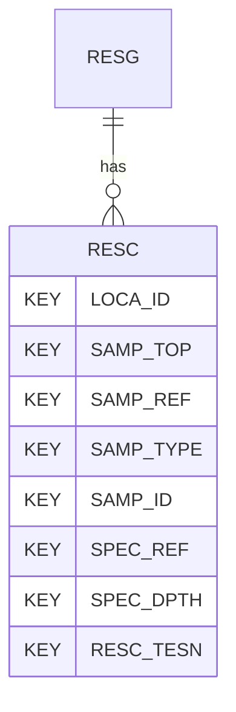

# RESC — Resonant Column Test - Consolidation

## Purpose
> [!quote] The **RESC** group — Resonant Column Test - Consolidation. It is a **child of [[RESG]]** in the PROJ-rooted hierarchy. See [[parent-child-graph]].

## Position in the model

- Parent: [[RESG]]
- Children: _none_
- See [[parent-child-graph]] · [[key-tuple-pseudo-keys]] · [[heading-status-vocabulary]]

## Headings
> [!quote] Rendered from `repo:rust-packages/laterite-ags4-reference/data/ags_dictionary.json groups[code=RESC]` (the repo's model authority — AGS edition 4.2). Suggested UNITs + worked examples are in the cited spec PDF, not duplicated here.

35 heading(s) — `**KEY**` = pseudo-key tuple, `*REQ*` = REQUIRED (non-null, Rule 10b), `DEP` = deprecated, OTHER = scope-dependent.

| Heading | Status | Type | Description |
|---|---|---|---|
| `LOCA_ID` | **KEY** | `ID` | Location identifier |
| `SAMP_TOP` | **KEY** | `2DP` | Depth to top of sample |
| `SAMP_REF` | **KEY** | `X` | Sample reference |
| `SAMP_TYPE` | **KEY** | `PA` | Sample type |
| `SAMP_ID` | **KEY** | `ID` | Sample unique identifier |
| `SPEC_REF` | **KEY** | `X` | Specimen reference |
| `SPEC_DPTH` | **KEY** | `2DP` | Depth to top of test specimen |
| `RESC_TESN` | **KEY** | `X` | Test / Stage Number |
| `RESC_SDIA` | OTHER | `2DP` | Specimen diameter |
| `RESC_HIGH` | OTHER | `2DP` | Specimen height |
| `RESC_CTYP` | OTHER | `PA` | Type of consolidation |
| `RESC_ELAP` | OTHER | `T` | Duration of stage |
| `RESC_CHGT` | OTHER | `2DP` | Specimen height at end of test/stage |
| `RESC_CDIA` | OTHER | `2DP` | Specimen diameter at end of test/stage |
| `RESC_CMC` | OTHER | `X` | Water content at end of test/stage |
| `RESC_CDDN` | OTHER | `2DP` | Dry density at end of test/stage |
| `RESC_CRD` | OTHER | `1DP` | Relative density at end of test/stage |
| `RESC_INCE` | OTHER | `3DP` | Voids ratio at end of test/stage |
| `RESC_EASC` | OTHER | `1DP` | Effective axial stress during consolidation at end of test/stage |
| `RESC_ERSC` | OTHER | `1DP` | Effective radial stress during consolidation at end of test/stage |
| `RESC_DEVS` | OTHER | `1DP` | Deviatoric stress at end of test/stage |
| `RESC_SHRS` | OTHER | `1DP` | Shear stress at end of test/stage |
| `RESC_MNES` | OTHER | `1DP` | Mean effective stress at end of test/stage |
| `RESC_AXSN` | OTHER | `3DP` | Axial strain at end of test/stage |
| `RESC_VLSN` | OTHER | `3DP` | Volumetric strain from measured volume change at end of test/stage |
| `RESC_RDSN` | OTHER | `3DP` | Radial strain from measured volume change |
| `RESC_BESE` | OTHER | `X` | Bender element test sequence |
| `RESC_BEAX` | OTHER | `X` | Bender element axis of measurement |
| `RESC_DBTE` | OTHER | `2DP` | Distance between bender elements |
| `RESC_MAT` | OTHER | `4DP` | Measured arrival time of propagated wave |
| `RESC_MATM` | OTHER | `X` | Method of measuring arrival time of propagated wave |
| `RESC_SWV` | OTHER | `0DP` | Calculated shear wave velocity |
| `RESC_SMGM` | OTHER | `1DP` | Shear modulus Gmax from bender elements |
| `RESC_REM` | OTHER | `X` | Remarks |
| `FILE_FSET` | OTHER | `X` | Associated file reference |

Full cross-edition heading deltas: AGS Change Log (see [[ags4-rules-frozen-dictionary-evolves]]).

## Relational notes
KEY tuple: `LOCA_ID`, `SAMP_TOP`, `SAMP_REF`, `SAMP_TYPE`, `SAMP_ID`, `SPEC_REF`, `SPEC_DPTH`, `RESC_TESN`. Children (0): _none_. As a child it **denormalises** its parent's KEY columns into every row; [[rule-10c-parent-child]] re-resolves that repeated tuple upward to [[RESG]]. See [[key-tuple-pseudo-keys]] · [[denormalised-child-rows]].

## Variations
No group-level change at 4.2 (present across the in-scope editions). Granular per-heading edition deltas live in the AGS online **Change Log** — the spec's own cited delta source (`spec:AGS4-4.2-2025.pdf` Foreword → ags.org.uk/.../change-log). Heading-level archaeology is deferred to a targeted Ingest if a rule/O-N interaction needs it (per [[ags4-rules-frozen-dictionary-evolves]]).

## Related
[[parent-child-graph]] · [[key-tuple-pseudo-keys]] · [[heading-status-vocabulary]] · [[rule-10c-parent-child]] · [[RESG]]
