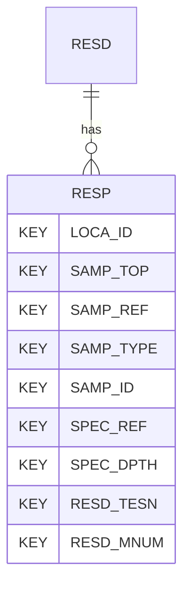

# RESP — Resonant Column Test - Derived Parameters

## Purpose
> [!quote] The **RESP** group — Resonant Column Test - Derived Parameters. It is a **child of [[RESD]]** in the PROJ-rooted hierarchy. See [[parent-child-graph]].

## Position in the model

- Parent: [[RESD]]
- Children: _none_
- See [[parent-child-graph]] · [[key-tuple-pseudo-keys]] · [[heading-status-vocabulary]]

## Headings
> [!quote] Rendered from `repo:rust-packages/laterite-ags4-reference/data/ags_dictionary.json groups[code=RESP]` (the repo's model authority — AGS edition 4.2). Suggested UNITs + worked examples are in the cited spec PDF, not duplicated here.

25 heading(s) — `**KEY**` = pseudo-key tuple, `*REQ*` = REQUIRED (non-null, Rule 10b), `DEP` = deprecated, OTHER = scope-dependent.

| Heading | Status | Type | Description |
|---|---|---|---|
| `LOCA_ID` | **KEY** | `ID` | Location identifier |
| `SAMP_TOP` | **KEY** | `2DP` | Depth to top of sample |
| `SAMP_REF` | **KEY** | `X` | Sample reference |
| `SAMP_TYPE` | **KEY** | `PA` | Sample type |
| `SAMP_ID` | **KEY** | `ID` | Sample unique identifier |
| `SPEC_REF` | **KEY** | `X` | Specimen reference |
| `SPEC_DPTH` | **KEY** | `2DP` | Depth to top of test specimen |
| `RESD_TESN` | **KEY** | `X` | Test / Stage Number |
| `RESD_MNUM` | **KEY** | `X` | Measurement Number |
| `RESP_CTYP` | OTHER | `X` | Type of Consolidation |
| `RESP_CSTG` | OTHER | `0DP` | Consolidation Stage |
| `RESP_CELL` | OTHER | `1DP` | Isotropic/Anisotropic Consolidation Cell Pressure |
| `RESP_BACK` | OTHER | `1DP` | Isotropic/Anisotropic Consolidation Back Pressure |
| `RESP_ERSC` | OTHER | `1DP` | Effective Radial Stress During Consolidation |
| `RESP_EASC` | OTHER | `1DP` | Effective Axial Stress During Consolidation |
| `RESP_DEV` | OTHER | `1DP` | Deviator Stress at End of Isotropic/Anisotropic Consolidation |
| `RESP_VOLS` | OTHER | `3DP` | Change to Volumetric Strain During Isotropic/Anisotropic Consolidation |
| `RESP_STRN` | OTHER | `3DP` | Axial Strain After Isotropic/Anisotropic Consolidation |
| `RESP_SMOD` | OTHER | `2DP` | Shear Modulus G0 |
| `RESP_SSTR` | OTHER | `1DP` | Mean Effective Stress |
| `RESP_DAMP` | OTHER | `4DP` | Damping Ratio |
| `RESP_SMRA` | OTHER | `2DP` | Normalised Shear Modulus by Maximum Shear Modulus |
| `RESP_SR` | OTHER | `2DP` | Slippage Ratio |
| `RESP_REM` | OTHER | `X` | Remarks |
| `FILE_FSET` | OTHER | `X` | Associated file reference |

Full cross-edition heading deltas: AGS Change Log (see [[ags4-rules-frozen-dictionary-evolves]]).

## Relational notes
KEY tuple: `LOCA_ID`, `SAMP_TOP`, `SAMP_REF`, `SAMP_TYPE`, `SAMP_ID`, `SPEC_REF`, `SPEC_DPTH`, `RESD_TESN`, `RESD_MNUM`. Children (0): _none_. As a child it **denormalises** its parent's KEY columns into every row; [[rule-10c-parent-child]] re-resolves that repeated tuple upward to [[RESD]]. See [[key-tuple-pseudo-keys]] · [[denormalised-child-rows]].

## Variations
No group-level change at 4.2 (present across the in-scope editions). Granular per-heading edition deltas live in the AGS online **Change Log** — the spec's own cited delta source (`spec:AGS4-4.2-2025.pdf` Foreword → ags.org.uk/.../change-log). Heading-level archaeology is deferred to a targeted Ingest if a rule/O-N interaction needs it (per [[ags4-rules-frozen-dictionary-evolves]]).

## Related
[[parent-child-graph]] · [[key-tuple-pseudo-keys]] · [[heading-status-vocabulary]] · [[rule-10c-parent-child]] · [[RESD]]
