# SAMP — Sample Information

## Purpose
> [!quote] The **SAMP** group — Sample Information. It is a **child of [[LOCA]]** in the PROJ-rooted hierarchy. See [[parent-child-graph]].

## Position in the model

```mermaid
erDiagram
  LOCA ||--o{ SAMP : has
  SAMP ||--o{ AAVT : has
  SAMP ||--o{ ACVT : has
  SAMP ||--o{ AELO : has
  SAMP ||--o{ AFLK : has
  SAMP ||--o{ AIVT : has
  SAMP ||--o{ ALOS : has
  SAMP ||--o{ APSV : has
  SAMP ||--o{ ARTW : has
  SAMP ||--o{ ASDI : has
  SAMP ||--o{ ASNS : has
  SAMP ||--o{ AWAD : has
  SAMP ||--o{ CBRG : has
  SAMP ||--o{ CHOC : has
  SAMP ||--o{ CMPG : has
  SAMP ||--o{ CONG : has
  SAMP ||--o{ CTRG : has
  SAMP ||--o{ ECTN : has
  SAMP ||--o{ ELRG : has
  SAMP ||--o{ ERES : has
  SAMP ||--o{ ESCG : has
  SAMP ||--o{ FRST : has
  SAMP ||--o{ GCHM : has
  SAMP ||--o{ GRAG : has
  SAMP ||--o{ LDEN : has
  SAMP ||--o{ LDYN : has
  SAMP ||--o{ LFCN : has
  SAMP ||--o{ LLIN : has
  SAMP ||--o{ LLPL : has
  SAMP ||--o{ LNMC : has
  SAMP ||--o{ LPDN : has
  SAMP ||--o{ LPEN : has
  SAMP ||--o{ LRES : has
  SAMP ||--o{ LSLT : has
  SAMP ||--o{ LSTG : has
  SAMP ||--o{ LSWL : has
  SAMP ||--o{ LTCH : has
  SAMP ||--o{ LUCT : has
  SAMP ||--o{ LVAN : has
  SAMP ||--o{ MCVG : has
  SAMP ||--o{ PTST : has
  SAMP ||--o{ RCAG : has
  SAMP ||--o{ RCCV : has
  SAMP ||--o{ RDEN : has
  SAMP ||--o{ RELD : has
  SAMP ||--o{ RESG : has
  SAMP ||--o{ RPLT : has
  SAMP ||--o{ RSCH : has
  SAMP ||--o{ RSHR : has
  SAMP ||--o{ RTEN : has
  SAMP ||--o{ RUCS : has
  SAMP ||--o{ RWCO : has
  SAMP ||--o{ SHBG : has
  SAMP ||--o{ SUCT : has
  SAMP ||--o{ TNPC : has
  SAMP ||--o{ TREG : has
  SAMP ||--o{ TRIG : has
  SAMP {
    KEY LOCA_ID
    KEY SAMP_TOP
    KEY SAMP_REF
    KEY SAMP_TYPE
    KEY SAMP_ID
  }
```

- Parent: [[LOCA]]
- Children: [[AAVT]] [[ACVT]] [[AELO]] [[AFLK]] [[AIVT]] [[ALOS]] [[APSV]] [[ARTW]] [[ASDI]] [[ASNS]] [[AWAD]] [[CBRG]] [[CHOC]] [[CMPG]] [[CONG]] [[CTRG]] [[ECTN]] [[ELRG]] [[ERES]] [[ESCG]] [[FRST]] [[GCHM]] [[GRAG]] [[LDEN]] [[LDYN]] [[LFCN]] [[LLIN]] [[LLPL]] [[LNMC]] [[LPDN]] [[LPEN]] [[LRES]] [[LSLT]] [[LSTG]] [[LSWL]] [[LTCH]] [[LUCT]] [[LVAN]] [[MCVG]] [[PTST]] [[RCAG]] [[RCCV]] [[RDEN]] [[RELD]] [[RESG]] [[RPLT]] [[RSCH]] [[RSHR]] [[RTEN]] [[RUCS]] [[RWCO]] [[SHBG]] [[SUCT]] [[TNPC]] [[TREG]] [[TRIG]]
- See [[parent-child-graph]] · [[key-tuple-pseudo-keys]] · [[heading-status-vocabulary]]

## Headings
> [!quote] Rendered from `repo:rust-packages/laterite-ags4-reference/data/ags_dictionary.json groups[code=SAMP]` (the repo's model authority — AGS edition 4.2). Suggested UNITs + worked examples are in the cited spec PDF, not duplicated here.

35 heading(s) — `**KEY**` = pseudo-key tuple, `*REQ*` = REQUIRED (non-null, Rule 10b), `DEP` = deprecated, OTHER = scope-dependent.

| Heading | Status | Type | Description |
|---|---|---|---|
| `LOCA_ID` | **KEY** | `ID` | Location identifier |
| `SAMP_TOP` | **KEY** | `2DP` | Depth to top of sample |
| `SAMP_REF` | **KEY** | `X` | Sample reference |
| `SAMP_TYPE` | **KEY** | `PA` | Sample type |
| `SAMP_ID` | **KEY** | `ID` | Sample unique identifier |
| `SAMP_BASE` | OTHER | `2DP` | Depth to base of sample |
| `SAMP_DTIM` | OTHER | `DT` | Date and time sample taken |
| `SAMP_UBLO` | OTHER | `0DP` | Number of blows required to drive sampler |
| `SAMP_CONT` | OTHER | `X` | Sample container |
| `SAMP_PREP` | OTHER | `X` | Details of sample preparation at time of sampling |
| `SAMP_SDIA` | OTHER | `0DP` | Sample diameter |
| `SAMP_WDEP` | OTHER | `2DP` | Depth to water below ground surface at time of sampling |
| `SAMP_RECV` | OTHER | `0DP` | Percentage of sample recovered |
| `SAMP_TECH` | OTHER | `X` | Sampling technique/method |
| `SAMP_MATX` | OTHER | `X` | Sample matrix |
| `SAMP_TYPC` | OTHER | `X` | Sample QA type (Normal, blank or spike) |
| `SAMP_WHO` | OTHER | `X` | Samplers initials or name |
| `SAMP_WHY` | OTHER | `X` | Reason for sampling |
| `SAMP_REM` | OTHER | `X` | Sample remarks |
| `SAMP_DESC` | OTHER | `X` | Sample/specimen description |
| `SAMP_DESD` | OTHER | `DT` | Date sample described |
| `SAMP_LOG` | OTHER | `X` | Person responsible for sample/specimen description |
| `SAMP_COND` | OTHER | `X` | Condition and representativeness of sample |
| `SAMP_CLSS` | OTHER | `X` | Sample classification as required by EN ISO 14688-1 |
| `SAMP_BAR` | OTHER | `1DP` | Barometric pressure at time of sampling |
| `SAMP_TEMP` | OTHER | `0DP` | Sample temperature at time of sampling |
| `SAMP_PRES` | OTHER | `1DP` | Gas pressure (above barometric) |
| `SAMP_FLOW` | OTHER | `1DP` | Gas flow rate |
| `SAMP_ETIM` | OTHER | `DT` | Date and time sampling completed |
| `SAMP_DURN` | OTHER | `T` | Sampling duration |
| `SAMP_CAPT` | OTHER | `X` | Caption used to describe sample |
| `SAMP_LINK` | OTHER | `RL` | Sample record link |
| `GEOL_STAT` | OTHER | `X` | Stratum reference shown on trial pit or traverse sketch |
| `FILE_FSET` | OTHER | `X` | Associated file reference (e.g. sampling field sheets, sample description records) |
| `SAMP_RECL` | OTHER | `0DP` | Length of sample recovered |

Full cross-edition heading deltas: AGS Change Log (see [[ags4-rules-frozen-dictionary-evolves]]).

## Relational notes
KEY tuple: `LOCA_ID`, `SAMP_TOP`, `SAMP_REF`, `SAMP_TYPE`, `SAMP_ID`. Children (56): [[AAVT]] [[ACVT]] [[AELO]] [[AFLK]] [[AIVT]] [[ALOS]] [[APSV]] [[ARTW]] [[ASDI]] [[ASNS]] [[AWAD]] [[CBRG]] [[CHOC]] [[CMPG]] [[CONG]] [[CTRG]] [[ECTN]] [[ELRG]] [[ERES]] [[ESCG]] [[FRST]] [[GCHM]] [[GRAG]] [[LDEN]] [[LDYN]] [[LFCN]] [[LLIN]] [[LLPL]] [[LNMC]] [[LPDN]] [[LPEN]] [[LRES]] [[LSLT]] [[LSTG]] [[LSWL]] [[LTCH]] [[LUCT]] [[LVAN]] [[MCVG]] [[PTST]] [[RCAG]] [[RCCV]] [[RDEN]] [[RELD]] [[RESG]] [[RPLT]] [[RSCH]] [[RSHR]] [[RTEN]] [[RUCS]] [[RWCO]] [[SHBG]] [[SUCT]] [[TNPC]] [[TREG]] [[TRIG]]. As a child it **denormalises** its parent's KEY columns into every row; [[rule-10c-parent-child]] re-resolves that repeated tuple upward to [[LOCA]]. See [[key-tuple-pseudo-keys]] · [[denormalised-child-rows]].

## Variations
No group-level change at 4.2 (present across the in-scope editions). Granular per-heading edition deltas live in the AGS online **Change Log** — the spec's own cited delta source (`spec:AGS4-4.2-2025.pdf` Foreword → ags.org.uk/.../change-log). Heading-level archaeology is deferred to a targeted Ingest if a rule/O-N interaction needs it (per [[ags4-rules-frozen-dictionary-evolves]]).

## Related
[[parent-child-graph]] · [[key-tuple-pseudo-keys]] · [[heading-status-vocabulary]] · [[rule-10c-parent-child]] · [[LOCA]] · [[AAVT]] · [[ACVT]] · [[AELO]] · [[AFLK]] · [[AIVT]] · [[ALOS]] · [[APSV]] · [[ARTW]] · [[ASDI]] · [[ASNS]] · [[AWAD]] · [[CBRG]] · [[CHOC]] · [[CMPG]] · [[CONG]] · [[CTRG]] · [[ECTN]] · [[ELRG]] · [[ERES]] · [[ESCG]] · [[FRST]] · [[GCHM]] · [[GRAG]] · [[LDEN]] · [[LDYN]] · [[LFCN]] · [[LLIN]] · [[LLPL]] · [[LNMC]] · [[LPDN]] · [[LPEN]] · [[LRES]] · [[LSLT]] · [[LSTG]] · [[LSWL]] · [[LTCH]] · [[LUCT]] · [[LVAN]] · [[MCVG]] · [[PTST]] · [[RCAG]] · [[RCCV]] · [[RDEN]] · [[RELD]] · [[RESG]] · [[RPLT]] · [[RSCH]] · [[RSHR]] · [[RTEN]] · [[RUCS]] · [[RWCO]] · [[SHBG]] · [[SUCT]] · [[TNPC]] · [[TREG]] · [[TRIG]]
