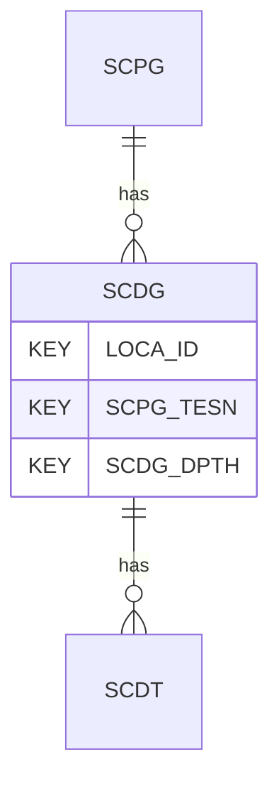

# SCDG — Static Cone Dissipation Tests - General

## Purpose
> [!quote] The **SCDG** group — Static Cone Dissipation Tests - General. It is a **child of [[SCPG]]** in the PROJ-rooted hierarchy. See [[parent-child-graph]].

## Position in the model

- Parent: [[SCPG]]
- Children: [[SCDT]]
- See [[parent-child-graph]] · [[key-tuple-pseudo-keys]] · [[heading-status-vocabulary]]

## Headings
> [!quote] Rendered from `repo:rust-packages/laterite-ags4-reference/data/ags_dictionary.json groups[code=SCDG]` (the repo's model authority — AGS edition 4.2). Suggested UNITs + worked examples are in the cited spec PDF, not duplicated here.

15 heading(s) — `**KEY**` = pseudo-key tuple, `*REQ*` = REQUIRED (non-null, Rule 10b), `DEP` = deprecated, OTHER = scope-dependent.

| Heading | Status | Type | Description |
|---|---|---|---|
| `LOCA_ID` | **KEY** | `ID` | Location identifier |
| `SCPG_TESN` | **KEY** | `X` | Test reference or push number |
| `SCDG_DPTH` | **KEY** | `2DP` | Depth of dissipation test |
| `SCDG_PWPI` | OTHER | `3DP` | Measured or assumed initial pore water pressure |
| `SCDG_PWPE` | OTHER | `3DP` | Measured or assumed equilibrium pore water pressure |
| `SCDG_DDIS` | OTHER | `0DP` | Degree of dissipation for analysis |
| `SCDG_T` | OTHER | `1DP` | Time to achieve degree of dissipation stated in SCDG_DDIS |
| `SCDG_CV` | OTHER | `2SCI` | Coefficient of consolidation (vertical) |
| `SCDG_CVMT` | OTHER | `X` | Method(s) used to determine vertical coefficient of consolidation |
| `SCDG_CH` | OTHER | `2SCI` | Coefficient of consolidation (horizontal) |
| `SCDG_CHMT` | OTHER | `X` | Method(s) used to determine horizontal coefficient of consolidation |
| `SCDG_REM` | OTHER | `X` | Remarks |
| `TEST_STAT` | OTHER | `X` | Test status |
| `FILE_FSET` | OTHER | `X` | Associated file reference (e.g. equipment calibrations) |
| `SCDG_OPER` | OTHER | `X` | Name of test operator |

Full cross-edition heading deltas: AGS Change Log (see [[ags4-rules-frozen-dictionary-evolves]]).

## Relational notes
KEY tuple: `LOCA_ID`, `SCPG_TESN`, `SCDG_DPTH`. Children (1): [[SCDT]]. As a child it **denormalises** its parent's KEY columns into every row; [[rule-10c-parent-child]] re-resolves that repeated tuple upward to [[SCPG]]. See [[key-tuple-pseudo-keys]] · [[denormalised-child-rows]].

## Variations
No group-level change at 4.2 (present across the in-scope editions). Granular per-heading edition deltas live in the AGS online **Change Log** — the spec's own cited delta source (`spec:AGS4-4.2-2025.pdf` Foreword → ags.org.uk/.../change-log). Heading-level archaeology is deferred to a targeted Ingest if a rule/O-N interaction needs it (per [[ags4-rules-frozen-dictionary-evolves]]).

## Related
[[parent-child-graph]] · [[key-tuple-pseudo-keys]] · [[heading-status-vocabulary]] · [[rule-10c-parent-child]] · [[SCPG]] · [[SCDT]]
