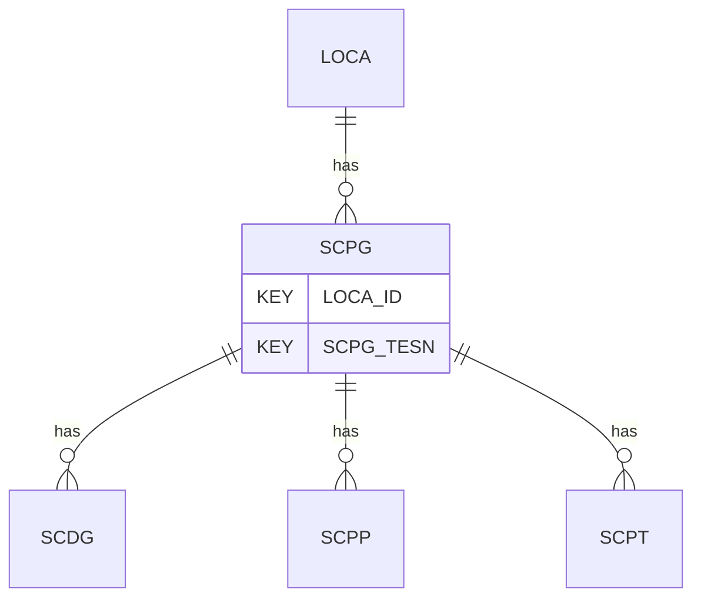

# SCPG — Static Cone Penetration Tests - General

## Purpose
> [!quote] The **SCPG** group — Static Cone Penetration Tests - General. It is a **child of [[LOCA]]** in the PROJ-rooted hierarchy. See [[parent-child-graph]].

## Position in the model

- Parent: [[LOCA]]
- Children: [[SCDG]] [[SCPP]] [[SCPT]]
- See [[parent-child-graph]] · [[key-tuple-pseudo-keys]] · [[heading-status-vocabulary]]

## Headings
> [!quote] Rendered from `repo:rust-packages/laterite-ags4-reference/data/ags_dictionary.json groups[code=SCPG]` (the repo's model authority — AGS edition 4.2). Suggested UNITs + worked examples are in the cited spec PDF, not duplicated here.

19 heading(s) — `**KEY**` = pseudo-key tuple, `*REQ*` = REQUIRED (non-null, Rule 10b), `DEP` = deprecated, OTHER = scope-dependent.

| Heading | Status | Type | Description |
|---|---|---|---|
| `LOCA_ID` | **KEY** | `ID` | Location identifier |
| `SCPG_TESN` | **KEY** | `X` | Test reference or push number |
| `SCPG_TYPE` | OTHER | `PA` | Cone test type |
| `SCPG_REF` | OTHER | `X` | Cone reference |
| `SCPG_CSA` | OTHER | `0DP` | Surface area of cone tip |
| `SCPG_RATE` | OTHER | `0DP` | Nominal rate of penetration of the cone |
| `SCPG_FILT` | OTHER | `X` | Type of filter material used |
| `SCPG_FRIC` | OTHER | `YN` | Friction reducer used |
| `SCPG_WAT` | OTHER | `2DP` | Groundwater level at time of test |
| `SCPG_WATA` | OTHER | `X` | Origin of water level in SCPG_WAT |
| `SCPG_REM` | OTHER | `X` | Comments on testing and basis of any interpreted parameters included in SCPT and SCPP |
| `SCPG_ENV` | OTHER | `X` | Details of weather and environmental conditions during test |
| `SCPG_CONT` | OTHER | `X` | Subcontractors name |
| `SCPG_METH` | OTHER | `X` | Standard followed for testing |
| `SCPG_CRED` | OTHER | `X` | Accrediting body and reference number (when appropriate) |
| `SCPG_CAR` | OTHER | `3DP` | Cone area ratio used to calculate qt |
| `SCPG_SLAR` | OTHER | `3DP` | Sleeve area ratio used to calculate ft |
| `FILE_FSET` | OTHER | `X` | Associated file reference (e.g. cone calibration records) |
| `SCPG_OPER` | OTHER | `X` | Name of test operator |

Full cross-edition heading deltas: AGS Change Log (see [[ags4-rules-frozen-dictionary-evolves]]).

## Relational notes
KEY tuple: `LOCA_ID`, `SCPG_TESN`. Children (3): [[SCDG]] [[SCPP]] [[SCPT]]. As a child it **denormalises** its parent's KEY columns into every row; [[rule-10c-parent-child]] re-resolves that repeated tuple upward to [[LOCA]]. See [[key-tuple-pseudo-keys]] · [[denormalised-child-rows]].

## Variations
> [!warning] **DEPRECATED in AGS 4.2** (strike-through in `spec:AGS4-4.2-2025.pdf` §3.6) — to be removed in a future edition; superseded by CPDx/CPTx.

Still valid in 4.2 but discouraged; a producer/consumer interoperability risk.

## Related
[[parent-child-graph]] · [[key-tuple-pseudo-keys]] · [[heading-status-vocabulary]] · [[rule-10c-parent-child]] · [[LOCA]] · [[SCDG]] · [[SCPP]] · [[SCPT]]
