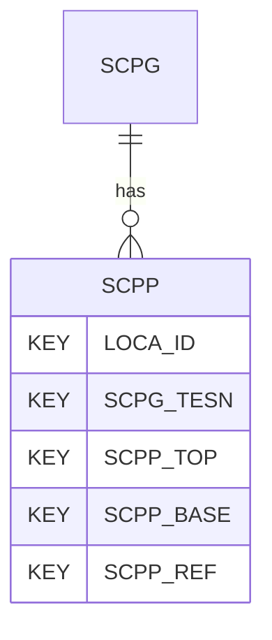

# SCPP — Static Cone Penetration Tests - Derived Parameters

## Purpose
> [!quote] The **SCPP** group — Static Cone Penetration Tests - Derived Parameters. It is a **child of [[SCPG]]** in the PROJ-rooted hierarchy. See [[parent-child-graph]].

## Position in the model

- Parent: [[SCPG]]
- Children: _none_
- See [[parent-child-graph]] · [[key-tuple-pseudo-keys]] · [[heading-status-vocabulary]]

## Headings
> [!quote] Rendered from `repo:rust-packages/laterite-ags4-reference/data/ags_dictionary.json groups[code=SCPP]` (the repo's model authority — AGS edition 4.2). Suggested UNITs + worked examples are in the cited spec PDF, not duplicated here.

13 heading(s) — `**KEY**` = pseudo-key tuple, `*REQ*` = REQUIRED (non-null, Rule 10b), `DEP` = deprecated, OTHER = scope-dependent.

| Heading | Status | Type | Description |
|---|---|---|---|
| `LOCA_ID` | **KEY** | `ID` | Location identifier |
| `SCPG_TESN` | **KEY** | `X` | Test reference or push number |
| `SCPP_TOP` | **KEY** | `2DP` | Depth to top of layer |
| `SCPP_BASE` | **KEY** | `2DP` | Depth to base of layer |
| `SCPP_REF` | **KEY** | `X` | Interpretation reference |
| `SCPP_REM` | OTHER | `X` | Remarks |
| `SCPP_CSBT` | OTHER | `X` | Interpreted Soil Type |
| `SCPP_CSU` | OTHER | `1DP` | Undrained Shear Strength (Su); fine soils only |
| `SCPP_CRD` | OTHER | `1DP` | Relative density (Dr); coarse soils only |
| `SCPP_CPHI` | OTHER | `1DP` | Internal Friction Angle; coarse soils only |
| `SCPP_CIC` | OTHER | `1DP` | Soil Behaviour Type Index (Ic) |
| `SCPP_CSPT` | OTHER | `0DP` | Equivalent SPT N60 value |
| `FILE_FSET` | OTHER | `X` | Associated file reference |

Full cross-edition heading deltas: AGS Change Log (see [[ags4-rules-frozen-dictionary-evolves]]).

## Relational notes
KEY tuple: `LOCA_ID`, `SCPG_TESN`, `SCPP_TOP`, `SCPP_BASE`, `SCPP_REF`. Children (0): _none_. As a child it **denormalises** its parent's KEY columns into every row; [[rule-10c-parent-child]] re-resolves that repeated tuple upward to [[SCPG]]. See [[key-tuple-pseudo-keys]] · [[denormalised-child-rows]].

## Variations
No group-level change at 4.2 (present across the in-scope editions). Granular per-heading edition deltas live in the AGS online **Change Log** — the spec's own cited delta source (`spec:AGS4-4.2-2025.pdf` Foreword → ags.org.uk/.../change-log). Heading-level archaeology is deferred to a targeted Ingest if a rule/O-N interaction needs it (per [[ags4-rules-frozen-dictionary-evolves]]).

## Related
[[parent-child-graph]] · [[key-tuple-pseudo-keys]] · [[heading-status-vocabulary]] · [[rule-10c-parent-child]] · [[SCPG]]
