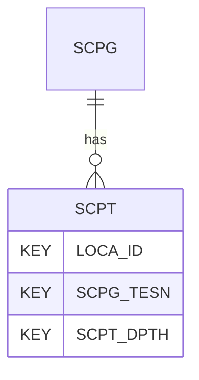

# SCPT — Static Cone Penetration Tests - Data

## Purpose
> [!quote] The **SCPT** group — Static Cone Penetration Tests - Data. It is a **child of [[SCPG]]** in the PROJ-rooted hierarchy. See [[parent-child-graph]].

## Position in the model

- Parent: [[SCPG]]
- Children: _none_
- See [[parent-child-graph]] · [[key-tuple-pseudo-keys]] · [[heading-status-vocabulary]]

## Headings
> [!quote] Rendered from `repo:rust-packages/laterite-ags4-reference/data/ags_dictionary.json groups[code=SCPT]` (the repo's model authority — AGS edition 4.2). Suggested UNITs + worked examples are in the cited spec PDF, not duplicated here.

36 heading(s) — `**KEY**` = pseudo-key tuple, `*REQ*` = REQUIRED (non-null, Rule 10b), `DEP` = deprecated, OTHER = scope-dependent.

| Heading | Status | Type | Description |
|---|---|---|---|
| `LOCA_ID` | **KEY** | `ID` | Location identifier |
| `SCPG_TESN` | **KEY** | `X` | Test reference or push number |
| `SCPT_DPTH` | **KEY** | `2DP` | Depth of result |
| `SCPT_RES` | OTHER | `3DP` | Cone resistance (qc) |
| `SCPT_FRES` | OTHER | `4DP` | Local unit side friction resistance (fs) |
| `SCPT_PWP1` | OTHER | `4DP` | Face porewater pressure (u1) |
| `SCPT_PWP2` | OTHER | `4DP` | Shoulder porewater pressure (u2) |
| `SCPT_PWP3` | OTHER | `4DP` | Top of sleeve porewater pressure (u3) |
| `SCPT_CON` | OTHER | `4DP` | Conductivity |
| `SCPT_TEMP` | OTHER | `4DP` | Temperature |
| `SCPT_PH` | OTHER | `4DP` | pH reading |
| `SCPT_SLP1` | OTHER | `4DP` | Slope indicator no. 1 |
| `SCPT_SLP2` | OTHER | `4DP` | Slope indicator no. 2 |
| `SCPT_REDX` | OTHER | `4DP` | Redox potential reading |
| `SCPT_MAGT` | OTHER | `4DP` | Magnetic flux - Total (calculated) |
| `SCPT_MAGX` | OTHER | `4DP` | Magnetic flux - X |
| `SCPT_MAGY` | OTHER | `4DP` | Magnetic flux - Y |
| `SCPT_MAGZ` | OTHER | `4DP` | Magnetic flux - Z |
| `SCPT_SMP` | OTHER | `4DP` | Soil moisture |
| `SCPT_NGAM` | OTHER | `4DP` | Natural gamma radiation |
| `SCPT_REM` | OTHER | `X` | Remarks |
| `SCPT_FRR` | OTHER | `2DP` | Friction ratio (Rf) |
| `SCPT_QT` | OTHER | `4DP` | Corrected cone resistance (qt) piezocone only |
| `SCPT_FT` | OTHER | `4DP` | Corrected sleeve resistance (ft) piezocone only |
| `SCPT_QE` | OTHER | `4DP` | Effective cone resistance (qe) piezocone only |
| `SCPT_BDEN` | OTHER | `2DP` | Bulk density of material (measured or assumed) |
| `SCPT_CPO` | OTHER | `2DP` | Total vertical stress (based on SCPT_BDEN) |
| `SCPT_CPOD` | OTHER | `2DP` | Effective vertical stress (calculated from SCPT_CPO and SCPT_ISPP or SCPG_WAT) |
| `SCPT_QNET` | OTHER | `4DP` | Net cone resistance (qn) |
| `SCPT_FRRC` | OTHER | `2DP` | Corrected friction ratio (Rf') piezocone only |
| `SCPT_EXPP` | OTHER | `4DP` | Excess pore pressure (u-uo) piezocone only |
| `SCPT_BQ` | OTHER | `4DP` | Pore pressure ratio (Bq) piezocone only |
| `SCPT_ISPP` | OTHER | `4DP` | In situ pore pressure (uo) (measured or assumed where not simple hydrostatic based on SCPG_WAT) |
| `SCPT_NQT` | OTHER | `4DP` | Normalised cone resistance (Qt) |
| `SCPT_NFR` | OTHER | `4DP` | Normalised friction ratio (Fr) |
| `FILE_FSET` | OTHER | `X` | Associated file reference (e.g. raw field data) |

Full cross-edition heading deltas: AGS Change Log (see [[ags4-rules-frozen-dictionary-evolves]]).

## Relational notes
KEY tuple: `LOCA_ID`, `SCPG_TESN`, `SCPT_DPTH`. Children (0): _none_. As a child it **denormalises** its parent's KEY columns into every row; [[rule-10c-parent-child]] re-resolves that repeated tuple upward to [[SCPG]]. See [[key-tuple-pseudo-keys]] · [[denormalised-child-rows]].

## Variations
> [!warning] **DEPRECATED in AGS 4.2** (strike-through in `spec:AGS4-4.2-2025.pdf` §3.6) — to be removed in a future edition; superseded by CPDx/CPTx.

Still valid in 4.2 but discouraged; a producer/consumer interoperability risk.

## Related
[[parent-child-graph]] · [[key-tuple-pseudo-keys]] · [[heading-status-vocabulary]] · [[rule-10c-parent-child]] · [[SCPG]]
