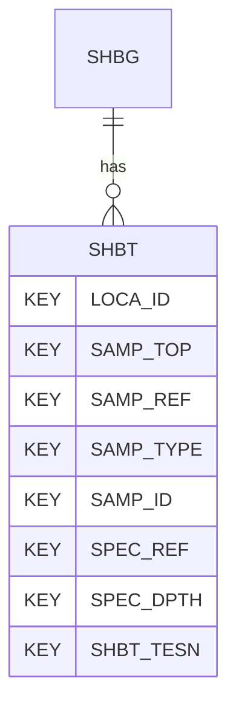

# SHBT — Shear Box Testing - Data

## Purpose
> [!quote] The **SHBT** group — Shear Box Testing - Data. It is a **child of [[SHBG]]** in the PROJ-rooted hierarchy. See [[parent-child-graph]].

## Position in the model

- Parent: [[SHBG]]
- Children: _none_
- See [[parent-child-graph]] · [[key-tuple-pseudo-keys]] · [[heading-status-vocabulary]]

## Headings
> [!quote] Rendered from `repo:rust-packages/laterite-ags4-reference/data/ags_dictionary.json groups[code=SHBT]` (the repo's model authority — AGS edition 4.2). Suggested UNITs + worked examples are in the cited spec PDF, not duplicated here.

32 heading(s) — `**KEY**` = pseudo-key tuple, `*REQ*` = REQUIRED (non-null, Rule 10b), `DEP` = deprecated, OTHER = scope-dependent.

| Heading | Status | Type | Description |
|---|---|---|---|
| `LOCA_ID` | **KEY** | `ID` | Location identifier |
| `SAMP_TOP` | **KEY** | `2DP` | Depth to top of sample |
| `SAMP_REF` | **KEY** | `X` | Sample reference |
| `SAMP_TYPE` | **KEY** | `PA` | Sample type |
| `SAMP_ID` | **KEY** | `ID` | Sample unique identifier |
| `SPEC_REF` | **KEY** | `X` | Specimen reference |
| `SPEC_DPTH` | **KEY** | `2DP` | Depth to top of test specimen |
| `SHBT_TESN` | **KEY** | `X` | Shear box stage/specimen reference |
| `SHBT_BDEN` | OTHER | `2DP` | Initial bulk density |
| `SHBT_DDEN` | OTHER | `2DP` | Initial dry density |
| `SHBT_NORM` | OTHER | `0DP` | Normal stress applied |
| `SHBT_DISP` | OTHER | `2SF` | Displacement rate for peak stress stage |
| `SHBT_DISR` | OTHER | `2SF` | Displacement rate for residual stress stage |
| `SHBT_REVS` | OTHER | `0DP` | Number of traverses if residual test |
| `SHBT_PEAK` | OTHER | `1DP` | Peak shear stress |
| `SHBT_RES` | OTHER | `1DP` | Residual shear stress |
| `SHBT_PDIS` | OTHER | `2DP` | Horizontal displacement at peak shear stress |
| `SHBT_RDIS` | OTHER | `2DP` | Horizontal displacement at residual shear stress |
| `SHBT_PDIN` | OTHER | `2DP` | Vertical displacement at peak shear stress |
| `SHBT_RDIN` | OTHER | `2DP` | Vertical displacement at residual shear stress |
| `SHBT_PDEN` | OTHER | `XN` | Particle density with prefix # if value assumed |
| `SHBT_IVR` | OTHER | `3DP` | Initial voids ratio |
| `SHBT_MCI` | OTHER | `X` | Initial water/moisture content |
| `SHBT_MCF` | OTHER | `X` | Final water/moisture content |
| `SHBT_DIA1` | OTHER | `2DP` | Specimen diameter in direction of shear (rock joints) |
| `SHBT_DIA2` | OTHER | `2DP` | Specimen diameter perpendicular to shear (rock joints) |
| `SHBT_HGT` | OTHER | `2DP` | Specimen height |
| `SHBT_CRIT` | OTHER | `X` | Failure/residual strength criterion used |
| `SHBT_REM` | OTHER | `X` | Remarks |
| `FILE_FSET` | OTHER | `X` | Associated file reference (e.g. test result sheets) |
| `SHBT_PVST` | OTHER | `0DP` | Normal (vertical) stress at peak shear stress |
| `SHBT_RVST` | OTHER | `0DP` | Normal (vertical) stress at residual shear stress |

Full cross-edition heading deltas: AGS Change Log (see [[ags4-rules-frozen-dictionary-evolves]]).

## Relational notes
KEY tuple: `LOCA_ID`, `SAMP_TOP`, `SAMP_REF`, `SAMP_TYPE`, `SAMP_ID`, `SPEC_REF`, `SPEC_DPTH`, `SHBT_TESN`. Children (0): _none_. As a child it **denormalises** its parent's KEY columns into every row; [[rule-10c-parent-child]] re-resolves that repeated tuple upward to [[SHBG]]. See [[key-tuple-pseudo-keys]] · [[denormalised-child-rows]].

## Variations
No group-level change at 4.2 (present across the in-scope editions). Granular per-heading edition deltas live in the AGS online **Change Log** — the spec's own cited delta source (`spec:AGS4-4.2-2025.pdf` Foreword → ags.org.uk/.../change-log). Heading-level archaeology is deferred to a targeted Ingest if a rule/O-N interaction needs it (per [[ags4-rules-frozen-dictionary-evolves]]).

## Related
[[parent-child-graph]] · [[key-tuple-pseudo-keys]] · [[heading-status-vocabulary]] · [[rule-10c-parent-child]] · [[SHBG]]
