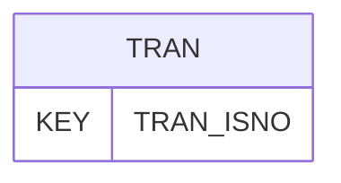

# TRAN — Data File Transmission Information / Data Status

## Purpose
> [!quote] The **TRAN** group — Data File Transmission Information / Data Status. It is a **root / non-hierarchy** group (file submission & description — Rules 13–18 territory). See [[parent-child-graph]].

## Position in the model

- Parent: _(root — no parent)_
- Children: _none_
- See [[parent-child-graph]] · [[key-tuple-pseudo-keys]] · [[heading-status-vocabulary]]

## Headings
> [!quote] Rendered from `repo:rust-packages/laterite-ags4-reference/data/ags_dictionary.json groups[code=TRAN]` (the repo's model authority — AGS edition 4.2). Suggested UNITs + worked examples are in the cited spec PDF, not duplicated here.

11 heading(s) — `**KEY**` = pseudo-key tuple, `*REQ*` = REQUIRED (non-null, Rule 10b), `DEP` = deprecated, OTHER = scope-dependent.

| Heading | Status | Type | Description |
|---|---|---|---|
| `TRAN_ISNO` | **KEY** | `X` | Issue sequence reference |
| `TRAN_DATE` | *REQ* | `DT` | Date of production of data file |
| `TRAN_PROD` | *REQ* | `X` | Data file producer |
| `TRAN_STAT` | *REQ* | `X` | Status of data within submission |
| `TRAN_DESC` | OTHER | `X` | Description of data transferred |
| `TRAN_AGS` | *REQ* | `X` | AGS Edition Reference |
| `TRAN_RECV` | *REQ* | `X` | Data file recipient |
| `TRAN_DLIM` | OTHER | `X` | Record Link data type Delimiter |
| `TRAN_RCON` | OTHER | `X` | Concatenator |
| `TRAN_REM` | OTHER | `X` | Remarks |
| `FILE_FSET` | OTHER | `X` | Associated file reference (e.g. data file QA check records) |

Full cross-edition heading deltas: AGS Change Log (see [[ags4-rules-frozen-dictionary-evolves]]).

## Relational notes
KEY tuple: `TRAN_ISNO`. Children (0): _none_. Parent linkage is implicit/absent — Rule 10c is skipped for root groups (see [[non-hierarchy-ten-vs-parentless-list]]). See [[key-tuple-pseudo-keys]] · [[denormalised-child-rows]].

## Variations
No group-level change at 4.2 (present across the in-scope editions). Granular per-heading edition deltas live in the AGS online **Change Log** — the spec's own cited delta source (`spec:AGS4-4.2-2025.pdf` Foreword → ags.org.uk/.../change-log). Heading-level archaeology is deferred to a targeted Ingest if a rule/O-N interaction needs it (per [[ags4-rules-frozen-dictionary-evolves]]).

## Related
[[parent-child-graph]] · [[key-tuple-pseudo-keys]] · [[heading-status-vocabulary]] · [[rule-10c-parent-child]]
