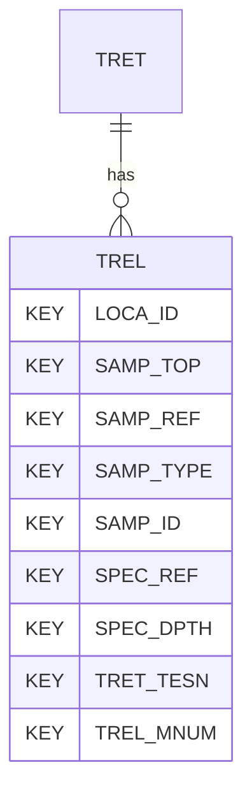

# TREL — Triaxial Tests - Logged Data

## Purpose
> [!quote] The **TREL** group — Triaxial Tests - Logged Data. It is a **child of [[TRET]]** in the PROJ-rooted hierarchy. See [[parent-child-graph]].

> [!warning] AGS-L draft group — not in the AGS4 4.x spec
> TREL is part of **AGS-L** (the AGS Library extension, expected publish 2026),
> scaffolded from `repo:reports/AGSL4_2_*.xlsx`. It is **retained** in the
> dictionary (never deleted) but is **not** a standard AGS4 4.x group. The
> AGS-L correction (PR #45) flags its dictionary `contents`
> `(AGS-L draft, publish 2026)`. See [[ags-4.2]].

## Position in the model

- Parent: [[TRET]]
- Children: _none_
- See [[parent-child-graph]] · [[key-tuple-pseudo-keys]] · [[heading-status-vocabulary]]

## Headings
> [!quote] Rendered from `repo:rust-packages/laterite-ags4-reference/data/ags_dictionary.json groups[code=TREL]` (the repo's model authority — AGS edition 4.1). Suggested UNITs + worked examples are in the cited spec PDF, not duplicated here.

33 heading(s) — `**KEY**` = pseudo-key tuple, `*REQ*` = REQUIRED (non-null, Rule 10b), OTHER = scope-dependent.

| Heading | Status | Type | Description |
|---|---|---|---|
| `LOCA_ID` | **KEY** | `ID` | Location identifier |
| `SAMP_TOP` | **KEY** | `2DP` | Depth to top of sample |
| `SAMP_REF` | **KEY** | `X` | Sample reference |
| `SAMP_TYPE` | **KEY** | `PA` | Sample type |
| `SAMP_ID` | **KEY** | `ID` | Sample unique identifier |
| `SPEC_REF` | **KEY** | `X` | Specimen reference |
| `SPEC_DPTH` | **KEY** | `2DP` | Depth to top of specimen |
| `TRET_TESN` | **KEY** | `X` | Triaxial test number |
| `TREL_MNUM` | **KEY** | `0DP` | Measurement number / record index |
| `TREL_TTIM` | OTHER | `1DP` | Elapsed time since start of test |
| `TREL_TTDT` | OTHER | `DT` | Test date time |
| `TREL_STIM` | OTHER | `1DP` | Elapsed time since start of stage |
| `TREL_STGN` | OTHER | `0DP` | Stage number |
| `TREL_STGD` | OTHER | `X` | Stage description |
| `TREL_CELL` | OTHER | `1DP` | Cell pressure |
| `TREL_BACK` | OTHER | `1DP` | Back pressure |
| `TREL_PWP` | OTHER | `1DP` | Pore pressure (external instrumentation) |
| `TREL_PWPM` | OTHER | `1DP` | Pore pressure (mid-height) |
| `TREL_SZT` | OTHER | `1DP` | Vertical total stress |
| `TREL_SZE` | OTHER | `1DP` | Vertical effective stress |
| `TREL_SRT` | OTHER | `1DP` | Radial total stress |
| `TREL_SRE` | OTHER | `1DP` | Radial effective stress |
| `TREL_EZET` | OTHER | `3DP` | Total vertical strain (external) |
| `TREL_EZES` | OTHER | `3DP` | Stage vertical strain (external) |
| `TREL_EPET` | OTHER | `3DP` | Total volumetric strain (external) |
| `TREL_EPES` | OTHER | `3DP` | Stage volumetric strain (external) |
| `TREL_EZ1T` | OTHER | `3DP` | Total vertical strain (local LVDT 1) |
| `TREL_EZ1S` | OTHER | `3DP` | Stage vertical strain (local LVDT 1) |
| `TREL_EZ2T` | OTHER | `3DP` | Total vertical strain (local LVDT 2) |
| `TREL_EZ2S` | OTHER | `3DP` | Stage vertical strain (local LVDT 2) |
| `TREL_ER1T` | OTHER | `3DP` | Total radial strain (local LDT 1) |
| `TREL_ER1S` | OTHER | `3DP` | Stage radial strain (local LDT 1) |
| `TREL_CYCN` | OTHER | `0DP` | Cycle number |

Full cross-edition heading deltas: AGS Change Log (see [[ags4-rules-frozen-dictionary-evolves]]).

## Relational notes
KEY tuple: `LOCA_ID`, `SAMP_TOP`, `SAMP_REF`, `SAMP_TYPE`, `SAMP_ID`, `SPEC_REF`, `SPEC_DPTH`, `TRET_TESN`, `TREL_MNUM`. No child groups. As a child it **denormalises** its parent's KEY columns into every row; [[rule-10c-parent-child]] re-resolves that repeated tuple upward to [[TRET]]. See [[key-tuple-pseudo-keys]] · [[denormalised-child-rows]].

## Variations
No group-level change at 4.2 (present across the in-scope editions). Granular per-heading edition deltas live in the AGS online **Change Log** — the spec's own cited delta source (`spec:AGS4-4.2-2025.pdf` Foreword → ags.org.uk/.../change-log). Heading-level archaeology is deferred to a targeted Ingest if a rule/O-N interaction needs it (per [[ags4-rules-frozen-dictionary-evolves]]).

## Related
[[parent-child-graph]] · [[key-tuple-pseudo-keys]] · [[heading-status-vocabulary]] · [[rule-10c-parent-child]] · [[TRET]]
