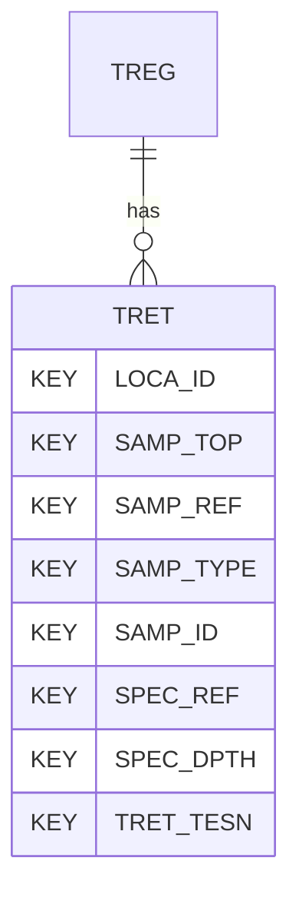

# TRET — Triaxial Tests - Effective Stress - Data

## Purpose
> [!quote] The **TRET** group — Triaxial Tests - Effective Stress - Data. It is a **child of [[TREG]]** in the PROJ-rooted hierarchy. See [[parent-child-graph]].

## Position in the model

- Parent: [[TREG]]
- Children: _none_
- See [[parent-child-graph]] · [[key-tuple-pseudo-keys]] · [[heading-status-vocabulary]]

## Headings
> [!quote] Rendered from `repo:rust-packages/laterite-ags4-reference/data/ags_dictionary.json groups[code=TRET]` (the repo's model authority — AGS edition 4.2). Suggested UNITs + worked examples are in the cited spec PDF, not duplicated here.

43 heading(s) — `**KEY**` = pseudo-key tuple, `*REQ*` = REQUIRED (non-null, Rule 10b), `DEP` = deprecated, OTHER = scope-dependent.

| Heading | Status | Type | Description |
|---|---|---|---|
| `LOCA_ID` | **KEY** | `ID` | Location identifier |
| `SAMP_TOP` | **KEY** | `2DP` | Depth to top of sample |
| `SAMP_REF` | **KEY** | `X` | Sample reference |
| `SAMP_TYPE` | **KEY** | `PA` | Sample type |
| `SAMP_ID` | **KEY** | `ID` | Sample unique identifier |
| `SPEC_REF` | **KEY** | `X` | Specimen reference |
| `SPEC_DPTH` | **KEY** | `2DP` | Depth to top of test specimen |
| `TRET_TESN` | **KEY** | `X` | Triaxial test/stage number |
| `TRET_SDIA` | OTHER | `2DP` | Specimen diameter |
| `TRET_LEN` | OTHER | `2DP` | Specimen length |
| `TRET_IMC` | OTHER | `X` | Specimen initial water/moisture content |
| `TRET_FMC` | OTHER | `X` | Specimen final water/moisture content |
| `TRET_BDEN` | OTHER | `2DP` | Initial bulk density |
| `TRET_DDEN` | OTHER | `2DP` | Initial dry density |
| `TRET_SAT` | OTHER | `X` | Method of saturation |
| `TRET_CONS` | OTHER | `X` | Details of consolidation stage |
| `TRET_CONP` | OTHER | `0DP` | Effective stress at end of consolidation/ start of shear stage |
| `TRET_CELL` | OTHER | `0DP` | Total cell pressure during shearing stage |
| `TRET_PWPI` | OTHER | `0DP` | Porewater pressure at start of shear stage |
| `TRET_STRR` | OTHER | `1DP` | Rate of axial strain during shear |
| `TRET_STRN` | OTHER | `1DP` | Axial strain at failure |
| `TRET_DEVF` | OTHER | `0DP` | Deviator stress at failure |
| `TRET_PWPF` | OTHER | `0DP` | Porewater pressure at failure |
| `TRET_STV` | OTHER | `2DP` | Volumetric strain at failure (drained only) |
| `TRET_MODE` | OTHER | `PA` | Mode of failure |
| `TRET_REM` | OTHER | `X` | Comments |
| `FILE_FSET` | OTHER | `X` | Associated file reference (e.g. test result sheets) |
| `TRET_BACK` | OTHER | `0DP` | Final back pressure applied prior to shearing |
| `TRET_VERT` | OTHER | `1DP` | Vertical strain at end of consolidation |
| `TRET_VOLM` | OTHER | `1DP` | Volumetric strain at end of consolidation |
| `TRET_RATE` | OTHER | `1DP` | Rate of volumetric strain immediately prior to shearing |
| `TRET_BVAL` | OTHER | `2DP` | Final B-value prior to shearing |
| `TRET_DRN` | OTHER | `X` | Type of drainage conditions during shear |
| `TRET_MEMB` | OTHER | `0DP` | Membrane corrections applied at failure |
| `TRET_FILC` | OTHER | `0DP` | Filter paper corrections applied at failure |
| `TRET_IVR` | OTHER | `3DP` | Initial voids ratio |
| `TRET_SATR` | OTHER | `0DP` | Saturation percentage |
| `TRET_CVP` | OTHER | `0DP` | Effective vertical pressure at end of consolidation |
| `TRET_CRP` | OTHER | `0DP` | Effective radial pressure at end of consolidation |
| `TRET_MEAN` | OTHER | `0DP` | Peak mean effective stress during shear |
| `TRET_CU` | OTHER | `0DP` | Undrained shear strength at failure |
| `TRET_EP50` | OTHER | `2DP` | Strain at 50 % peak deviator stress |
| `TRET_E50` | OTHER | `2DP` | Secant modulus at 50 % peak deviator stress |

Full cross-edition heading deltas: AGS Change Log (see [[ags4-rules-frozen-dictionary-evolves]]).

## Relational notes
KEY tuple: `LOCA_ID`, `SAMP_TOP`, `SAMP_REF`, `SAMP_TYPE`, `SAMP_ID`, `SPEC_REF`, `SPEC_DPTH`, `TRET_TESN`. Children (0): _none_. As a child it **denormalises** its parent's KEY columns into every row; [[rule-10c-parent-child]] re-resolves that repeated tuple upward to [[TREG]]. See [[key-tuple-pseudo-keys]] · [[denormalised-child-rows]].

## Variations
No group-level change at 4.2 (present across the in-scope editions). Granular per-heading edition deltas live in the AGS online **Change Log** — the spec's own cited delta source (`spec:AGS4-4.2-2025.pdf` Foreword → ags.org.uk/.../change-log). Heading-level archaeology is deferred to a targeted Ingest if a rule/O-N interaction needs it (per [[ags4-rules-frozen-dictionary-evolves]]).

## Related
[[parent-child-graph]] · [[key-tuple-pseudo-keys]] · [[heading-status-vocabulary]] · [[rule-10c-parent-child]] · [[TREG]]
