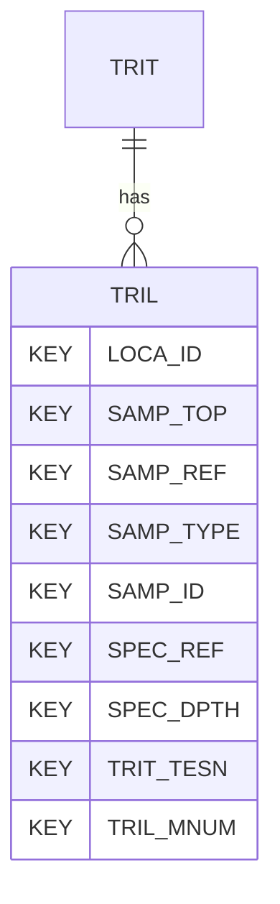

# TRIL — Triaxial Test Logged Data (AGS-L draft)

## Purpose
> [!quote] The **TRIL** group — Triaxial Test Logged Data. It is a **child of [[TRIT]]** in the PROJ-rooted hierarchy. See [[parent-child-graph]].

> [!warning] AGS-L draft group — not in the AGS4 4.x spec
> TRIL is part of **AGS-L** (the AGS Library extension, expected publish
> 2026), hand-authored from the AGS-L draft library workbooks — see
> [[ags-library-xlsx]]. It is **not** part of the AGS4 4.x standard, so it is
> **absent from `ags_dictionary.json`**, the union that drives the generated
> group tier: there is no typed `laterite.groups` class for it and no validator
> dictionary membership. That absence is asserted, not incidental — see
> `repo:rust-packages/laterite-ags4-reference/src/union.rs::dropped_agsl_drafts_are_absent`.
> To carry the group in a file, declare it in the [[effective-dictionary]]
> (in-file `DICT`, [[rule-18-dict-group]]) or register it dynamically. See
> [[ags-4.2]].

## Position in the model

- Parent: [[TRIT]]
- Children: _none_
- See [[parent-child-graph]] · [[key-tuple-pseudo-keys]] · [[heading-status-vocabulary]]

## Headings
> [!quote] Hand-authored from the AGS-L draft library workbooks (`AGSL4_2_*.xlsx` — not vendored; see [[ags-library-xlsx]]). **Not** rendered from `ags_dictionary.json`, which has no TRIL entry. Suggested UNITs + worked examples live in the workbook, not duplicated here.

17 heading(s) — `**KEY**` = pseudo-key tuple, `*REQ*` = REQUIRED (non-null, Rule 10b), OTHER = scope-dependent.

| Heading | Status | Type | Description |
|---|---|---|---|
| `LOCA_ID` | **KEY** | `ID` |  |
| `SAMP_TOP` | **KEY** | `2DP` |  |
| `SAMP_REF` | **KEY** | `X` |  |
| `SAMP_TYPE` | **KEY** | `PA` |  |
| `SAMP_ID` | **KEY** | `ID` |  |
| `SPEC_REF` | **KEY** | `X` |  |
| `SPEC_DPTH` | **KEY** | `2DP` |  |
| `TRIT_TESN` | **KEY** | `X` |  |
| `TRIL_MNUM` | **KEY** | `0DP` |  |
| `TRIL_TTIM` | OTHER | `1DP` |  |
| `TRIL_TTDT` | OTHER | `DT` |  |
| `TRIL_STIM` | OTHER | `1DP` |  |
| `TRIL_STGN` | OTHER | `0DP` |  |
| `TRIL_STGD` | OTHER | `X` |  |
| `TRIL_CELL` | OTHER | `1DP` |  |
| `TRIL_SDEV` | OTHER | `1DP` |  |
| `TRIL_EZES` | OTHER | `3DP` |  |

Full cross-edition heading deltas: AGS Change Log (see [[ags4-rules-frozen-dictionary-evolves]]).

## Relational notes
KEY tuple: `LOCA_ID`, `SAMP_TOP`, `SAMP_REF`, `SAMP_TYPE`, `SAMP_ID`, `SPEC_REF`, `SPEC_DPTH`, `TRIT_TESN`, `TRIL_MNUM`. No child groups. As a child it **denormalises** its parent's KEY columns into every row; [[rule-10c-parent-child]] re-resolves that repeated tuple upward to [[TRIT]]. See [[key-tuple-pseudo-keys]] · [[denormalised-child-rows]].

## Variations
**Edition variation does not apply.** The AGS4 editions do not carry this group at all, so there is no per-edition delta to record and the AGS4 Change Log has nothing to say about it — the headings above track the AGS-L draft, which publishes on its own timetable (see [[ags-library-xlsx]] · [[ags-4.2]]). What the shipped rules do here is unchanged by that: they are frozen across editions ([[ags4-rules-frozen-dictionary-evolves]]), and a group outside the dictionary is reached through the [[effective-dictionary]], not through an edition.

## Related
[[parent-child-graph]] · [[key-tuple-pseudo-keys]] · [[heading-status-vocabulary]] · [[rule-10c-parent-child]] · [[TRIT]]
