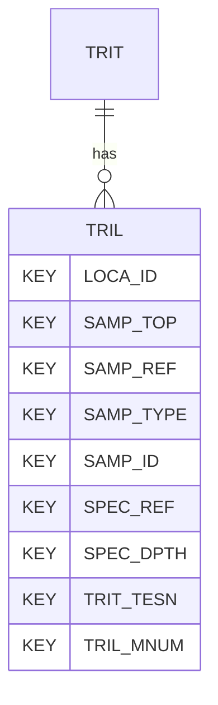

# TRIL — Triaxial Test Logged Data (AGS-L draft)

## Purpose
> [!quote] The **TRIL** group — Triaxial Test Logged Data. It is a **child of [[TRIT]]** in the PROJ-rooted hierarchy. See [[parent-child-graph]].

> [!warning] AGS-L draft group — not in the AGS4 4.x spec
> Its dictionary `contents` once read "(AGS 4.2)", which wrongly implied it
> ships in the AGS4 4.2 spec. TRIL is part of **AGS-L** (the AGS Library
> extension, expected publish 2026), scaffolded from `repo:reports/AGSL4_2_*.xlsx`.
> It is **retained** in the dictionary (never deleted) but is **not** a standard
> AGS4 4.x group. The AGS-L correction (PR #45) replaces that `contents` with
> `(AGS-L draft, publish 2026)`. See [[ags-4.2]].

## Position in the model

- Parent: [[TRIT]]
- Children: _none_
- See [[parent-child-graph]] · [[key-tuple-pseudo-keys]] · [[heading-status-vocabulary]]

## Headings
> [!quote] Rendered from `repo:rust-packages/laterite-ags4-reference/data/ags_dictionary.json groups[code=TRIL]` (the repo's model authority — AGS edition 4.1). Suggested UNITs + worked examples are in the cited spec PDF, not duplicated here.

17 heading(s) — `**KEY**` = pseudo-key tuple, `*REQ*` = REQUIRED (non-null, Rule 10b), OTHER = scope-dependent.

| Heading | Status | Type | Description |
|---|---|---|---|
| `LOCA_ID` | **KEY** | `ID` |  |
| `SAMP_TOP` | **KEY** | `2DP` |  |
| `SAMP_REF` | **KEY** | `X` |  |
| `SAMP_TYPE` | **KEY** | `PA` |  |
| `SAMP_ID` | **KEY** | `ID` |  |
| `SPEC_REF` | **KEY** | `X` |  |
| `SPEC_DPTH` | **KEY** | `2DP` |  |
| `TRIT_TESN` | **KEY** | `X` |  |
| `TRIL_MNUM` | **KEY** | `0DP` |  |
| `TRIL_TTIM` | OTHER | `1DP` |  |
| `TRIL_TTDT` | OTHER | `DT` |  |
| `TRIL_STIM` | OTHER | `1DP` |  |
| `TRIL_STGN` | OTHER | `0DP` |  |
| `TRIL_STGD` | OTHER | `X` |  |
| `TRIL_CELL` | OTHER | `1DP` |  |
| `TRIL_SDEV` | OTHER | `1DP` |  |
| `TRIL_EZES` | OTHER | `3DP` |  |

Full cross-edition heading deltas: AGS Change Log (see [[ags4-rules-frozen-dictionary-evolves]]).

## Relational notes
KEY tuple: `LOCA_ID`, `SAMP_TOP`, `SAMP_REF`, `SAMP_TYPE`, `SAMP_ID`, `SPEC_REF`, `SPEC_DPTH`, `TRIT_TESN`, `TRIL_MNUM`. No child groups. As a child it **denormalises** its parent's KEY columns into every row; [[rule-10c-parent-child]] re-resolves that repeated tuple upward to [[TRIT]]. See [[key-tuple-pseudo-keys]] · [[denormalised-child-rows]].

## Variations
No group-level change at 4.2 (present across the in-scope editions). Granular per-heading edition deltas live in the AGS online **Change Log** — the spec's own cited delta source (`spec:AGS4-4.2-2025.pdf` Foreword → ags.org.uk/.../change-log). Heading-level archaeology is deferred to a targeted Ingest if a rule/O-N interaction needs it (per [[ags4-rules-frozen-dictionary-evolves]]).

## Related
[[parent-child-graph]] · [[key-tuple-pseudo-keys]] · [[heading-status-vocabulary]] · [[rule-10c-parent-child]] · [[TRIT]]
