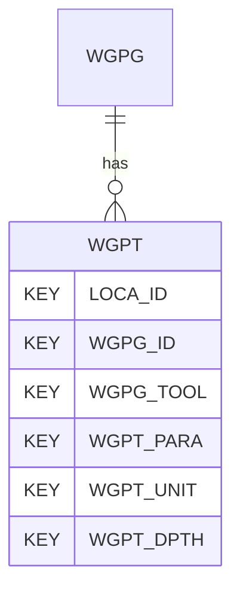

# WGPT — Wireline Geophysics - Readings

## Purpose
> [!quote] The **WGPT** group — Wireline Geophysics - Readings. It is a **child of [[WGPG]]** in the PROJ-rooted hierarchy. See [[parent-child-graph]].

## Position in the model

- Parent: [[WGPG]]
- Children: _none_
- See [[parent-child-graph]] · [[key-tuple-pseudo-keys]] · [[heading-status-vocabulary]]

## Headings
> [!quote] Rendered from `repo:rust-packages/laterite-ags4-reference/data/ags_dictionary.json groups[code=WGPT]` (the repo's model authority — AGS edition 4.2). Suggested UNITs + worked examples are in the cited spec PDF, not duplicated here.

10 heading(s) — `**KEY**` = pseudo-key tuple, `*REQ*` = REQUIRED (non-null, Rule 10b), `DEP` = deprecated, OTHER = scope-dependent.

| Heading | Status | Type | Description |
|---|---|---|---|
| `LOCA_ID` | **KEY** | `ID` | Location identifier |
| `WGPG_ID` | **KEY** | `X` | Test reference |
| `WGPG_TOOL` | **KEY** | `PA` | Tool used |
| `WGPT_PARA` | **KEY** | `PA` | Parameter recorded by tool WGPG_TOOL |
| `WGPT_UNIT` | **KEY** | `PU` | Test result units |
| `WGPT_DPTH` | **KEY** | `2DP` | Depth of reading |
| `WGPT_RDNG` | OTHER | `U` | Reading |
| `WGPT_CAS` | OTHER | `PA` | Borehole casing details at depth of reading |
| `WGPT_REM` | OTHER | `X` | Remarks |
| `FILE_FSET` | OTHER | `X` | Associated file reference |

Full cross-edition heading deltas: AGS Change Log (see [[ags4-rules-frozen-dictionary-evolves]]).

## Relational notes
KEY tuple: `LOCA_ID`, `WGPG_ID`, `WGPG_TOOL`, `WGPT_PARA`, `WGPT_UNIT`, `WGPT_DPTH`. Children (0): _none_. As a child it **denormalises** its parent's KEY columns into every row; [[rule-10c-parent-child]] re-resolves that repeated tuple upward to [[WGPG]]. See [[key-tuple-pseudo-keys]] · [[denormalised-child-rows]].

## Variations
No group-level change at 4.2 (present across the in-scope editions). Granular per-heading edition deltas live in the AGS online **Change Log** — the spec's own cited delta source (`spec:AGS4-4.2-2025.pdf` Foreword → ags.org.uk/.../change-log). Heading-level archaeology is deferred to a targeted Ingest if a rule/O-N interaction needs it (per [[ags4-rules-frozen-dictionary-evolves]]).

## Related
[[parent-child-graph]] · [[key-tuple-pseudo-keys]] · [[heading-status-vocabulary]] · [[rule-10c-parent-child]] · [[WGPG]]
