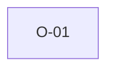

# O-01 — Rule 1 "entirely ASCII" is not enforced literally

> Source-of-truth: `repo:observations.json` (record O-1), rendered at `repo:OBSERVATIONS.md#o-1`.
> This page links + cross-references only — it never copies the 5 fields.

## Summary
> [!variance] **VARIANCE.** Rule 1 says 'entirely ASCII' (0–127) but python-ags4 (and we) treat 0–255 as acceptable: 128–255 = suppressed FYI, only >255 = Rule 1 error. Real geotech data is full of °/±/µ.

Source-of-truth (never pasted): `repo:observations.json`, record O-1 — rendered at `repo:OBSERVATIONS.md#o-1`.

## Rules affected
[[rule-01-ascii]]

## Cross-observation graph

## Upstream status
> [!note] Upstream-reportable: [SPEC] — spec text vs reference impl contradict; AGS-DFWG should permit Latin-1 or acknowledge the de-facto tolerance.

_Not yet marked Reported in OBSERVATIONS.md._

## Related
[[parity-model]] · [[upstream-reporting]]
