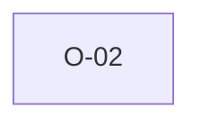

# O-02 — Rule 6 is a complete no-op in python-ags4

> Source-of-truth: `repo:OBSERVATIONS.md#o-2`.
> This page links + cross-references only — it never copies the 5 fields.

## Summary
> [!bug] **BUG.** python-ags4 Rule 6 is a literal no-op (return ags_errors). The 2a/4b/5-subsume claim isn't airtight: a bare embedded CR inside a quoted field passes 5/4 but violates Rule 6. We implement the independent embedded-CR check (a better impl, not a port).

Source-of-truth (never pasted): `repo:OBSERVATIONS.md#o-2`.

## Rules affected
[[rule-06-comma-no-embedded-crlf]]

## Cross-observation graph

## Upstream status
> [!note] Upstream-reportable: [BUG] — Rule 6 should at minimum scan embedded CR/LF.

_Not yet marked Reported in OBSERVATIONS.md._

## Related
[[parity-model]] · [[upstream-reporting]]
