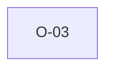

# O-03 — Rule 5 enclosure check special-cases DATA rows

> Source-of-truth: `repo:observations.json` (record O-3), rendered at `repo:OBSERVATIONS.md#o-3`.
> This page links + cross-references only — it never copies the 5 fields.

## Summary
> [!note] **NOTE.** python-ags4 skips the Rule 5 comma cross-check for DATA rows (legit X-values may contain commas) and catches unquoted DATA fields via Rule 4b instead — so an unquoted DATA field is Rule 4 in python, Rule 5 in us. Parity compares presence, not per-rule line.

Source-of-truth (never pasted): `repo:observations.json`, record O-3 — rendered at `repo:OBSERVATIONS.md#o-3`.

## Rules affected
[[rule-04-field-count]] · [[rule-05-quoting]]

## Cross-observation graph

## Upstream status
Not upstream-reportable — — behavioural by design..

## Related
[[parity-model]] · [[upstream-reporting]]
