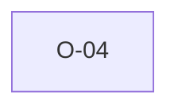

# O-04 — "HEADING row missing" attributed to Rule 4, not Rule 2b

> Source-of-truth: `repo:observations.json` (record O-4), rendered at `repo:OBSERVATIONS.md#o-4`.
> This page links + cross-references only — it never copies the 5 fields.

## Summary
> [!spec] **SPEC.** By plain Rule 2b text a missing HEADING row is a 2b violation, but python files it under Rule 4 (rule_4_2 'Headings row missing.'). We follow python's attribution for count parity.

Source-of-truth (never pasted): `repo:observations.json`, record O-4 — rendered at `repo:OBSERVATIONS.md#o-4`.

## Rules affected
[[rule-02-group-has-data]] · [[rule-04-field-count]]

## Cross-observation graph

## Upstream status
> [!note] Upstream-reportable: [SPEC] — minor; reference impl files a 2b-class defect under 4.

_Not yet marked Reported in OBSERVATIONS.md._

## Related
[[parity-model]] · [[upstream-reporting]]
