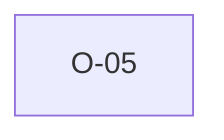

# O-05 — HEADING-less groups: we keep validating, python-ags4 may not

> Source-of-truth: `repo:observations.json` (record O-5), rendered at `repo:OBSERVATIONS.md#o-5`.
> This page links + cross-references only — it never copies the 5 fields.

## Summary
> [!note] **NOTE.** We retain + fully validate a HEADING-less group; python's table-scan rules may under-report on it (unverified — clean-room boundary). Flagged as a robustness difference, not asserted a bug.

Source-of-truth (never pasted): `repo:observations.json`, record O-5 — rendered at `repo:OBSERVATIONS.md#o-5`.

## Rules affected
[[rule-02-group-has-data]] · [[rule-04-field-count]]

## Cross-observation graph

## Upstream status
Not upstream-reportable — yet — needs substantiation; promote to [BUG] if confirmed..

## Related
[[parity-model]] · [[upstream-reporting]]
